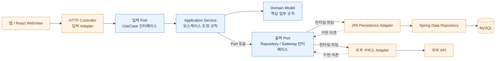

# API 구조

## 서비스 경계

엄지마켓은 Flutter 앱 셸, React WebView, Kotlin/Spring Boot API로 구성함. 초기에는 사용자·관리자 기능을 하나의 API 서비스에서 제공하고 계정의 role/permission으로 UI와 API 접근을 구분함

```text
Flutter App -> WebView -> React Web -> umji-market-api -> MySQL / 외부 서비스
```

관리자 기능은 UI 은닉만으로 보호하지 않으며, 모든 관리자성 API에서 서버 권한 검사를 수행함

## 아키텍처 원칙

기반 아키텍처는 **헥사고날 아키텍처(Ports and Adapters)와 클린 아키텍처**임. 의존성은 바깥 계층에서 안쪽 계층을 향해야 하며, 도메인·애플리케이션 코드는 Spring, JPA, HTTP, DB 구현을 알지 않아야 함.



실선은 요청/호출 흐름을, 점선은 adapter가 안쪽 Port를 구현하며 의존하는 방향을 나타냄. 런타임에는 application이 출력 Port를 호출하고, 그 Port의 구현체인 바깥 adapter가 저장소나 외부 서비스를 연결함.

Controller는 입력 adapter, 애플리케이션 Service는 유스케이스 조정자, JPA와 Spring Data 구현은 persistence outbound adapter임. 저장소 인터페이스(출력 Port)는 안쪽 계층에 두고 JPA adapter가 이를 구현함. 트랜잭션 경계는 애플리케이션 유스케이스에 두며 adapter는 해당 작업에 필요한 저장·조회만 제공함.

## 패키지와 계층

패키지 루트는 `com.buyeong.umji.api`임

```text
auth          인증·토큰·권한
account       계정·주소
catalog       상품·카테고리·브랜드
cart          장바구니
order         주문·취소·환불
payment       결제
inventory     재고·예약·변경 이력
operation     관리자 운영·감사 로그
notification  알림
file          파일 메타데이터
common        공통 설정·예외·웹·추적
```

목표 구조는 도메인별로 `domain`, `application`, `adapter/in`, `adapter/out` 경계를 드러내는 것임. 프로젝트 규모에 맞춰 패키지 깊이는 조정할 수 있지만, 이름보다 의존성 규칙을 우선함. Controller는 HTTP 입출력만 담당하고, application use case는 도메인 규칙을 호출하고 유스케이스를 조정함. 외부 request/response에는 도메인 모델이나 JPA Entity를 직접 노출하지 않음.

## Persistence 경계

JPA 구현은 도메인·애플리케이션 안쪽 계층과 분리해 `persistence/jpa/{aggregate}`에 둠. 현재 aggregate는 `account`, `auth`, `catalog`, `cart`, `inventory`, `order`임. 각 aggregate 아래 `entity`, `repository`, `service` 폴더를 사용하며, 이는 파일을 나누는 물리 구조일 뿐 아키텍처 경계를 보장하지는 않음.

## 현재 구조 평가 및 개선 사항

기존 코드는 Controller → 도메인 `*Service` → `*JpaEntityService` → Spring Data Repository → JPA Entity 형태를 주로 사용해 왔음. 주문 흐름은 이번 리팩터링에서 `OrderUseCase` 입력 Port, 순수 Kotlin `OrderService`, `CheckoutCartPort`·`InventoryReservationPort`·`OrderStorePort` 출력 Port와 persistence adapter로 전환함. Controller는 계정의 공개 ID를 전달하고 application 모델을 HTTP 응답으로 변환하며, JPA 매핑과 트랜잭션 경계는 바깥 adapter에 둠.

주문, 장바구니, 재고, 공개 카탈로그, 인증, 관리자 계정·카탈로그 흐름은 application 모델·입출력 Port·adapter 구조로 전환함. 관리자 HTTP DTO는 web adapter에서 application 명령/응답으로 변환하고, JPA Entity 매핑은 persistence adapter에서 처리함. `*JpaEntityService`는 기존 도메인 adapter의 DB 호출 보조자로 남아 있으며 application 계층에서 직접 참조하지 않음.

`persistence/jpa` 내부의 `entity`, `repository`, `service`는 저장 기술 구현을 분류하는 물리 디렉터리임. 일부 Kotlin package 선언이 aggregate 루트에 유지된 것은 의도된 단계이며, 애플리케이션과 adapter 간 의존 경계는 도메인별 `{domain}/application` 및 `{domain}/adapter` 패키지에서 표현함. 패키지 이름만 바꾸는 것보다 안쪽 계층이 JPA를 참조하지 않는지 확인하는 것을 우선함.

남은 정리 사항은 공통 예외 모델의 계층 귀속, 도메인별 adapter 트랜잭션 설정 일관화, 테스트 범위 보강임. 계정·카탈로그의 규칙은 application use case에 두고, JPA adapter는 영속성과 Entity 매핑을 맡음.

1. 각 유스케이스가 필요로 하는 저장·조회 계약을 application 안쪽에 인터페이스(출력 Port)로 선언하고 persistence adapter가 구현함
2. JPA Entity와 도메인 모델을 분리하고, persistence adapter에서 매핑함. 유스케이스 입력·출력 모델도 HTTP DTO와 분리함
3. 도메인 간 유스케이스 호출은 다른 도메인의 JPA Entity 전달 대신 식별자와 명시적 Port/도메인 계약을 사용함
4. 여러 aggregate를 변경하는 트랜잭션 경계는 application use case에 두고, 저장소 adapter는 트랜잭션을 가로질러 비즈니스 흐름을 소유하지 않도록 함
5. 테스트는 도메인 규칙과 유스케이스를 Spring/JPA 없이 검증할 수 있게 구성하고, 별도로 adapter 통합을 검증함

따라서 `entity`, `repository`, `service` 폴더화는 persistence 구현 내부의 파일 분류로 사용하고, 각 기능의 `application`과 `adapter` 패키지 경계를 아키텍처 경계로 사용함. 패키지 이름 자체보다 dependency direction을 유지하는지 확인함.

## 도메인 모델

| 도메인 | 핵심 개념 |
| --- | --- |
| auth | Account, Role, Permission, AccessToken, RefreshToken |
| account | Member, AdminProfile, Address, Contact |
| catalog | Product, ProductOption, Category, Brand, ProductImage |
| cart | Cart, CartItem, SelectedOption |
| order | Order, OrderItem, OrderStatus, ShippingRequest, CancelRequest, RefundRequest |
| payment | Payment, PaymentMethod, PaymentStatus, ProviderTransaction |
| inventory | Stock, StockChange, StockReservation |
| operation | AdminActionLog, OperatorMemo, ProductChangeHistory, OrderHandlingHistory |

상품의 판매·재고 단위는 SKU이며, 주문은 상품명·SKU명·가격을 스냅샷으로 보관함. 재고는 주문 생성 시 예약하고 결제 승인 시 확정 차감함

## API 규칙

- 기본 prefix: `/api`
- 역할 구분은 URL prefix가 아니라 서버 role/permission 검사로 수행
- 관리자성 후보 prefix: `/api/operation/**`
- 목록 API는 `page`, `size`, `sort`를 기본 후보로 사용하고 무한 스크롤 화면은 cursor 방식을 별도 검토
- OpenAPI tag는 도메인·역할이 드러나게 작성

응답 형식은 구현 전에 공통화함

```json
{ "data": {}, "traceId": "..." }
```

```json
{ "code": "ERROR_CODE", "message": "...", "traceId": "...", "details": [] }
```

WebView 흐름에서는 인증 만료, 앱 뒤로가기, 외부 PG 이동·복귀, 파일 업로드, 푸시 토큰 등록을 계약에 포함함

## 인증과 권한

초기 모델은 `Account`, `Role`, `Permission`, `AccountRole`, `RolePermission`임. Role 후보는 `CUSTOMER`, `ADMIN`, `PRODUCT_MANAGER`, `ORDER_MANAGER`, `INVENTORY_MANAGER`, `SUPER_ADMIN`임

토큰은 RS256 Access Token과 Refresh Token을 사용함. Access Token은 짧은 수명으로 유지하고, Refresh Token은 기기별 영속 세션으로 관리함. 명시적 토큰 삭제·무효화, 계정 정지·탈퇴, `tokenVersion` 증가 또는 운영자 강제 종료 전까지 Refresh Token의 시간 만료를 두지 않음. 원문은 클라이언트 보관·서버 SHA-256 hash 저장 방식이며, 갱신마다 계정 상태와 권한을 DB에서 재검증하고 토큰을 회전함. JWT 개인키는 설정 파일이 아닌 PEM 파일 경로로 주입함

JWT claim 후보: `sub`, `iss`, `aud`, `roles`, `tokenVersion`, `iat`, `exp`

휴대폰 번호 로그인, 계정 상태 기반 본인 인증, 기존 회원 활성화, 개인정보 동의 흐름은 `services/authentication.md`와 루트 `SERVICE_FLOW.md`를 기준으로 함

## 데이터 접근과 향후 분리

read/write datasource를 유지하고 `@Transactional(readOnly = true)`는 read 연결로 라우팅함. 접속 정보는 환경 변수로 주입함

아래 조건이 누적되면 모듈 또는 서비스 분리를 검토함

- 특정 도메인의 독립 배포·확장 요구
- Kafka consumer·batch의 별도 확장 요구
- 관리자 운영 기능과 사용자 트래픽의 보안·성능 요구 차이
- 공통 코드보다 도메인 독립성이 중요해진 경우
