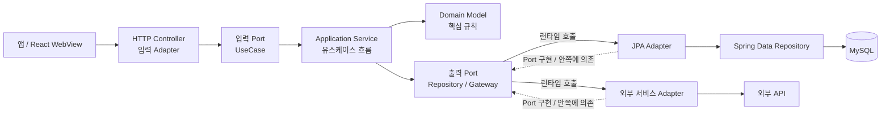

# 아키텍처

## 기준

서비스의 최상위 기준은 헥사고날 아키텍처(Ports and Adapters)와 클린 아키텍처입니다. 의존성은 바깥 adapter에서 안쪽 application·domain을 향합니다. 안쪽 계층은 Spring MVC, Spring Data JPA, DB 구현, HTTP DTO를 참조하지 않습니다.

## 요청과 의존 흐름



실선은 런타임 요청·호출 흐름이고 점선은 구현 의존 방향입니다. Application은 출력 Port를 호출하며, adapter가 DB나 외부 API에 연결합니다.

## 패키지 구조

```text
{domain}/
  domain/                    # 필요한 도메인 모델과 규칙
  application/
    model/                   # 프레임워크 독립 명령·조회 모델
    port/in/                 # 입력 UseCase
    port/out/                # 저장소·외부 연동 계약
    *Service.kt              # 유스케이스 구현
  adapter/
    in/web/                  # HTTP Controller, 요청/응답 변환
    in/security/             # Spring Security 입력 연동
    out/persistence/         # JPA Entity ↔ application/domain 변환
    out/{integration}/       # 외부 시스템 연동
```

모든 도메인에 불필요한 계층을 기계적으로 만들지 않습니다. Port는 실제 경계가 필요한 곳에 두고, 이름보다 의존 방향을 지킵니다. JPA Entity와 Spring Data Repository는 `persistence/jpa/{aggregate}` 구현 내부에 둡니다.

현재 adapter/application 경계를 적용한 도메인은 인증, 카탈로그, 장바구니, 주문, 재고, 관리자 계정, 관리자 카탈로그입니다. account 사용자 API, 결제, 파일, 알림 기능은 아직 구현되지 않았습니다.

## 도메인 책임

| 도메인 | 책임 |
| --- | --- |
| auth | 휴대폰 로그인, Access/Refresh Token 및 현재 인증 계정 |
| account | 사용자 프로필·주소 (API 미구현) |
| catalog | 공개 카탈로그 조회 |
| cart | 사용자 장바구니 |
| order | 주문·주문 항목 및 상태 이력 |
| inventory | SKU 재고·예약·변동 이력 |
| operation | 관리자 계정·상품 운영 |
| payment, file, notification | 구현 전 |

관리자 URL prefix는 `/api/operation/**`입니다. 인증 `REQUIRED` 모드에서는 인증된 요청만 허용하며, 로컬 `BYPASS`는 보안 검사를 건너뜁니다. 관리자별 permission 검사는 endpoint 권한 매핑이 구현되기 전까지 완료된 것으로 간주하지 않습니다.

## DB와 서비스 분리

현재는 하나의 API와 MySQL을 사용합니다. 헥사고날 구조는 내부 코드의 변경·테스트 경계를 만들며, 그 자체가 MSA 분리를 뜻하지 않습니다. 독립 배포·확장 요구와 데이터 소유권이 분명해질 때 모듈/서비스 분리를 검토합니다. Flyway 현황은 [database.md](database.md), 관계도는 [database-erd.md](database-erd.md)를 기준으로 합니다.
