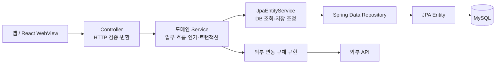
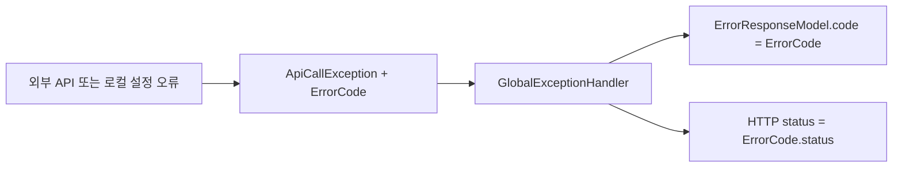

# 아키텍처

## 기준

서비스는 Controller·Service·Persistence의 계층형 구조를 사용함.<br>
주요 요청 흐름은 `Controller → 도메인 Service → JpaEntityService → Spring Data Repository → JPA Entity`.<br>
의존성은 호출 방향을 따라 바깥 계층에서 안쪽 업무 계층 및 영속성 계층으로 향함.<br>


```mermaid
flowchart LR
    Client["앱 / React WebView"] --> Controller["Controller<br/>HTTP 검증·변환"]
    Controller --> Service["도메인 Service<br/>업무 흐름·인가·트랜잭션"]
    Service --> JpaService["JpaEntityService<br/>DB 조회·저장 조정"]
    JpaService --> Repository["Spring Data Repository"]
    Repository --> Entity["JPA Entity"]
    Entity --> Database[("MySQL")]
    Service --> Integration["외부 연동 구체 구현"]
    Integration --> External["외부 API"]
```

## 계층 책임

| 계층 | 책임 |
| --- | --- |
| Controller | HTTP 입력 검증, 인증 사용자 식별, 도메인 Service 호출, HTTP 응답 변환 |
| 도메인 Service | 유스케이스 조정, 업무 규칙, 권한 확인, 트랜잭션 경계, 도메인 간 Service 호출 |
| JpaEntityService | JPA Repository 호출 조정, Entity 조회·저장·관계 관리 |
| Spring Data Repository | DB query 실행 |
| JPA Entity | 테이블 영속 모델 |
| 외부 연동 구현 | 외부 API·SDK 호출, 결과 변환 및 오류 처리 |

UseCase·Port를 위한 서비스 계약 인터페이스와 위임 전용 adapter/wrapper를 두지 않음.<br>
도메인 Service는 구체 Kotlin class로 선언하고 필요한 하위 Service 또는 `JpaEntityService`를 생성자 주입함.<br>
Spring Data Repository 인터페이스와 외부 라이브러리 callback/provider 요구로 필요한 인터페이스는 유지 가능.<br>
외부 HTTP 입력 모델은 `domain/{domain}/model/<Action>Request`, 외부 HTTP 출력 모델은 `domain/{domain}/model/<Action>Response`로 두며 client와 Controller 사이의 계약으로 사용함.<br>
Controller 이하 내부 계층에서 전달하는 DTO는 `<Action>Dto`로 명명하고 `domain/{domain}/dto`에 둠. 내부 DTO에는 Request/Response 접미사를 사용하지 않음.<br>
각 Request·Response·DTO는 별도 파일의 최상위 `data class` 하나로 선언함. 중첩 데이터 클래스와 서로 다른 역할의 데이터 클래스를 한 파일에 함께 선언하는 방식은 사용하지 않음.<br>
JPA Entity는 외부 응답에 직접 노출하지 않음.<br>

## 외부 API 오류 응답

외부 API 호출 오류는 `ApiCallException`에 `ErrorCode`와 원인을 보관하고 `GlobalExceptionHandler`에서 처리함.<br>
오류 응답 본문의 코드와 HTTP 상태는 동일한 `ErrorCode`에서 생성함. upstream 통신 실패는 `BAD_GATEWAY_ERROR`(502), 로컬 설정 누락은 `INTERNAL_SERVER_ERROR`(500) 사용.<br>


```mermaid
flowchart LR
    FAIL[외부 API 또는 로컬 설정 오류] --> EX[ApiCallException + ErrorCode]
    EX --> HANDLER[GlobalExceptionHandler]
    HANDLER --> BODY[ErrorResponseModel.code = ErrorCode]
    HANDLER --> STATUS[HTTP status = ErrorCode.status]
```

## 패키지 구조

서비스 도메인은 `domain/<domain>/` 아래에서 기능별로 구분하고, `persistence/jpa/`는 도메인 패키지와 분리된 영속성 영역으로 유지함.<br>

```text
domain/
  <domain>/
    controller/         # Controller
    service/            # 도메인 Service
    model/              # <Action>Request, <Action>Response
    dto/                # Controller 이하 내부 전달용 <Action>Dto
    integration/        # 외부 연동 구체 구현과 설정
persistence/
  jpa/
    <domain>/
      entity/           # JPA Entity
      repository/       # Spring Data Repository
      service/          # JpaEntityService
    entity/backbone/    # 여러 도메인이 공유하는 mapped superclass
```

인증 계정 식별과 활성 상태 확인은 Controller가 구체 인증 Service를 직접 호출해 수행함.<br>
외부 연동은 도메인 Service에서 구체 integration class를 직접 호출함.<br>
외부 SDK가 요구하는 callback/provider interface는 integration 내부 구현 세부로만 유지 가능함.<br>
`application`, `adapter/in`, `adapter/out`, `port`는 계층 패키지로 사용하지 않음.<br>
단순 조회·저장 위임 adapter는 제거하고 DB 작업은 `JpaEntityService`에서 수행함.<br>

## 서비스 경계

엄지마켓은 Flutter 앱 셸, React WebView, Kotlin/Spring Boot API, MySQL로 구성된 단일 API 서비스임.<br>
사용자와 관리자 기능은 role/permission 기반 서버 권한 검사로 구분하며, 모든 관리자 API에서 권한 검사를 수행함.<br>
계층형 구조는 모듈 또는 배포 서비스 분리를 뜻하지 않음.<br>

## 도메인 책임

| 도메인 | 책임 |
| --- | --- |
| auth | 휴대폰 로그인, Access/Refresh Token, 현재 인증 계정 |
| account | 사용자 프로필, 구매자 그룹, 그룹 공용 배송지, 그룹 onboarding |
| catalog | 공용 상품·SKU와 채널별 카탈로그 |
| cart | 사용자 장바구니 |
| order | 주문·주문 항목 및 상태 이력 |
| inventory | SKU 재고·예약·변동 이력 |
| operation | 관리자 계정·상품 운영 |
| payment | 수동 계좌이체 안내와 운영자 입금 확인 |
| file | 구현 전 |
| notification | 업무 이벤트 outbox 및 기기 token 관리, 발송 worker |

## DB와 서비스 배포

단일 API와 MySQL을 사용함.<br>
신규·변경 스키마는 Flyway로 관리하고 적용된 migration은 수정하지 않음.<br>
스키마 현황은 [database.md](database.md), 관계도는 [database-erd.md](database-erd.md)를 기준으로 함.<br>
