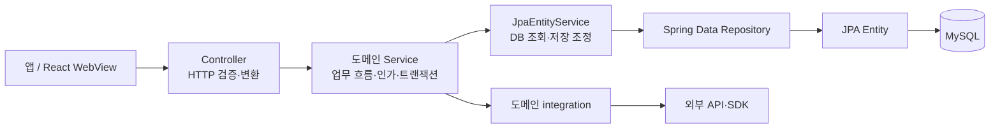
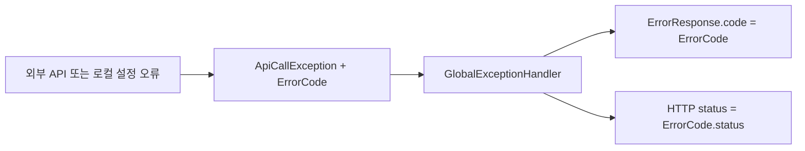

# 아키텍처

## 구조

서비스는 Controller·Service·Persistence로 구성된 계층형 구조.<br>
요청 흐름은 `Client → Controller → 도메인 Service → JpaEntityService → Spring Data Repository → JPA Entity`.<br>
도메인 Service는 외부 연동이 필요할 때 도메인의 구체 integration 구현을 호출.<br>


```mermaid
flowchart LR
    Client["앱 / React WebView"] --> Controller["Controller<br/>HTTP 검증·변환"]
    Controller --> Service["도메인 Service<br/>업무 흐름·인가·트랜잭션"]
    Service --> JpaService["JpaEntityService<br/>DB 조회·저장 조정"]
    JpaService --> Repository["Spring Data Repository"]
    Repository --> Entity["JPA Entity"]
    Entity --> Database[("MySQL")]
    Service --> Integration["도메인 integration"]
    Integration --> External["외부 API·SDK"]
```

## 계층 책임

| 계층 | 책임 |
| --- | --- |
| Controller | HTTP 입력 검증, 인증 사용자 식별, 도메인 Service 호출, HTTP 응답 변환 |
| 도메인 Service | 업무 흐름·규칙, 권한 확인, 트랜잭션, 도메인 간 호출 조정 |
| JpaEntityService | JPA Repository 호출, Entity 조회·저장·관계 관리 |
| Spring Data Repository | DB query 실행 |
| JPA Entity | 테이블 영속 모델 |
| 도메인 integration | 외부 API·SDK 호출, 결과 변환, 오류 처리 |

Controller는 구체 도메인 Service를 호출하고, 도메인 Service는 필요한 JpaEntityService 또는 구체 integration class를 사용함.<br>
JPA Entity를 외부 HTTP 응답에 직접 노출하지 않음.<br>

## HTTP 모델과 내부 DTO

HTTP 계약 모델과 내부 데이터 전달 객체의 위치·명명 기준.<br>

| 종류 | 위치 | 명명 | 경계 |
| --- | --- | --- | --- |
| Request | `domain/<domain>/model/` | `<Action>Request` | Client에서 Controller까지 |
| Response | `domain/<domain>/model/` | `<Action>Response` | Controller에서 Client까지 |
| DTO | `domain/<domain>/dto/` | `<Action>Dto` | Controller 이하 내부 계층 |

각 객체는 별도 파일의 최상위 `data class` 하나로 선언함.<br>
중첩 data class, 한 파일에 서로 다른 역할의 Request·Response를 함께 선언하는 방식은 사용하지 않음.<br>
공통 오류 응답 등 도메인에 속하지 않는 공통 객체는 `api/model` 또는 `api/dto`에 둠.<br>

## 패키지 구조

서비스 도메인과 영속성 구현은 `com.buyeong.umji.api` 아래에서 별도 영역으로 관리함.<br>

```text
api/
  domain/
    <domain>/
      controller/
      service/
      model/
      dto/
      integration/
  persistence/
    jpa/
      <domain>/
        entity/
        repository/
        service/          # JpaEntityService
      entity/backbone/    # 여러 도메인이 공유하는 mapped superclass
  model/                  # 공통 HTTP 모델
  dto/                    # 공통 내부 DTO
  config/                 # 공통 설정
  exception/              # 공통 예외
  handler/                # 공통 처리기
```

서비스 도메인 코드는 `api/domain/<domain>/` 아래에 둠.<br>
`api/persistence/jpa/`는 도메인 패키지가 아니며 DB 접근 구현만 둠.<br>
도메인 별 상세 책임은 [서비스 문서 목차](services/README.md)와 연결된 도메인 문서를 기준으로 함.<br>

## 외부 API 오류

외부 API 호출 오류는 `ApiCallException`에 `ErrorCode`와 원인을 보관하고 `GlobalExceptionHandler`에서 처리함.<br>
오류 응답 본문과 HTTP 상태는 동일한 `ErrorCode`에서 생성함. upstream 통신 실패는 `BAD_GATEWAY_ERROR`(502), 로컬 설정 누락은 `INTERNAL_SERVER_ERROR`(500) 사용.<br>


```mermaid
flowchart LR
    FAIL[외부 API 또는 로컬 설정 오류] --> EX[ApiCallException + ErrorCode]
    EX --> HANDLER[GlobalExceptionHandler]
    HANDLER --> BODY[ErrorResponse.code = ErrorCode]
    HANDLER --> STATUS[HTTP status = ErrorCode.status]
```

## 서비스 경계

엄지마켓은 Flutter 앱 셸, React WebView, Kotlin/Spring Boot API, MySQL로 구성된 단일 API 서비스.<br>
사용자·관리자 기능은 role·permission 기반 서버 권한 검사로 구분. 모든 관리자 API에서 권한 검사 수행.<br>
계층형 구조는 모듈 또는 배포 서비스 분리를 뜻하지 않음.<br>

## DB

신규·변경 schema는 Flyway로 관리하고 적용된 migration은 수정하지 않음.<br>
현재 DB 규칙과 migration은 [database.md](database.md), 전체 schema 관계는 [database-erd.md](database-erd.md)를 기준으로 함.<br>
