# 데이터베이스 ERD

이 문서는 현재 Flyway 버전 마이그레이션 V2–V9가 만드는 관계형 스키마를 나타냅니다. 실제 컬럼과 제약의 기준은 `src/main/resources/db/migration`이며, DB 규칙은 [database.md](database.md)에 정리합니다. 미구현 테이블은 현재 ERD에 포함하지 않습니다.

## 공통 표기

- 내부 PK/FK는 `BIGINT`, API 공개 ID는 `BINARY(16)` UUID입니다.
- 시각은 UTC `DATETIME(3)`, 금액은 KRW 최소 단위 `BIGINT`입니다.
- 관계도는 FK와 핵심 컬럼만 표시합니다.

## 현재 관계도

```mermaid
erDiagram
    ACCOUNT {
        BIGINT id PK
        BINARY public_id UK
        VARCHAR phone
        VARCHAR phone_normalized UK
        VARCHAR status
        BIGINT token_version
    }
    ROLE {
        BIGINT id PK
        VARCHAR code UK
    }
    PERMISSION {
        BIGINT id PK
        VARCHAR code UK
    }
    ACCOUNT_ROLE {
        BIGINT account_id PK,FK
        BIGINT role_id PK,FK
    }
    ROLE_PERMISSION {
        BIGINT role_id PK,FK
        BIGINT permission_id PK,FK
    }
    REFRESH_TOKEN {
        BIGINT id PK
        BIGINT account_id FK
        BINARY token_hash UK
        DATETIME expires_at
        DATETIME revoked_at
    }
    ACCOUNT_ADDRESS {
        BIGINT id PK
        BIGINT account_id FK
    }
    BUSINESS_PROFILE {
        BIGINT id PK
        BIGINT account_id FK
    }
    CONSENT_HISTORY {
        BIGINT id PK
        BIGINT account_id FK
        VARCHAR consent_type
    }
    CATEGORY {
        BIGINT id PK
        BIGINT parent_id FK
        BINARY public_id UK
        VARCHAR display_status
    }
    BRAND {
        BIGINT id PK
        BINARY public_id UK
        VARCHAR display_status
    }
    PRODUCT {
        BIGINT id PK
        BIGINT category_id FK
        BIGINT brand_id FK
        BINARY public_id UK
    }
    PRODUCT_IMAGE {
        BIGINT id PK
        BIGINT product_id FK
        VARCHAR storage_key
    }
    PRODUCT_OPTION {
        BIGINT id PK
        BIGINT product_id FK
    }
    PRODUCT_OPTION_VALUE {
        BIGINT id PK
        BIGINT product_option_id FK
    }
    PRODUCT_SKU {
        BIGINT id PK
        BIGINT product_id FK
        VARCHAR sku_code UK
        BIGINT sale_price
    }
    PRODUCT_SKU_OPTION_VALUE {
        BIGINT product_sku_id PK,FK
        BIGINT product_option_value_id PK,FK
    }
    INVENTORY_STOCK {
        BIGINT id PK
        BIGINT sku_id FK,UK
        INT on_hand_quantity
        INT reserved_quantity
    }
    INVENTORY_MOVEMENT {
        BIGINT id PK
        BIGINT sku_id FK
        INT quantity_delta
    }
    STOCK_RESERVATION {
        BIGINT id PK
        BINARY reservation_key UK
        BIGINT sku_id FK
        INT quantity
        VARCHAR status
    }
    CART {
        BIGINT id PK
        BIGINT account_id FK,UK
    }
    CART_ITEM {
        BIGINT id PK
        BIGINT cart_id FK
        BIGINT sku_id FK
        INT quantity
    }
    PURCHASE_ORDER {
        BIGINT id PK
        BIGINT account_id FK
        BINARY public_id UK
        VARCHAR order_number UK
        VARCHAR status
        BIGINT total_amount
    }
    ORDER_NUMBER_SEQUENCE {
        DATE order_date PK
        BIGINT last_value
    }
    ORDER_ITEM {
        BIGINT id PK
        BIGINT order_id FK
        BIGINT sku_id FK
        BINARY reservation_key UK
        BIGINT unit_price
    }
    ORDER_STATUS_HISTORY {
        BIGINT id PK
        BIGINT order_id FK
        VARCHAR to_status
    }

    ACCOUNT ||--o{ ACCOUNT_ROLE : has
    ROLE ||--o{ ACCOUNT_ROLE : assigned
    ROLE ||--o{ ROLE_PERMISSION : grants
    PERMISSION ||--o{ ROLE_PERMISSION : included
    ACCOUNT ||--o{ REFRESH_TOKEN : owns
    ACCOUNT ||--o{ ACCOUNT_ADDRESS : has
    ACCOUNT ||--o| BUSINESS_PROFILE : has
    ACCOUNT ||--o{ CONSENT_HISTORY : records
    CATEGORY ||--o{ CATEGORY : parent
    CATEGORY ||--o{ PRODUCT : classifies
    BRAND ||--o{ PRODUCT : labels
    PRODUCT ||--o{ PRODUCT_IMAGE : displays
    PRODUCT ||--o{ PRODUCT_OPTION : defines
    PRODUCT_OPTION ||--o{ PRODUCT_OPTION_VALUE : offers
    PRODUCT ||--o{ PRODUCT_SKU : sells
    PRODUCT_SKU ||--o{ PRODUCT_SKU_OPTION_VALUE : selects
    PRODUCT_OPTION_VALUE ||--o{ PRODUCT_SKU_OPTION_VALUE : belongs
    PRODUCT_SKU ||--o| INVENTORY_STOCK : tracks
    PRODUCT_SKU ||--o{ INVENTORY_MOVEMENT : records
    PRODUCT_SKU ||--o{ STOCK_RESERVATION : reserves
    ACCOUNT ||--o| CART : owns
    CART ||--o{ CART_ITEM : contains
    PRODUCT_SKU ||--o{ CART_ITEM : selected
    ACCOUNT ||--o{ PURCHASE_ORDER : places
    PURCHASE_ORDER ||--|{ ORDER_ITEM : contains
    PRODUCT_SKU ||--o{ ORDER_ITEM : snapshots
    PURCHASE_ORDER ||--o{ ORDER_STATUS_HISTORY : tracks
```

`ORDER_ITEM.reservation_key`와 `STOCK_RESERVATION.reservation_key`는 주문·재고 예약을 연결하는 값입니다. DB FK로 직접 묶지는 않습니다. `ORDER_NUMBER_SEQUENCE`는 주문 번호 발급용 테이블입니다.

## 버전별 테이블

| Migration | 생성·변경 범위 |
| --- | --- |
| V2 | 계정, 역할/권한, 연결 테이블, refresh token, 주소 |
| V3 | 카테고리, 브랜드, 상품, SKU |
| V4 | 계정 휴대폰 번호 nullable 처리, 업체 프로필, 동의 이력 |
| V5 | 상품 이미지, 옵션/옵션값, SKU-옵션값 연결 |
| V6 | 정규화 전화번호 unique, refresh token 만료 nullable·최근 사용 시각 |
| V7 | 재고, 재고 변동, 재고 예약 |
| V8 | 장바구니, 장바구니 항목 |
| V9 | 주문, 주문 번호 시퀀스, 주문 항목, 주문 상태 이력 |

Flyway의 실제 스키마와 이 문서가 다르면 migration 파일이 기준입니다. 새 테이블이나 컬럼은 새 버전 migration으로 추가하고, 적용된 migration은 수정하지 않습니다.
