# 데이터베이스 ERD

엄지마켓의 논리 데이터 모델. 현재 Flyway `V2`~`V5`로 인증·계정·운영 업체 프로필·카탈로그·상품 이미지·옵션 영역이 생성되어 있음. 상세 컬럼·제약·마이그레이션 순서는 `database.md`를 기준으로 함

## ExERD 작성 기준

- 내부 PK: `BIGINT` auto increment
- 외부 공개 식별자: `public_id BINARY(16)`
- 시간: UTC `DATETIME(3)`
- 금액: KRW 최소 단위 `BIGINT`
- 상태: `VARCHAR` 코드
- 주문·결제·재고·운영 이력은 append-only

## 관계도

```mermaid
erDiagram
    ACCOUNT {
        BIGINT id PK
        BINARY public_id UK
        VARCHAR phone
        VARCHAR status
        BIGINT token_version
    }
    ROLE {
        BIGINT id PK
        VARCHAR code UK
    }
    PERMISSION {
        BIGINT id PK
        VARCHAR code UK
    }
    ACCOUNT_ROLE {
        BIGINT account_id FK
        BIGINT role_id FK
    }
    ROLE_PERMISSION {
        BIGINT role_id FK
        BIGINT permission_id FK
    }
    REFRESH_TOKEN {
        BIGINT id PK
        BIGINT account_id FK
        BINARY token_hash UK
        DATETIME expires_at
        DATETIME revoked_at
    }
    ACCOUNT_ADDRESS {
        BIGINT id PK
        BIGINT account_id FK
        VARCHAR recipient_name
        VARCHAR recipient_phone
    }
    CONSENT_HISTORY {
        BIGINT id PK
        BIGINT account_id FK
        VARCHAR consent_type
        VARCHAR document_version
        VARCHAR method
        DATETIME consented_at
    }
    BUSINESS_PROFILE {
        BIGINT id PK
        BIGINT account_id FK
        VARCHAR business_name
        VARCHAR business_registration_number
        VARCHAR business_status
    }
    PHONE_AUTH_CHALLENGE {
        BIGINT id PK
        VARCHAR phone
        BINARY code_hash
        DATETIME expires_at
        DATETIME verified_at
    }
    CATEGORY {
        BIGINT id PK
        BIGINT parent_id FK
        BINARY public_id UK
        VARCHAR name
    }
    BRAND {
        BIGINT id PK
        BINARY public_id UK
        VARCHAR name
    }
    PRODUCT {
        BIGINT id PK
        BIGINT category_id FK
        BIGINT brand_id FK
        BINARY public_id UK
        VARCHAR name
    }
    PRODUCT_IMAGE {
        BIGINT id PK
        BIGINT product_id FK
        VARCHAR storage_key
    }
    PRODUCT_OPTION {
        BIGINT id PK
        BIGINT product_id FK
        VARCHAR name
    }
    PRODUCT_OPTION_VALUE {
        BIGINT id PK
        BIGINT product_option_id FK
        VARCHAR value
    }
    PRODUCT_SKU {
        BIGINT id PK
        BIGINT product_id FK
        BINARY public_id UK
        VARCHAR sku_code UK
        BIGINT sale_price
    }
    PRODUCT_SKU_OPTION_VALUE {
        BIGINT product_sku_id FK
        BIGINT product_option_value_id FK
    }
    CART {
        BIGINT id PK
        BIGINT account_id FK
    }
    CART_ITEM {
        BIGINT id PK
        BIGINT cart_id FK
        BIGINT sku_id FK
        INT quantity
    }
    PURCHASE_ORDER {
        BIGINT id PK
        BIGINT account_id FK
        BINARY public_id UK
        VARCHAR order_number UK
        VARCHAR status
        BIGINT total_amount
    }
    ORDER_ITEM {
        BIGINT id PK
        BIGINT order_id FK
        BIGINT sku_id FK
        BIGINT unit_price
        INT quantity
    }
    ORDER_STATUS_HISTORY {
        BIGINT id PK
        BIGINT order_id FK
        VARCHAR from_status
        VARCHAR to_status
    }
    PAYMENT {
        BIGINT id PK
        BIGINT order_id FK
        BINARY public_id UK
        VARCHAR status
        BIGINT requested_amount
    }
    PAYMENT_TRANSACTION {
        BIGINT id PK
        BIGINT payment_id FK
        VARCHAR provider_transaction_id UK
        BIGINT amount
    }
    CANCELLATION {
        BIGINT id PK
        BIGINT order_id FK
        VARCHAR status
    }
    REFUND {
        BIGINT id PK
        BIGINT cancellation_id FK
        BIGINT payment_id FK
        VARCHAR status
    }
    INVENTORY_STOCK {
        BIGINT id PK
        BIGINT sku_id FK
        INT on_hand_quantity
        INT reserved_quantity
    }
    INVENTORY_MOVEMENT {
        BIGINT id PK
        BIGINT sku_id FK
        INT quantity_delta
        VARCHAR movement_type
    }
    STOCK_RESERVATION {
        BIGINT id PK
        BIGINT sku_id FK
        BIGINT order_item_id FK
        INT quantity
        VARCHAR status
    }
    ADMIN_ACTION_LOG {
        BIGINT id PK
        BIGINT actor_account_id FK
        VARCHAR action_type
        VARCHAR target_type
    }

    ACCOUNT ||--o{ ACCOUNT_ROLE : has
    ROLE ||--o{ ACCOUNT_ROLE : grants
    ROLE ||--o{ ROLE_PERMISSION : has
    PERMISSION ||--o{ ROLE_PERMISSION : grants
    ACCOUNT ||--o{ REFRESH_TOKEN : owns
    ACCOUNT ||--o{ ACCOUNT_ADDRESS : has
    ACCOUNT ||--o{ CONSENT_HISTORY : consents
    ACCOUNT ||--o| BUSINESS_PROFILE : operates
    CATEGORY o|--o{ CATEGORY : parent
    CATEGORY ||--o{ PRODUCT : categorizes
    BRAND ||--o{ PRODUCT : brands
    PRODUCT ||--o{ PRODUCT_IMAGE : has
    PRODUCT ||--o{ PRODUCT_OPTION : has
    PRODUCT_OPTION ||--o{ PRODUCT_OPTION_VALUE : has
    PRODUCT ||--o{ PRODUCT_SKU : sells_as
    PRODUCT_SKU ||--o{ PRODUCT_SKU_OPTION_VALUE : selects
    PRODUCT_OPTION_VALUE ||--o{ PRODUCT_SKU_OPTION_VALUE : selected_by
    ACCOUNT ||--|| CART : owns
    CART ||--o{ CART_ITEM : contains
    PRODUCT_SKU ||--o{ CART_ITEM : selected
    ACCOUNT ||--o{ PURCHASE_ORDER : places
    PURCHASE_ORDER ||--o{ ORDER_ITEM : contains
    PRODUCT_SKU ||--o{ ORDER_ITEM : snapshot_source
    PURCHASE_ORDER ||--o{ ORDER_STATUS_HISTORY : changes
    PURCHASE_ORDER ||--o{ PAYMENT : has
    PAYMENT ||--o{ PAYMENT_TRANSACTION : records
    PURCHASE_ORDER ||--o{ CANCELLATION : requests
    CANCELLATION ||--o{ REFUND : results_in
    PAYMENT ||--o{ REFUND : refunds
    PRODUCT_SKU ||--|| INVENTORY_STOCK : has
    PRODUCT_SKU ||--o{ INVENTORY_MOVEMENT : moves
    PRODUCT_SKU ||--o{ STOCK_RESERVATION : reserves
    ORDER_ITEM ||--o| STOCK_RESERVATION : reserves
    ACCOUNT ||--o{ ADMIN_ACTION_LOG : acts
```

## 현재 스키마 관계도 (컬럼 설명 포함)

현재 Flyway `V2`~`V5`로 생성된 테이블만 표시한 관계도입니다. Mermaid의 큰따옴표 문자열은 각 컬럼의 설명 또는 특이사항입니다.

### 테이블 설명

| 도메인 | 테이블 | 설명 | 특이사항 |
| --- | --- | --- | --- |
| 인증·계정 | `account` | 고객과 운영자를 함께 관리하는 계정 기준 테이블 | API에는 `public_id`를 노출하고, 휴대폰 인증 전환 기간에는 로그인 ID·비밀번호 해시가 `NULL`일 수 있음 |
| 인증·계정 | `role` | 계정에 부여하는 업무 역할 정의 | `CUSTOMER`, `PRODUCT_MANAGER` 등 시스템 기본 역할 포함 |
| 인증·계정 | `permission` | 기능 실행 단위의 권한 정의 | `PRODUCT_WRITE`처럼 코드로 검사 |
| 인증·계정 | `account_role` | 계정과 역할의 다대다 연결 | 계정별 역할 부여 시각을 보관 |
| 인증·계정 | `role_permission` | 역할과 권한의 다대다 연결 | 역할이 가진 권한 집합을 정의 |
| 인증·계정 | `refresh_token` | 기기별 로그인 유지 토큰 이력 | Token 원문 대신 SHA-256 해시만 저장 |
| 인증·계정 | `account_address` | 계정의 배송지 | 주문 생성 시 배송지 정보를 주문 스냅샷으로 복사 예정 |
| 회원 활성화 | `business_profile` | 도매 거래 업체의 사업자 정보 | 계정당 하나만 보유하며 계정 상태와 별도로 업체 검토 상태 관리 |
| 회원 활성화 | `consent_history` | 개인정보 등 동의 사실의 이력 | 수정하지 않고 동의·철회·정정마다 새 행 추가 |
| 카탈로그 | `category` | 상품 분류를 표현하는 계층형 카테고리 | `parent_id`, `path`, `depth`로 트리 조회 지원 |
| 카탈로그 | `brand` | 상품 브랜드 마스터 | 상품은 선택적으로 브랜드를 참조 |
| 카탈로그 | `product` | 상품의 공통 정보 | 가격·재고는 직접 보관하지 않고 SKU에서 관리 |
| 카탈로그 | `product_image` | 상품에 연결한 이미지 메타데이터 | 원본 파일 대신 object storage의 `storage_key`만 저장 |
| 카탈로그 | `product_option` | 색상·규격처럼 상품 옵션의 기준 축 | 상품별 옵션명은 중복될 수 없음 |
| 카탈로그 | `product_option_value` | 옵션 축에서 선택 가능한 개별 값 | 예: 색상 옵션의 빨강, 파랑 |
| 카탈로그 | `product_sku` | 실제 판매·가격·재고 관리 단위 | 옵션이 없는 상품도 기본 SKU 하나가 필요 |
| 카탈로그 | `product_sku_option_value` | SKU와 옵션값의 다대다 연결 | SKU 조합을 구성하며 다른 상품의 옵션값 연결은 서비스에서 차단 |

```mermaid
erDiagram
    ACCOUNT {
        BIGINT id PK "내부 계정 식별자"
        BINARY public_id UK "API 공개 UUID"
        VARCHAR login_id "자체 로그인 ID, nullable"
        VARCHAR password_hash "비밀번호 해시, nullable"
        VARCHAR name "회원 또는 운영자명"
        VARCHAR phone "정규화한 휴대폰 번호"
        VARCHAR email "이메일, nullable"
        VARCHAR status "계정 상태"
        BIGINT token_version "토큰 무효화 버전"
        DATETIME last_login_at "마지막 로그인 시각"
        DATETIME created_at "생성 시각"
        DATETIME updated_at "수정 시각"
    }
    ROLE {
        BIGINT id PK "내부 역할 식별자"
        VARCHAR code UK "역할 코드"
        VARCHAR name "역할명"
        BOOLEAN is_system "시스템 기본 역할 여부"
        DATETIME created_at "생성 시각"
        DATETIME updated_at "수정 시각"
    }
    PERMISSION {
        BIGINT id PK "내부 권한 식별자"
        VARCHAR code UK "권한 코드"
        VARCHAR name "권한명"
        DATETIME created_at "생성 시각"
        DATETIME updated_at "수정 시각"
    }
    ACCOUNT_ROLE {
        BIGINT account_id PK, FK "역할을 받는 계정"
        BIGINT role_id PK, FK "부여된 역할"
        DATETIME granted_at "부여 시각"
        BIGINT granted_by "부여 처리자 ID"
    }
    ROLE_PERMISSION {
        BIGINT role_id PK, FK "권한을 보유한 역할"
        BIGINT permission_id PK, FK "역할에 연결한 권한"
    }
    REFRESH_TOKEN {
        BIGINT id PK "내부 토큰 식별자"
        BIGINT account_id FK "토큰 소유 계정"
        BINARY token_hash UK "원문 없는 토큰 해시"
        VARCHAR device_id "기기 식별자"
        DATETIME expires_at "만료 시각"
        DATETIME revoked_at "폐기 시각"
        DATETIME created_at "발급 시각"
    }
    ACCOUNT_ADDRESS {
        BIGINT id PK "내부 배송지 식별자"
        BIGINT account_id FK "배송지 소유 계정"
        VARCHAR recipient_name "수령인명"
        VARCHAR recipient_phone "수령인 연락처"
        VARCHAR postal_code "우편번호"
        VARCHAR address1 "기본 주소"
        VARCHAR address2 "상세 주소"
        BOOLEAN is_default "기본 배송지 여부"
        DATETIME created_at "생성 시각"
        DATETIME updated_at "수정 시각"
    }
    BUSINESS_PROFILE {
        BIGINT id PK "내부 업체 프로필 식별자"
        BIGINT account_id FK "프로필 소유 계정, unique"
        VARCHAR business_name "업체명"
        VARCHAR business_registration_number "사업자등록번호"
        VARCHAR representative_name "대표자명"
        VARCHAR business_phone "업체 연락처"
        VARCHAR postal_code "우편번호"
        VARCHAR address1 "기본 주소"
        VARCHAR address2 "상세 주소"
        VARCHAR status "업체 검토·활성 상태"
        DATETIME created_at "생성 시각"
        DATETIME updated_at "수정 시각"
    }
    CONSENT_HISTORY {
        BIGINT id PK "내부 동의 이력 식별자"
        BIGINT account_id FK "동의한 계정"
        VARCHAR consent_type "동의 종류"
        VARCHAR document_version "동의 문서 버전"
        VARCHAR consent_method "온라인·서면 등 동의 방식"
        VARCHAR evidence_reference "증빙 참조값"
        BIGINT processed_by FK "기록한 운영자"
        DATETIME consented_at "실제 동의 시각"
        DATETIME created_at "이력 생성 시각"
    }
    CATEGORY {
        BIGINT id PK "내부 카테고리 식별자"
        BINARY public_id UK "API 공개 UUID"
        BIGINT parent_id FK "상위 카테고리"
        VARCHAR name "카테고리명"
        VARCHAR path "계층 탐색용 경로"
        INT depth "계층 깊이"
        INT display_order "노출 정렬 순서"
        VARCHAR display_status "노출 상태"
        DATETIME deleted_at "소프트 삭제 시각"
        BIGINT deleted_by "삭제 처리자"
        BIGINT version "낙관적 잠금 버전"
        DATETIME created_at "생성 시각"
        DATETIME updated_at "수정 시각"
    }
    BRAND {
        BIGINT id PK "내부 브랜드 식별자"
        BINARY public_id UK "API 공개 UUID"
        VARCHAR name UK "브랜드명"
        VARCHAR display_status "노출 상태"
        DATETIME deleted_at "소프트 삭제 시각"
        BIGINT deleted_by "삭제 처리자"
        BIGINT version "낙관적 잠금 버전"
        DATETIME created_at "생성 시각"
        DATETIME updated_at "수정 시각"
    }
    PRODUCT {
        BIGINT id PK "내부 상품 식별자"
        BINARY public_id UK "API 공개 UUID"
        BIGINT category_id FK "소속 카테고리"
        BIGINT brand_id FK "소속 브랜드, nullable"
        VARCHAR name "상품명"
        TEXT description "상품 상세 설명"
        VARCHAR display_status "노출 상태"
        VARCHAR sales_status "판매 상태"
        INT display_order "노출 정렬 순서"
        DATETIME deleted_at "소프트 삭제 시각"
        BIGINT deleted_by "삭제 처리자"
        BIGINT version "낙관적 잠금 버전"
        DATETIME created_at "생성 시각"
        DATETIME updated_at "수정 시각"
    }
    PRODUCT_IMAGE {
        BIGINT id PK "내부 이미지 식별자"
        BINARY public_id UK "API 공개 UUID"
        BIGINT product_id FK "이미지가 속한 상품"
        VARCHAR storage_key UK "object storage 파일 key"
        VARCHAR alt_text "이미지 대체 텍스트"
        INT display_order "이미지 노출 순서"
        DATETIME created_at "생성 시각"
        DATETIME updated_at "수정 시각"
    }
    PRODUCT_OPTION {
        BIGINT id PK "내부 옵션 축 식별자"
        BINARY public_id UK "API 공개 UUID"
        BIGINT product_id FK "옵션이 속한 상품"
        VARCHAR name "옵션 축 이름, 예: 색상"
        INT display_order "옵션 노출 순서"
        DATETIME created_at "생성 시각"
        DATETIME updated_at "수정 시각"
    }
    PRODUCT_OPTION_VALUE {
        BIGINT id PK "내부 옵션값 식별자"
        BINARY public_id UK "API 공개 UUID"
        BIGINT product_option_id FK "소속 옵션 축"
        VARCHAR value "선택값, 예: 빨강"
        INT display_order "옵션값 노출 순서"
        DATETIME created_at "생성 시각"
        DATETIME updated_at "수정 시각"
    }
    PRODUCT_SKU {
        BIGINT id PK "내부 SKU 식별자"
        BINARY public_id UK "API 공개 UUID"
        BIGINT product_id FK "SKU가 속한 상품"
        VARCHAR sku_code UK "판매·재고 관리 코드"
        VARCHAR name "SKU 표시명"
        BIGINT sale_price "실제 판매가"
        BIGINT list_price "정가, nullable"
        VARCHAR sales_status "SKU 판매 상태"
        BIGINT version "낙관적 잠금 버전"
        DATETIME created_at "생성 시각"
        DATETIME updated_at "수정 시각"
    }
    PRODUCT_SKU_OPTION_VALUE {
        BIGINT product_sku_id PK, FK "옵션값을 선택한 SKU"
        BIGINT product_option_value_id PK, FK "SKU 조합에 포함된 옵션값"
    }

    ACCOUNT ||--o{ ACCOUNT_ROLE : receives
    ROLE ||--o{ ACCOUNT_ROLE : assigned_to
    ROLE ||--o{ ROLE_PERMISSION : has
    PERMISSION ||--o{ ROLE_PERMISSION : granted_to
    ACCOUNT ||--o{ REFRESH_TOKEN : owns
    ACCOUNT ||--o{ ACCOUNT_ADDRESS : has
    ACCOUNT ||--o| BUSINESS_PROFILE : operates
    ACCOUNT ||--o{ CONSENT_HISTORY : agrees
    CATEGORY o|--o{ CATEGORY : parent_of
    CATEGORY ||--o{ PRODUCT : categorizes
    BRAND o|--o{ PRODUCT : brands
    PRODUCT ||--o{ PRODUCT_IMAGE : has
    PRODUCT ||--o{ PRODUCT_OPTION : has
    PRODUCT_OPTION ||--o{ PRODUCT_OPTION_VALUE : has
    PRODUCT ||--o{ PRODUCT_SKU : sells_as
    PRODUCT_SKU ||--o{ PRODUCT_SKU_OPTION_VALUE : selects
    PRODUCT_OPTION_VALUE ||--o{ PRODUCT_SKU_OPTION_VALUE : selected_by
```

## 현재 적용 테이블 컬럼 설명

아래 명세는 현재 Flyway `V2`~`V5`에 실제 생성되는 테이블 기준입니다. `created_at`은 생성 시각, `updated_at`은 행의 마지막 수정 시각이며 모두 UTC `DATETIME(3)`입니다.

### 인증·계정

#### `account`

| 컬럼 | 설명 | 비고 |
| --- | --- | --- |
| `id` | 계정 내부 식별자 | PK, 자동 증가 |
| `public_id` | API에 노출하는 계정 식별자 | UUID를 `BINARY(16)`으로 보관, unique |
| `login_id` | 자체 로그인 식별자 | 휴대폰 인증 전환을 위해 nullable |
| `password_hash` | 비밀번호 해시 | 원문 저장 금지, 휴대폰 인증 전환을 위해 nullable |
| `name` | 회원 또는 운영자 이름 | 필수 |
| `phone` | 정규화한 휴대폰 번호 | 중복·변경은 운영 검토 정책 적용 예정 |
| `email` | 이메일 주소 | 선택값 |
| `status` | 계정 상태 | `ACTIVE`, `SUSPENDED` 등 서비스 흐름 코드 |
| `token_version` | 발급 토큰 무효화 버전 | 권한·상태 변경 시 증가 예정 |
| `last_login_at` | 마지막 로그인 시각 | 선택값 |
| `created_at`, `updated_at` | 생성·수정 시각 | 감사용 기본 컬럼 |

#### `role`, `permission`, `account_role`, `role_permission`

| 테이블 | 컬럼 | 설명 | 비고 |
| --- | --- | --- | --- |
| `role` | `id` | 역할 내부 식별자 | PK, 자동 증가 |
| `role` | `code` | 역할 코드 | 예: `CUSTOMER`, `PRODUCT_MANAGER`, unique |
| `role` | `name` | 역할 표시 이름 | 관리자 UI 표시용 |
| `role` | `is_system` | 시스템 기본 역할 여부 | 기본 역할의 임의 삭제·변경 방지 기준 |
| `role` | `created_at`, `updated_at` | 생성·수정 시각 | 기본 감사 컬럼 |
| `permission` | `id` | 권한 내부 식별자 | PK, 자동 증가 |
| `permission` | `code` | 권한 코드 | 예: `PRODUCT_WRITE`, unique |
| `permission` | `name` | 권한 표시 이름 | 운영 화면 표시용 |
| `permission` | `created_at`, `updated_at` | 생성·수정 시각 | 기본 감사 컬럼 |
| `account_role` | `account_id` | 역할을 받는 계정 | `account.id` FK, 복합 PK 구성 |
| `account_role` | `role_id` | 계정에 부여한 역할 | `role.id` FK, 복합 PK 구성 |
| `account_role` | `granted_at` | 역할 부여 시각 | 권한 감사 기준 |
| `account_role` | `granted_by` | 역할을 부여한 계정 | 향후 `account.id` FK 추가 검토 대상 |
| `role_permission` | `role_id` | 권한을 보유한 역할 | `role.id` FK, 복합 PK 구성 |
| `role_permission` | `permission_id` | 역할에 연결한 권한 | `permission.id` FK, 복합 PK 구성 |

#### `refresh_token`, `account_address`

| 테이블 | 컬럼 | 설명 | 비고 |
| --- | --- | --- | --- |
| `refresh_token` | `id` | Refresh Token 내부 식별자 | PK, 자동 증가 |
| `refresh_token` | `account_id` | 토큰 소유 계정 | `account.id` FK |
| `refresh_token` | `token_hash` | Refresh Token의 SHA-256 해시 | 원문 저장 금지, unique |
| `refresh_token` | `device_id` | 발급 기기 식별자 | 기기별 세션 관리용, 선택값 |
| `refresh_token` | `expires_at` | 토큰 만료 시각 | 만료·폐기 토큰은 재발급 불가 |
| `refresh_token` | `revoked_at` | 토큰 폐기 시각 | `NULL`이면 유효 후보 |
| `refresh_token` | `created_at` | 발급 시각 | 수정 시각 없음 |
| `account_address` | `id` | 배송지 내부 식별자 | PK, 자동 증가 |
| `account_address` | `account_id` | 배송지 소유 계정 | `account.id` FK |
| `account_address` | `recipient_name`, `recipient_phone` | 수령인 이름·연락처 | 주문 생성 시 주문 스냅샷으로 복사 예정 |
| `account_address` | `postal_code`, `address1`, `address2` | 우편번호·기본·상세 주소 | `address2`는 선택값 |
| `account_address` | `is_default` | 기본 배송지 여부 | 계정별 하나만 유지하도록 서비스에서 제어 |
| `account_address` | `created_at`, `updated_at` | 생성·수정 시각 | 기본 감사 컬럼 |

### 업체 프로필·개인정보 동의

#### `business_profile`, `consent_history`

| 테이블 | 컬럼 | 설명 | 비고 |
| --- | --- | --- | --- |
| `business_profile` | `id` | 업체 프로필 내부 식별자 | PK, 자동 증가 |
| `business_profile` | `account_id` | 프로필 소유 계정 | `account.id` FK, 계정당 하나(unique) |
| `business_profile` | `business_name` | 업체명 | 필수 |
| `business_profile` | `business_registration_number` | 사업자등록번호 | 인덱스 있음, 중복·검증 정책은 별도 |
| `business_profile` | `representative_name`, `business_phone` | 대표자명·업체 연락처 | 선택값 |
| `business_profile` | `postal_code`, `address1`, `address2` | 업체 주소 | 모두 선택값, `address2`는 상세 주소 |
| `business_profile` | `status` | 업체 검토·활성 상태 | 계정 상태와 분리하여 관리 |
| `business_profile` | `created_at`, `updated_at` | 생성·수정 시각 | 기본 감사 컬럼 |
| `consent_history` | `id` | 동의 이력 내부 식별자 | PK, 자동 증가 |
| `consent_history` | `account_id` | 동의한 계정 | `account.id` FK |
| `consent_history` | `consent_type` | 동의 종류 | 예: 개인정보 처리 동의 |
| `consent_history` | `document_version` | 동의 문서 버전 | 당시 문서 기준을 보존 |
| `consent_history` | `consent_method` | 동의 방식 | 온라인·서면 등 |
| `consent_history` | `evidence_reference` | 증빙 참조값 | 서면 증빙의 저장소 key 등, 선택값 |
| `consent_history` | `processed_by` | 동의를 기록한 운영자 | `account.id` FK, 온라인 동의는 `NULL` 가능 |
| `consent_history` | `consented_at`, `created_at` | 실제 동의·이력 생성 시각 | 이력은 수정하지 않고 새 행 추가 |

### 카탈로그

#### `category`, `brand`, `product`

| 테이블 | 컬럼 | 설명 | 비고 |
| --- | --- | --- | --- |
| `category` | `id`, `public_id` | 내부·외부 카테고리 식별자 | PK / UUID unique |
| `category` | `parent_id` | 상위 카테고리 | 자기 참조 FK, 최상위는 `NULL` |
| `category` | `name` | 카테고리명 | 필수 |
| `category` | `path`, `depth` | 계층 경로·깊이 | 목록·트리 조회 최적화용 |
| `category` | `display_order`, `display_status` | 노출 정렬·노출 상태 | 공개 목록은 노출 상태만 반환 |
| `category` | `deleted_at`, `deleted_by` | 소프트 삭제 시각·처리자 | 삭제 행은 일반 조회에서 제외 |
| `category` | `version`, `created_at`, `updated_at` | 낙관적 잠금·감사 시각 | 동시 수정 감지용 |
| `brand` | `id`, `public_id` | 내부·외부 브랜드 식별자 | PK / UUID unique |
| `brand` | `name` | 브랜드명 | unique |
| `brand` | `display_status` | 브랜드 노출 상태 | 공개 카탈로그 필터 기준 |
| `brand` | `deleted_at`, `deleted_by` | 소프트 삭제 시각·처리자 | 삭제 행은 재사용하지 않음 |
| `brand` | `version`, `created_at`, `updated_at` | 낙관적 잠금·감사 시각 | 기본 관리 컬럼 |
| `product` | `id`, `public_id` | 내부·외부 상품 식별자 | PK / UUID unique |
| `product` | `category_id`, `brand_id` | 소속 카테고리·브랜드 | 카테고리는 필수, 브랜드는 선택값 |
| `product` | `name`, `description` | 상품명·상세 설명 | 설명은 선택값 |
| `product` | `display_status`, `sales_status` | 노출·판매 상태 | 둘 다 유효해야 공개 조회 가능 |
| `product` | `display_order` | 상품 노출 정렬 순서 | 낮은 값 우선 |
| `product` | `deleted_at`, `deleted_by` | 소프트 삭제 시각·처리자 | 주문 이력 보호를 위해 물리 삭제하지 않음 |
| `product` | `version`, `created_at`, `updated_at` | 낙관적 잠금·감사 시각 | 기본 관리 컬럼 |

#### `product_sku`, `product_image`, 옵션 테이블

| 테이블 | 컬럼 | 설명 | 비고 |
| --- | --- | --- | --- |
| `product_sku` | `id`, `public_id` | 내부·외부 SKU 식별자 | PK / UUID unique |
| `product_sku` | `product_id` | SKU가 속한 상품 | `product.id` FK |
| `product_sku` | `sku_code` | 판매·재고 관리 코드 | 전 상품 범위에서 unique |
| `product_sku` | `name` | SKU 표시명 | 옵션 조합명을 포함할 수 있음 |
| `product_sku` | `sale_price`, `list_price` | 판매가·정가 | KRW 최소 단위 `BIGINT`, 정가는 선택값 |
| `product_sku` | `sales_status` | SKU 판매 상태 | 상품이 판매 중이어도 SKU별 판매 중지 가능 |
| `product_sku` | `version`, `created_at`, `updated_at` | 낙관적 잠금·감사 시각 | 재고 도메인이 SKU를 참조 |
| `product_image` | `id`, `public_id` | 내부·외부 이미지 식별자 | PK / UUID unique |
| `product_image` | `product_id` | 이미지가 속한 상품 | `product.id` FK |
| `product_image` | `storage_key` | 객체 스토리지 파일 key | 파일 원본·공개 URL은 DB에 저장하지 않음, unique |
| `product_image` | `alt_text` | 이미지 대체 텍스트 | 접근성·이미지 미표시 대응, 선택값 |
| `product_image` | `display_order` | 이미지 노출 순서 | 같은 상품 안에서 낮은 값 우선 |
| `product_image` | `created_at`, `updated_at` | 생성·수정 시각 | 기본 감사 컬럼 |
| `product_option` | `id`, `public_id` | 내부·외부 옵션 축 식별자 | PK / UUID unique |
| `product_option` | `product_id` | 옵션이 속한 상품 | `product.id` FK |
| `product_option` | `name` | 옵션 축 이름 | 예: 색상, 규격; 상품별 unique |
| `product_option` | `display_order` | 옵션 노출 순서 | 낮은 값 우선 |
| `product_option` | `created_at`, `updated_at` | 생성·수정 시각 | 기본 감사 컬럼 |
| `product_option_value` | `id`, `public_id` | 내부·외부 옵션값 식별자 | PK / UUID unique |
| `product_option_value` | `product_option_id` | 소속 옵션 축 | `product_option.id` FK |
| `product_option_value` | `value` | 선택 가능한 옵션값 | 예: 빨강, 10mm; 옵션별 unique |
| `product_option_value` | `display_order` | 옵션값 노출 순서 | 낮은 값 우선 |
| `product_option_value` | `created_at`, `updated_at` | 생성·수정 시각 | 기본 감사 컬럼 |
| `product_sku_option_value` | `product_sku_id` | 옵션값을 선택한 SKU | `product_sku.id` FK, 복합 PK 구성 |
| `product_sku_option_value` | `product_option_value_id` | SKU 조합에 포함되는 옵션값 | `product_option_value.id` FK, 복합 PK 구성 |

## 설계 특이사항

- **내부·외부 식별자 분리:** FK와 조인은 `id BIGINT`를 사용하고, API에는 추측하기 어려운 `public_id UUID`만 노출합니다. 조인 성능과 외부 식별자 비노출을 동시에 확보하기 위한 구조입니다.
- **상품과 SKU의 책임 분리:** `product`는 상품의 공통 정보, `product_sku`는 실제 판매가·판매 상태와 이후 재고를 갖습니다. 옵션이 없는 상품도 주문·재고 처리를 위해 기본 SKU 하나가 필요합니다.
- **SKU 옵션 조합:** `product_sku_option_value`는 SKU와 옵션값의 다대다 연결 테이블입니다. 서비스는 연결하려는 옵션값이 반드시 동일 상품의 옵션인지 검사합니다. 서로 다른 상품의 옵션값을 섞어 SKU를 만들 수 없습니다.
- **이미지 저장 방식:** `product_image.storage_key`에는 object storage의 파일 key만 보관합니다. 이미지 원본, 다운로드 URL, 접근 서명은 DB에 저장하지 않고 파일 서비스에서 관리합니다.
- **삭제·이력 보존:** 카테고리·브랜드·상품은 `deleted_at` 기반 소프트 삭제입니다. 주문·재고가 도입된 뒤에도 과거 주문의 상품 참조를 보존하기 위해 물리 삭제하지 않습니다. `consent_history`는 기존 행을 수정하지 않고 변경 사실을 새 행으로 추가합니다.
- **계정 전환 기간:** 현재 `account.login_id`, `password_hash`는 nullable입니다. 서비스의 휴대폰 인증 로그인 전환 과정에서 기존 자체 로그인 데이터를 수용하기 위한 것이며, 최종 인증 정책 확정 후 제약을 다시 검토합니다.
- **표기 범위:** 관계도에는 향후 도입할 주문·결제·재고·휴대폰 인증 테이블도 포함됩니다. 컬럼별 설명 표는 현재 실제 마이그레이션으로 생성된 V2~V5 테이블만 대상으로 합니다.

## 현재와 후속 범위

| 범위 | 테이블 | 상태 |
| --- | --- | --- |
| 인증·계정 | `account`, `role`, `permission`, 연결 테이블, `refresh_token`, `account_address` | V2 생성 |
| 회원 활성화 | `consent_history`, `business_profile` | V4 생성, 휴대폰 인증 challenge는 후속 |
| 카탈로그 | `category`, `brand`, `product`, `product_sku` | V3 생성 |
| 카탈로그 확장 | `product_image`, `product_option`, `product_option_value`, `product_sku_option_value` | V5 생성 |
| 장바구니 | `cart`, `cart_item` | 후속 Flyway |
| 주문·결제 | `purchase_order`부터 `refund` | 후속 Flyway |
| 재고·운영 | `inventory_stock`부터 `admin_action_log` | 후속 Flyway |

## ExERD 사용 방법

ExERD에서 이 문서의 엔터티·PK·FK 관계를 기준으로 테이블을 배치함. 실제 DDL을 반영할 때는 `database.md`의 컬럼, unique index, check constraint, 삭제·이력 정책을 우선함. ERD 변경은 먼저 Flyway 마이그레이션과 `database.md`를 갱신한 뒤 이 문서에 반영함
