# 데이터베이스 ERD

이 문서는 현재 Flyway V2–V9가 만드는 테이블과 컬럼을 설명합니다. 실제 DDL·제약조건은 `src/main/resources/db/migration`이 기준이며, DB 공통 규칙은 [database.md](database.md)를 참고하세요. 미구현 테이블은 포함하지 않습니다.

## 표기

- `PK`: 기본 키, `FK`: 외래 키, `UK`: unique 제약이 있는 컬럼입니다. `BINARY` 공개 ID는 UUID를 16바이트로 저장합니다.
- 관계도 각 필드 뒤의 따옴표 안 문구가 해당 필드의 설명입니다. 타입은 읽기 편하게 기본 타입명으로 표시하며, 길이·default·check 제약은 migration 파일을 기준으로 확인합니다.
- Nullable 필드는 설명에 표시했습니다. `created_at`은 생성 시각, `updated_at`은 마지막 수정 시각이며 UTC `DATETIME(3)`입니다.

## 현재 관계 및 컬럼 설명

```mermaid
erDiagram
    ACCOUNT {
        BIGINT id PK "내부 계정 ID"
        BINARY public_id UK "API 공개 UUID"
        VARCHAR login_id "기존 로그인 ID, nullable"
        VARCHAR password_hash "비밀번호 해시, nullable"
        VARCHAR name "회원 또는 운영자 이름"
        VARCHAR phone "휴대폰 번호, nullable"
        VARCHAR phone_normalized UK "정규화 휴대폰 번호, nullable"
        VARCHAR email "이메일, nullable"
        VARCHAR status "계정 상태"
        BIGINT token_version "토큰 무효화 버전"
        DATETIME last_login_at "마지막 로그인 시각, nullable"
        DATETIME created_at "생성 시각"
        DATETIME updated_at "수정 시각"
    }
    ROLE {
        BIGINT id PK "내부 역할 ID"
        VARCHAR code UK "역할 코드"
        VARCHAR name "표시 이름"
        BOOLEAN is_system "시스템 역할 여부"
        DATETIME created_at "생성 시각"
        DATETIME updated_at "수정 시각"
    }
    PERMISSION {
        BIGINT id PK "내부 권한 ID"
        VARCHAR code UK "권한 코드"
        VARCHAR name "표시 이름"
        DATETIME created_at "생성 시각"
        DATETIME updated_at "수정 시각"
    }
    ACCOUNT_ROLE {
        BIGINT account_id PK,FK "계정 ID"
        BIGINT role_id PK,FK "역할 ID"
        DATETIME granted_at "역할 부여 시각"
        BIGINT granted_by "부여한 계정 ID, nullable, FK 제약 없음"
    }
    ROLE_PERMISSION {
        BIGINT role_id PK,FK "역할 ID"
        BIGINT permission_id PK,FK "권한 ID"
    }
    REFRESH_TOKEN {
        BIGINT id PK "내부 토큰 ID"
        BIGINT account_id FK "토큰 소유 계정 ID"
        BINARY token_hash UK "Refresh Token SHA-256 해시"
        VARCHAR device_id "기기 식별자, nullable"
        DATETIME expires_at "만료 시각, nullable"
        DATETIME revoked_at "폐기 시각, nullable이면 미폐기"
        DATETIME created_at "발급 시각"
        DATETIME last_used_at "최근 사용 시각, nullable"
    }
    ACCOUNT_ADDRESS {
        BIGINT id PK "배송지 내부 ID"
        BIGINT account_id FK "소유 계정 ID"
        VARCHAR recipient_name "수령인 이름"
        VARCHAR recipient_phone "수령인 연락처"
        VARCHAR postal_code "우편번호"
        VARCHAR address1 "기본 주소"
        VARCHAR address2 "상세 주소, nullable"
        BOOLEAN is_default "기본 배송지 여부"
        DATETIME created_at "생성 시각"
        DATETIME updated_at "수정 시각"
    }
    BUSINESS_PROFILE {
        BIGINT id PK "업체 프로필 내부 ID"
        BIGINT account_id FK,UK "소유 계정 ID, 계정당 하나"
        VARCHAR business_name "업체명"
        VARCHAR business_registration_number "사업자등록번호, nullable"
        VARCHAR representative_name "대표자명, nullable"
        VARCHAR business_phone "업체 연락처, nullable"
        VARCHAR postal_code "우편번호, nullable"
        VARCHAR address1 "기본 주소, nullable"
        VARCHAR address2 "상세 주소, nullable"
        VARCHAR status "업체 프로필 상태"
        DATETIME created_at "생성 시각"
        DATETIME updated_at "수정 시각"
    }
    CONSENT_HISTORY {
        BIGINT id PK "동의 이력 ID"
        BIGINT account_id FK "동의한 계정 ID"
        VARCHAR consent_type "동의 항목 코드"
        VARCHAR document_version "동의 문서 버전"
        VARCHAR consent_method "동의 방식"
        VARCHAR evidence_reference "증빙 참조값, nullable"
        BIGINT processed_by FK "처리자 계정 ID, nullable"
        DATETIME consented_at "동의 시각"
        DATETIME created_at "이력 생성 시각"
    }
    CATEGORY {
        BIGINT id PK "내부 카테고리 ID"
        BINARY public_id UK "API 공개 UUID"
        BIGINT parent_id FK "상위 카테고리 ID, 최상위는 nullable"
        VARCHAR name "카테고리명"
        VARCHAR path "계층 경로"
        INT depth "트리 깊이"
        INT display_order "노출 순서"
        VARCHAR display_status "노출 상태"
        DATETIME deleted_at "소프트 삭제 시각, nullable"
        BIGINT deleted_by "삭제 처리자 ID, nullable"
        BIGINT version "낙관적 잠금 버전"
        DATETIME created_at "생성 시각"
        DATETIME updated_at "수정 시각"
    }
    BRAND {
        BIGINT id PK "내부 브랜드 ID"
        BINARY public_id UK "API 공개 UUID"
        VARCHAR name UK "브랜드명"
        VARCHAR display_status "노출 상태"
        DATETIME deleted_at "소프트 삭제 시각, nullable"
        BIGINT deleted_by "삭제 처리자 ID, nullable"
        BIGINT version "낙관적 잠금 버전"
        DATETIME created_at "생성 시각"
        DATETIME updated_at "수정 시각"
    }
    PRODUCT {
        BIGINT id PK "내부 상품 ID"
        BINARY public_id UK "API 공개 UUID"
        BIGINT category_id FK "카테고리 ID"
        BIGINT brand_id FK "브랜드 ID, nullable"
        VARCHAR name "상품명"
        TEXT description "상품 설명, nullable"
        VARCHAR display_status "노출 상태"
        VARCHAR sales_status "판매 상태"
        INT display_order "노출 순서"
        DATETIME deleted_at "소프트 삭제 시각, nullable"
        BIGINT deleted_by "삭제 처리자 ID, nullable"
        BIGINT version "낙관적 잠금 버전"
        DATETIME created_at "생성 시각"
        DATETIME updated_at "수정 시각"
    }
    PRODUCT_SKU {
        BIGINT id PK "내부 SKU ID"
        BINARY public_id UK "API 공개 UUID"
        BIGINT product_id FK "소속 상품 ID"
        VARCHAR sku_code UK "고유 SKU 코드"
        VARCHAR name "SKU 표시명"
        BIGINT sale_price "판매가"
        BIGINT list_price "정가, nullable"
        VARCHAR sales_status "판매 상태"
        BIGINT version "낙관적 잠금 버전"
        DATETIME created_at "생성 시각"
        DATETIME updated_at "수정 시각"
    }
    PRODUCT_IMAGE {
        BIGINT id PK "내부 이미지 ID"
        BINARY public_id UK "API 공개 UUID"
        BIGINT product_id FK "소속 상품 ID"
        VARCHAR storage_key UK "객체 스토리지 키"
        VARCHAR alt_text "대체 텍스트, nullable"
        INT display_order "노출 순서"
        DATETIME created_at "생성 시각"
        DATETIME updated_at "수정 시각"
    }
    PRODUCT_OPTION {
        BIGINT id PK "내부 옵션 ID"
        BINARY public_id UK "API 공개 UUID"
        BIGINT product_id FK "소속 상품 ID"
        VARCHAR name "옵션명"
        INT display_order "노출 순서"
        DATETIME created_at "생성 시각"
        DATETIME updated_at "수정 시각"
    }
    PRODUCT_OPTION_VALUE {
        BIGINT id PK "내부 옵션값 ID"
        BINARY public_id UK "API 공개 UUID"
        BIGINT product_option_id FK "소속 옵션 ID"
        VARCHAR value "옵션값"
        INT display_order "노출 순서"
        DATETIME created_at "생성 시각"
        DATETIME updated_at "수정 시각"
    }
    PRODUCT_SKU_OPTION_VALUE {
        BIGINT product_sku_id PK,FK "SKU ID"
        BIGINT product_option_value_id PK,FK "SKU 조합에 포함된 옵션값 ID"
    }
    INVENTORY_STOCK {
        BIGINT id PK "재고 레코드 ID"
        BIGINT sku_id FK,UK "대상 SKU ID, SKU당 하나"
        INT on_hand_quantity "실재고 수량"
        INT reserved_quantity "예약 수량"
        INT safety_stock_quantity "안전 재고 수량"
        BIGINT version "낙관적 잠금 버전"
        DATETIME created_at "생성 시각"
        DATETIME updated_at "수정 시각"
    }
    INVENTORY_MOVEMENT {
        BIGINT id PK "재고 이동 이력 ID"
        BIGINT sku_id FK "대상 SKU ID"
        VARCHAR movement_type "이동 유형"
        INT quantity_delta "재고 증감량"
        VARCHAR reference_type "참조 대상 유형, nullable"
        BINARY reference_id "참조 대상 UUID, nullable"
        VARCHAR memo "운영 메모, nullable"
        DATETIME occurred_at "업무상 발생 시각"
        DATETIME created_at "이력 저장 시각"
    }
    STOCK_RESERVATION {
        BIGINT id PK "예약 레코드 ID"
        BINARY reservation_key UK "예약 UUID"
        BIGINT sku_id FK "대상 SKU ID"
        INT quantity "예약 수량"
        VARCHAR status "예약 상태"
        DATETIME expires_at "만료 시각, nullable"
        DATETIME released_at "해제 시각, nullable"
        DATETIME created_at "예약 생성 시각"
    }
    CART {
        BIGINT id PK "장바구니 내부 ID"
        BINARY public_id UK "API 공개 UUID"
        BIGINT account_id FK,UK "소유 계정 ID, 계정당 하나"
        BIGINT version "낙관적 잠금 버전"
        DATETIME created_at "생성 시각"
        DATETIME updated_at "수정 시각"
    }
    CART_ITEM {
        BIGINT id PK "장바구니 항목 내부 ID"
        BINARY public_id UK "API 공개 UUID"
        BIGINT cart_id FK "소속 장바구니 ID"
        BIGINT sku_id FK "선택 SKU ID"
        INT quantity "수량"
        BIGINT version "낙관적 잠금 버전"
        DATETIME created_at "생성 시각"
        DATETIME updated_at "수정 시각"
    }
    PURCHASE_ORDER {
        BIGINT id PK "주문 내부 ID"
        BINARY public_id UK "API 공개 UUID"
        VARCHAR order_number UK "표시용 고유 주문번호"
        BIGINT account_id FK "주문자 계정 ID"
        VARCHAR status "주문 상태"
        BIGINT subtotal_amount "상품 소계"
        BIGINT total_amount "주문 총액"
        DATETIME ordered_at "주문 시각"
        BIGINT version "낙관적 잠금 버전"
        DATETIME created_at "생성 시각"
        DATETIME updated_at "수정 시각"
    }
    ORDER_NUMBER_SEQUENCE {
        DATE order_date PK "주문번호 발급 기준 날짜"
        BIGINT last_value "해당 날짜 마지막 발급 순번"
    }
    ORDER_ITEM {
        BIGINT id PK "주문 항목 내부 ID"
        BINARY public_id UK "API 공개 UUID"
        BIGINT order_id FK "소속 주문 ID"
        BIGINT sku_id FK "참조 SKU ID"
        VARCHAR product_name "주문 당시 상품명 스냅샷"
        VARCHAR sku_name "주문 당시 SKU명 스냅샷"
        VARCHAR sku_code "주문 당시 SKU 코드 스냅샷"
        BIGINT unit_price "주문 당시 단가"
        INT quantity "주문 수량"
        BIGINT line_amount "주문 항목 합계"
        BINARY reservation_key UK "연결 재고 예약 UUID"
        VARCHAR status "주문 항목 상태"
        DATETIME created_at "생성 시각"
    }
    ORDER_STATUS_HISTORY {
        BIGINT id PK "주문 상태 이력 ID"
        BIGINT order_id FK "대상 주문 ID"
        VARCHAR from_status "변경 전 상태, 최초 이력은 nullable"
        VARCHAR to_status "변경 후 상태"
        VARCHAR reason_code "상태 변경 사유 코드, nullable"
        VARCHAR memo "추가 설명, nullable"
        DATETIME changed_at "업무상 변경 시각"
        DATETIME created_at "이력 저장 시각"
    }

    ACCOUNT ||--o{ ACCOUNT_ROLE : has
    ROLE ||--o{ ACCOUNT_ROLE : assigned
    ROLE ||--o{ ROLE_PERMISSION : grants
    PERMISSION ||--o{ ROLE_PERMISSION : includes
    ACCOUNT ||--o{ REFRESH_TOKEN : owns
    ACCOUNT ||--o{ ACCOUNT_ADDRESS : has
    ACCOUNT ||--o| BUSINESS_PROFILE : has
    ACCOUNT ||--o{ CONSENT_HISTORY : records
    CATEGORY ||--o{ CATEGORY : parent
    CATEGORY ||--o{ PRODUCT : classifies
    BRAND ||--o{ PRODUCT : labels
    PRODUCT ||--o{ PRODUCT_IMAGE : displays
    PRODUCT ||--o{ PRODUCT_OPTION : defines
    PRODUCT_OPTION ||--o{ PRODUCT_OPTION_VALUE : offers
    PRODUCT ||--o{ PRODUCT_SKU : sells
    PRODUCT_SKU ||--o{ PRODUCT_SKU_OPTION_VALUE : selects
    PRODUCT_OPTION_VALUE ||--o{ PRODUCT_SKU_OPTION_VALUE : belongs
    PRODUCT_SKU ||--o| INVENTORY_STOCK : tracks
    PRODUCT_SKU ||--o{ INVENTORY_MOVEMENT : records
    PRODUCT_SKU ||--o{ STOCK_RESERVATION : reserves
    ACCOUNT ||--o| CART : owns
    CART ||--o{ CART_ITEM : contains
    PRODUCT_SKU ||--o{ CART_ITEM : selected
    ACCOUNT ||--o{ PURCHASE_ORDER : places
    PURCHASE_ORDER ||--|{ ORDER_ITEM : contains
    PRODUCT_SKU ||--o{ ORDER_ITEM : snapshots
    PURCHASE_ORDER ||--o{ ORDER_STATUS_HISTORY : tracks
```

## 관계 및 유의사항

- `account_role`과 `role_permission`은 각각 계정-역할, 역할-권한 다대다 연결입니다. `account_role.granted_by`는 migration에서 FK 제약이 없습니다.
- `refresh_token.expires_at`은 V6 이후 nullable입니다. `account.phone_normalized`는 V6에서 추가된 unique 정규화 번호입니다.
- 카테고리는 자기 참조 트리입니다. 상품은 카테고리를 반드시 가지며 브랜드는 선택입니다. 상품의 이미지·옵션·SKU는 상품에 속합니다.
- 장바구니는 계정당 하나이며 한 장바구니 안에서 같은 SKU 항목은 하나입니다. 주문 항목은 주문 당시 상품명·SKU명·코드·단가를 보존합니다.
- `order_item.reservation_key`와 `stock_reservation.reservation_key`는 같은 예약 UUID로 주문 항목과 재고 예약을 대응시킵니다. 둘 사이에는 DB FK가 없습니다.
- `order_number_sequence`는 주문번호 순번 관리용 독립 테이블입니다.

## 마이그레이션별 테이블

| Migration | 테이블 / 변경 |
| --- | --- |
| V2 | `account`, `role`, `permission`, `account_role`, `role_permission`, `refresh_token`, `account_address` |
| V3 | `category`, `brand`, `product`, `product_sku` |
| V4 | 로그인 필드 nullable 변경, `business_profile`, `consent_history` |
| V5 | `product_image`, `product_option`, `product_option_value`, `product_sku_option_value` |
| V6 | `account.phone_normalized`, Refresh Token nullable 만료 시각·최근 사용 시각 |
| V7 | `inventory_stock`, `inventory_movement`, `stock_reservation` |
| V8 | `cart`, `cart_item` |
| V9 | `purchase_order`, `order_number_sequence`, `order_item`, `order_status_history` |

새 스키마 변경은 다음 Flyway 버전으로 추가합니다. 적용된 version migration은 수정하지 않습니다. 결제·취소/환불·OTP·파일·알림·운영 감사 테이블은 아직 없으므로 이 ERD에 포함하지 않았습니다.