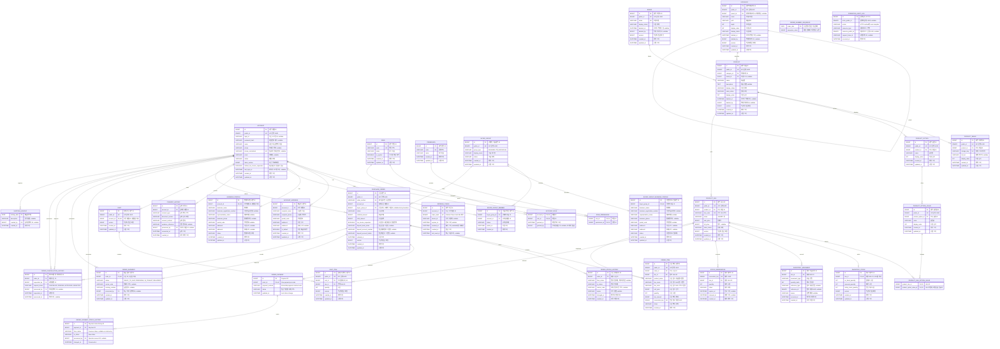

# 데이터베이스 ERD

이 문서는 현재 Flyway V2–V18가 관리하는 테이블과 컬럼을 설명함. 
실제 DDL·제약조건은 `src/main/resources/db/migration`이 기준이며, DB 공통 규칙은 [database.md](database.md)를 참고. 
미구현 테이블은 포함하지 않음. 

## 표기

- `PK`: 기본 키, `FK`: 외래 키, `UK`: unique 제약이 있는 컬럼임. 
  `BINARY` 공개 ID는 UUID를 16바이트로 저장함. 
- 관계도 각 필드 뒤의 따옴표 안 문구가 해당 필드의 설명임. 
  타입은 읽기 편하게 기본 타입명으로 표시하며, 길이·default·check 제약은 migration 파일을 기준으로 확인함. 
- Nullable 필드는 설명에 표시했음. 
  `created_at`은 생성 시각, `updated_at`은 마지막 수정 시각이며 UTC `DATETIME(3)`임. 

## 현재 관계 및 컬럼 설명

```mermaid
erDiagram
    ACCOUNT {
        BIGINT id PK "내부 계정 ID"
        BINARY public_id UK "API 공개 UUID"
        VARCHAR login_id "기존 로그인 ID, nullable"
        VARCHAR password_hash "비밀번호 해시, nullable"
        VARCHAR name "회원 또는 운영자 이름"
        VARCHAR phone "휴대폰 번호, nullable"
        VARCHAR phone_normalized UK "정규화 휴대폰 번호, nullable"
        VARCHAR email "이메일, nullable"
        VARCHAR status "계정 상태"
        BIGINT token_version "토큰 무효화 버전"
        BOOLEAN default_tax_invoice_requested "세금계산서 발행 기본값"
        DATETIME last_login_at "마지막 로그인 시각, nullable"
        DATETIME created_at "생성 시각"
        DATETIME updated_at "수정 시각"
    }
    ROLE {
        BIGINT id PK "내부 역할 ID"
        VARCHAR code UK "역할 코드"
        VARCHAR name "표시 이름"
        BOOLEAN is_system "시스템 역할 여부"
        DATETIME created_at "생성 시각"
        DATETIME updated_at "수정 시각"
    }
    PERMISSION {
        BIGINT id PK "내부 권한 ID"
        VARCHAR code UK "권한 코드"
        VARCHAR name "표시 이름"
        DATETIME created_at "생성 시각"
        DATETIME updated_at "수정 시각"
    }
    ACCOUNT_ROLE {
        BIGINT account_id PK,FK "계정 ID"
        BIGINT role_id PK,FK "역할 ID"
        DATETIME granted_at "역할 부여 시각"
        BIGINT granted_by "부여한 계정 ID, nullable, FK 제약 없음"
    }
    ROLE_PERMISSION {
        BIGINT role_id PK,FK "역할 ID"
        BIGINT permission_id PK,FK "권한 ID"
    }
    REFRESH_TOKEN {
        BIGINT id PK "내부 토큰 ID"
        BIGINT account_id FK "토큰 소유 계정 ID"
        BINARY token_hash UK "Refresh Token SHA-256 해시"
        VARCHAR device_id "기기 식별자, nullable"
        DATETIME expires_at "만료 시각, nullable"
        DATETIME revoked_at "폐기 시각, nullable이면 미폐기"
        DATETIME created_at "발급 시각"
        DATETIME last_used_at "최근 사용 시각, nullable"
    }
    ACCOUNT_ADDRESS {
        BIGINT id PK "배송지 내부 ID"
        BIGINT account_id FK "소유 계정 ID"
        VARCHAR recipient_name "수령인 이름"
        VARCHAR recipient_phone "수령인 연락처"
        VARCHAR postal_code "우편번호"
        VARCHAR address1 "기본 주소"
        VARCHAR address2 "상세 주소, nullable"
        BOOLEAN is_default "기본 배송지 여부"
        DATETIME created_at "생성 시각"
        DATETIME updated_at "수정 시각"
    }
    BUSINESS_PROFILE {
        BIGINT id PK "업체 프로필 내부 ID"
        BIGINT account_id FK,UK "소유 계정 ID, 계정당 하나"
        VARCHAR business_name "업체명"
        VARCHAR business_registration_number "사업자등록번호, nullable"
        VARCHAR representative_name "대표자명, nullable"
        VARCHAR business_phone "업체 연락처, nullable"
        VARCHAR postal_code "우편번호, nullable"
        VARCHAR address1 "기본 주소, nullable"
        VARCHAR address2 "상세 주소, nullable"
        VARCHAR status "업체 프로필 상태"
        DATETIME created_at "생성 시각"
        DATETIME updated_at "수정 시각"
    }
    BUYER_GROUP {
        BIGINT id PK "구매자 그룹 내부 ID"
        BINARY public_id UK "API 공개 UUID"
        VARCHAR group_type "BUSINESS 또는 INDIVIDUAL"
        VARCHAR display_name "그룹 표시명"
        VARCHAR status "그룹 상태"
        DATETIME created_at "생성 시각"
        DATETIME updated_at "수정 시각"
    }
    BUYER_GROUP_MEMBER {
        BIGINT id PK "그룹 구성원 내부 ID"
        BIGINT buyer_group_id FK "구매자 그룹 ID"
        BIGINT account_id FK "구성원 계정 ID"
        VARCHAR status "구성원 상태"
        DATETIME joined_at "가입 시각"
        DATETIME created_at "생성 시각"
    }
    BUYER_GROUP_BUSINESS_PROFILE {
        BIGINT id PK "사업자 프로필 내부 ID"
        BIGINT buyer_group_id FK,UK "사업자 그룹 ID"
        VARCHAR business_name "업체명"
        VARCHAR business_registration_number "사업자등록번호, nullable"
        VARCHAR representative_name "대표자명, nullable"
        VARCHAR business_phone "업체 연락처, nullable"
        VARCHAR postal_code "우편번호, nullable"
        VARCHAR address1 "기본 주소, nullable"
        VARCHAR address2 "상세 주소, nullable"
        VARCHAR status "사업자 프로필 상태"
        DATETIME created_at "생성 시각"
        DATETIME updated_at "수정 시각"
    }
    CONSENT_HISTORY {
        BIGINT id PK "동의 이력 ID"
        BIGINT account_id FK "동의한 계정 ID"
        VARCHAR consent_type "동의 항목 코드"
        VARCHAR document_version "동의 문서 버전"
        VARCHAR consent_method "동의 방식"
        VARCHAR evidence_reference "증빙 참조값, nullable"
        BIGINT processed_by FK "처리자 계정 ID, nullable"
        DATETIME consented_at "동의 시각"
        DATETIME created_at "이력 생성 시각"
    }
    CATEGORY {
        BIGINT id PK "내부 카테고리 ID"
        BINARY public_id UK "API 공개 UUID"
        BIGINT parent_id FK "상위 카테고리 ID, 최상위는 nullable"
        VARCHAR name "카테고리명"
        VARCHAR path "계층 경로"
        INT depth "트리 깊이"
        INT display_order "노출 순서"
        VARCHAR display_status "노출 상태"
        DATETIME deleted_at "소프트 삭제 시각, nullable"
        BIGINT deleted_by "삭제 처리자 ID, nullable"
        BIGINT version "낙관적 잠금 버전"
        DATETIME created_at "생성 시각"
        DATETIME updated_at "수정 시각"
    }
    BRAND {
        BIGINT id PK "내부 브랜드 ID"
        BINARY public_id UK "API 공개 UUID"
        VARCHAR name UK "브랜드명"
        VARCHAR display_status "노출 상태"
        DATETIME deleted_at "소프트 삭제 시각, nullable"
        BIGINT deleted_by "삭제 처리자 ID, nullable"
        BIGINT version "낙관적 잠금 버전"
        DATETIME created_at "생성 시각"
        DATETIME updated_at "수정 시각"
    }
    PRODUCT {
        BIGINT id PK "내부 상품 ID"
        BINARY public_id UK "API 공개 UUID"
        BIGINT category_id FK "카테고리 ID"
        BIGINT brand_id FK "브랜드 ID, nullable"
        VARCHAR name "상품명"
        TEXT description "상품 설명, nullable"
        VARCHAR display_status "노출 상태"
        VARCHAR sales_status "판매 상태"
        INT display_order "노출 순서"
        DATETIME deleted_at "소프트 삭제 시각, nullable"
        BIGINT deleted_by "삭제 처리자 ID, nullable"
        BIGINT version "낙관적 잠금 버전"
        DATETIME created_at "생성 시각"
        DATETIME updated_at "수정 시각"
    }
    PRODUCT_SKU {
        BIGINT id PK "내부 SKU ID"
        BINARY public_id UK "API 공개 UUID"
        BIGINT product_id FK "소속 상품 ID"
        VARCHAR sku_code UK "고유 SKU 코드"
        VARCHAR name "SKU 표시명"
        BIGINT sale_price "판매가"
        BIGINT list_price "정가, nullable"
        VARCHAR sales_status "판매 상태"
        BIGINT version "낙관적 잠금 버전"
        DATETIME created_at "생성 시각"
        DATETIME updated_at "수정 시각"
    }
    PRODUCT_IMAGE {
        BIGINT id PK "내부 이미지 ID"
        BINARY public_id UK "API 공개 UUID"
        BIGINT product_id FK "소속 상품 ID"
        VARCHAR storage_key UK "객체 스토리지 키"
        VARCHAR alt_text "대체 텍스트, nullable"
        INT display_order "노출 순서"
        DATETIME created_at "생성 시각"
        DATETIME updated_at "수정 시각"
    }
    PRODUCT_OPTION {
        BIGINT id PK "내부 옵션 ID"
        BINARY public_id UK "API 공개 UUID"
        BIGINT product_id FK "소속 상품 ID"
        VARCHAR name "옵션명"
        INT display_order "노출 순서"
        DATETIME created_at "생성 시각"
        DATETIME updated_at "수정 시각"
    }
    PRODUCT_OPTION_VALUE {
        BIGINT id PK "내부 옵션값 ID"
        BINARY public_id UK "API 공개 UUID"
        BIGINT product_option_id FK "소속 옵션 ID"
        VARCHAR value "옵션값"
        INT display_order "노출 순서"
        DATETIME created_at "생성 시각"
        DATETIME updated_at "수정 시각"
    }
    PRODUCT_SKU_OPTION_VALUE {
        BIGINT product_sku_id PK,FK "SKU ID"
        BIGINT product_option_value_id PK,FK "SKU 조합에 포함된 옵션값 ID"
    }
    INVENTORY_STOCK {
        BIGINT id PK "재고 레코드 ID"
        BIGINT sku_id FK,UK "대상 SKU ID, SKU당 하나"
        INT on_hand_quantity "실재고 수량"
        INT reserved_quantity "예약 수량"
        INT safety_stock_quantity "안전 재고 수량"
        BIGINT version "낙관적 잠금 버전"
        DATETIME created_at "생성 시각"
        DATETIME updated_at "수정 시각"
    }
    INVENTORY_MOVEMENT {
        BIGINT id PK "재고 이동 이력 ID"
        BIGINT sku_id FK "대상 SKU ID"
        VARCHAR movement_type "이동 유형"
        INT quantity_delta "재고 증감량"
        VARCHAR reference_type "참조 대상 유형, nullable"
        BINARY reference_id "참조 대상 UUID, nullable"
        VARCHAR memo "운영 메모, nullable"
        DATETIME occurred_at "업무상 발생 시각"
        DATETIME created_at "이력 저장 시각"
    }
    STOCK_RESERVATION {
        BIGINT id PK "예약 레코드 ID"
        BINARY reservation_key UK "예약 UUID"
        BIGINT sku_id FK "대상 SKU ID"
        INT quantity "예약 수량"
        VARCHAR status "예약 상태"
        DATETIME expires_at "만료 시각, nullable"
        DATETIME released_at "해제 시각, nullable"
        DATETIME created_at "예약 생성 시각"
    }
    CART {
        BIGINT id PK "장바구니 내부 ID"
        BINARY public_id UK "API 공개 UUID"
        BIGINT account_id FK,UK "소유 계정 ID, 계정당 하나"
        BIGINT version "낙관적 잠금 버전"
        DATETIME created_at "생성 시각"
        DATETIME updated_at "수정 시각"
    }
    CART_ITEM {
        BIGINT id PK "장바구니 항목 내부 ID"
        BINARY public_id UK "API 공개 UUID"
        BIGINT cart_id FK "소속 장바구니 ID"
        BIGINT sku_id FK "선택 SKU ID"
        INT quantity "수량"
        BIGINT version "낙관적 잠금 버전"
        DATETIME created_at "생성 시각"
        DATETIME updated_at "수정 시각"
    }
    PURCHASE_ORDER {
        BIGINT id PK "주문 내부 ID"
        BINARY public_id UK "API 공개 UUID"
        VARCHAR order_number UK "표시용 고유 주문번호"
        BIGINT account_id FK "실제 주문 계정 ID"
        BIGINT buyer_group_id FK "주문 귀속 구매자 그룹 ID, nullable during transition"
        VARCHAR status "주문 상태"
        BIGINT subtotal_amount "상품 소계"
        BIGINT total_amount "주문 총액"
        BOOLEAN tax_invoice_requested "주문 당시 세금계산서 발행 선택"
        VARCHAR deposit_bank_name "입금 은행 스냅샷, nullable"
        VARCHAR deposit_account_number "입금 계좌번호 스냅샷, nullable"
        VARCHAR deposit_account_holder "입금 예금주 스냅샷, nullable"
        DATETIME ordered_at "주문 시각"
        BIGINT version "낙관적 잠금 버전"
        DATETIME created_at "생성 시각"
        DATETIME updated_at "수정 시각"
    }
    ORDER_NUMBER_SEQUENCE {
        DATE order_date PK "주문번호 발급 기준 날짜"
        BIGINT sequence_value "해당 날짜 마지막 발급 순번"
    }
    ORDER_ITEM {
        BIGINT id PK "주문 항목 내부 ID"
        BINARY public_id UK "API 공개 UUID"
        BIGINT order_id FK "소속 주문 ID"
        BIGINT sku_id FK "참조 SKU ID"
        VARCHAR product_name "주문 당시 상품명 스냅샷"
        VARCHAR sku_name "주문 당시 SKU명 스냅샷"
        VARCHAR sku_code "주문 당시 SKU 코드 스냅샷"
        BIGINT unit_price "주문 당시 단가"
        INT quantity "주문 수량"
        BIGINT line_amount "주문 항목 합계"
        BINARY reservation_key UK "연결 재고 예약 UUID"
        VARCHAR status "주문 항목 상태"
        DATETIME created_at "생성 시각"
    }
    ORDER_STATUS_HISTORY {
        BIGINT id PK "주문 상태 이력 ID"
        BIGINT order_id FK "대상 주문 ID"
        VARCHAR from_status "변경 전 상태, 최초 이력은 nullable"
        VARCHAR to_status "변경 후 상태"
        VARCHAR reason_code "상태 변경 사유 코드, nullable"
        VARCHAR memo "추가 설명, nullable"
        DATETIME changed_at "업무상 변경 시각"
        DATETIME created_at "이력 저장 시각"
    }
    ORDER_PAYMENT {
        BIGINT id PK "Payment ID"
        BIGINT order_id FK,UK "One payment per order"
        VARCHAR payment_method "Extensible payment method code"
        VARCHAR status "입금 및 환불 상태 코드"
        DATETIME updated_at "Last status change"
    }
    ORDER_PAYMENT_STATUS_HISTORY {
        BIGINT id PK "Payment status history ID"
        BIGINT payment_id FK "Payment ID"
        VARCHAR from_status "Previous status, nullable on initial entry"
        VARCHAR to_status "New status"
        BIGINT processed_by FK "Operator account ID, nullable"
        DATETIME changed_at "Processed at"
    }
    ORDER_SHIPMENT {
        BIGINT id PK "배송 정보 내부 ID"
        BIGINT order_id FK,UK "주문 ID, 주문당 하나"
        VARCHAR status "READY_TO_SHIP, PREPARING, IN_TRANSIT, DELIVERED"
        VARCHAR carrier_code "택배사 코드, nullable"
        VARCHAR tracking_number "송장번호, nullable"
        BIGINT processed_by FK "최근 처리 운영자 ID, nullable"
        DATETIME created_at "생성 시각"
        DATETIME updated_at "수정 시각"
    }
    ORDER_CANCELLATION_HISTORY {
        BIGINT id PK "취소 요청 및 처리 이력 ID"
        BIGINT order_id FK "대상 주문 ID"
        BIGINT requested_by FK "요청 계정 ID"
        VARCHAR request_status "CANCELLED, PENDING, APPROVED, REJECTED"
        BIGINT processed_by FK "처리 운영자 ID, nullable"
        DATETIME requested_at "요청 시각"
        DATETIME processed_at "처리 시각, nullable"
    }
    SHIPPING_HOLIDAY {
        DATE holiday_date PK "배송 휴무일"
        VARCHAR description "휴무 설명, nullable"
        BIGINT created_by FK "등록 운영자 ID, nullable"
        DATETIME created_at "생성 시각"
    }
    OPERATION_AUDIT_LOG {
        BIGINT id PK "운영 감사 로그 ID"
        BINARY actor_public_id "운영자 공개 UUID, nullable"
        VARCHAR action "HTTP method와 route template"
        VARCHAR resource_type "대상 리소스 유형"
        BINARY resource_public_id "대상 리소스 공개 UUID, nullable"
        VARCHAR request_trace_id "요청 추적 ID, nullable"
        DATETIME occurred_at "변경 시각"
    }

    ACCOUNT ||--o{ ACCOUNT_ROLE : has
    ROLE ||--o{ ACCOUNT_ROLE : assigned
    ROLE ||--o{ ROLE_PERMISSION : grants
    PERMISSION ||--o{ ROLE_PERMISSION : includes
    ACCOUNT ||--o{ REFRESH_TOKEN : owns
    ACCOUNT ||--o{ ACCOUNT_ADDRESS : has
    ACCOUNT ||--o| BUSINESS_PROFILE : has
    ACCOUNT ||--o{ BUYER_GROUP_MEMBER : joins
    BUYER_GROUP ||--o{ BUYER_GROUP_MEMBER : includes
    BUYER_GROUP ||--o| BUYER_GROUP_BUSINESS_PROFILE : describes
    ACCOUNT ||--o{ CONSENT_HISTORY : records
    CATEGORY ||--o{ CATEGORY : parent
    CATEGORY ||--o{ PRODUCT : classifies
    BRAND ||--o{ PRODUCT : labels
    PRODUCT ||--o{ PRODUCT_IMAGE : displays
    PRODUCT ||--o{ PRODUCT_OPTION : defines
    PRODUCT_OPTION ||--o{ PRODUCT_OPTION_VALUE : offers
    PRODUCT ||--o{ PRODUCT_SKU : sells
    PRODUCT_SKU ||--o{ PRODUCT_SKU_OPTION_VALUE : selects
    PRODUCT_OPTION_VALUE ||--o{ PRODUCT_SKU_OPTION_VALUE : belongs
    PRODUCT_SKU ||--o| INVENTORY_STOCK : tracks
    PRODUCT_SKU ||--o{ INVENTORY_MOVEMENT : records
    PRODUCT_SKU ||--o{ STOCK_RESERVATION : reserves
    ACCOUNT ||--o| CART : owns
    CART ||--o{ CART_ITEM : contains
    PRODUCT_SKU ||--o{ CART_ITEM : selected
    ACCOUNT ||--o{ PURCHASE_ORDER : places
    BUYER_GROUP ||--o{ PURCHASE_ORDER : owns
    PURCHASE_ORDER ||--|{ ORDER_ITEM : contains
    PRODUCT_SKU ||--o{ ORDER_ITEM : snapshots
    PURCHASE_ORDER ||--o{ ORDER_STATUS_HISTORY : tracks
    PURCHASE_ORDER ||--o| ORDER_PAYMENT : payment
    ORDER_PAYMENT ||--o{ ORDER_PAYMENT_STATUS_HISTORY : tracks
    ACCOUNT ||--o{ ORDER_PAYMENT_STATUS_HISTORY : processes
    PURCHASE_ORDER ||--o| ORDER_SHIPMENT : shipment
    ACCOUNT ||--o{ ORDER_SHIPMENT : processes
    PURCHASE_ORDER ||--o{ ORDER_CANCELLATION_HISTORY : records
    ACCOUNT ||--o{ ORDER_CANCELLATION_HISTORY : requests
    ACCOUNT ||--o{ ORDER_CANCELLATION_HISTORY : processes
    ACCOUNT ||--o{ SHIPPING_HOLIDAY : registers
```

## 관계 및 유의사항

- `account_role`과 `role_permission`은 각각 계정-역할, 역할-권한 다대다 연결임. 
  `account_role.granted_by`는 migration에서 FK 제약이 없음. 
- `operation_audit_log`의 운영자·대상 공개 UUID는 삭제·정책 변경과 무관하게 이력에서 식별 가능하도록 FK 없이 보관. 
  이름과 변경 전·후 값은 저장하지 않으며 V11 감사 정책에 따라 730일 후 삭제. 
- `refresh_token.expires_at`은 V6 이후 nullable임. 
  `account.phone_normalized`는 V6에서 추가된 unique 정규화 번호임. 
- 구매자 그룹은 법적 사업자번호와 독립적인 주문 소유 범위임. 
  `buyer_group_member`는 같은 계정의 여러 그룹 참여를 허용하고 `(buyer_group_id, account_id)` 조합만 unique임. 
  `buyer_group_business_profile.business_registration_number`는 nullable이며 unique가 아님. 
- `purchase_order.account_id`는 실제 주문한 계정, `purchase_order.buyer_group_id`는 주문의 그룹 소유 범위임. 
  V18은 기존 계정마다 그룹 하나를 생성해 기존 주문을 backfill했으며, 신규 주문 저장은 애플리케이션 연동 전까지 `buyer_group_id`가 nullable임. 
  기존 `business_profile`은 유지하면서 그룹 프로필로 데이터를 복사함. 
- 카테고리는 자기 참조 트리임. 
  상품은 카테고리를 반드시 가지며 브랜드는 선택임. 
  상품의 이미지·옵션·SKU는 상품에 속함. 
- 장바구니는 계정당 하나이며 한 장바구니 안에서 같은 SKU 항목은 하나임. 
  주문 항목은 주문 당시 상품명·SKU명·코드·단가를 보존함. 
- `order_item.reservation_key`와 `stock_reservation.reservation_key`는 같은 예약 UUID로 주문 항목과 재고 예약을 대응. 
  둘 사이에는 DB FK가 없음. 
- `order_number_sequence`는 주문번호 순번 관리용 독립 테이블임. 

## 마이그레이션별 테이블

| Migration | 테이블 / 변경 |
| --- | --- |
| V2 | `account`, `role`, `permission`, `account_role`, `role_permission`, `refresh_token`, `account_address` |
| V3 | `category`, `brand`, `product`, `product_sku` |
| V4 | 로그인 필드 nullable 변경, `business_profile`, `consent_history` |
| V5 | `product_image`, `product_option`, `product_option_value`, `product_sku_option_value` |
| V6 | `account.phone_normalized`, Refresh Token nullable 만료 시각·최근 사용 시각 |
| V7 | `inventory_stock`, `inventory_movement`, `stock_reservation` |
| V8 | `cart`, `cart_item` |
| V9 | `purchase_order`, `order_number_sequence`, `order_item`, `order_status_history` |
| V10 | 시스템 role-permission 기본 매핑 |
| V11 | `operation_audit_log`, `ADMIN_AUDIT_READ` permission 및 `SUPER_ADMIN` role mapping |
| V12 | `order_payment`, `order_payment_status_history`, 기존 주문 결제 상태 초기화 |
| V13 | 계정 세금계산서 발행 기본값, 주문별 발행 여부와 입금 계좌 스냅샷 |
| V14 | `order_shipment`, 기존 주문 배송 준비 상태 초기화 |
| V15 | 결제 이슈 검토 상태 제약 추가 |
| V16 | 공휴일 일정·취소 이력 테이블, 환불 상태 제약 추가 |
| V17 | 배송 상태 `DELIVERED` 허용 |
| V18 | 구매자 그룹·구성원·그룹 사업자 프로필 생성, 주문 그룹 귀속 및 기존 데이터 backfill |

새 스키마 변경은 다음 Flyway 버전으로 추가함. 
적용된 version migration은 수정하지 않음. 
부분 취소·SMS 본인 확인·파일·알림 테이블은 아직 없으므로 이 ERD에 포함하지 않았음. 
