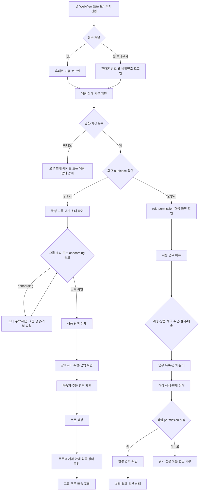

# 서비스 문서

이 문서는 사용자와 운영자 업무 흐름을 나누어 해당 도메인 문서의 기준을 찾기 위한 목차. 
전체 채널·계정·그룹·화면 권한 흐름은 작업 공간의 [SERVICE_FLOW.md](../../../SERVICE_FLOW.md)를 기준으로 함. 
도메인 문서는 현재 구현과 미구현 설계안을 명확히 구분하며, 계획 endpoint·table을 운영 중인 계약처럼 기록하지 않음. 
서비스 개발·수정은 해당 문서 Mermaid 흐름과 수용 기준을 먼저 갱신하고 코드가 그 흐름을 따르도록 진행. 

## 반응형 화면 사용 흐름 설계

React 화면은 앱 WebView와 브라우저에서 같은 구매 업무 흐름을 제공하며, Flutter는 WebView 수명 주기와 필요한 네이티브 기능만 담당. 
핵심 구매 흐름은 `로그인 → 그룹 확인·onboarding → 상품 탐색 → 장바구니 → 주문·배송지 확인 → 계좌 안내 → 주문·배송 조회` 순서. 
운영 흐름은 `로그인·권한 확인 → 허용된 업무 목록 → 대상 검색·목록 → 상세 확인 → 허용된 변경 → 결과 확인` 순서. 
화면 노출은 향후 API access context와 permission에 연결하는 설계 기준이며, 실제 화면별 context endpoint는 미구현. 모든 작업 API는 권한·그룹 범위를 별도로 다시 확인. 

### 화면 크기별 배치 기준

- 좁은 화면은 한 열로 구성하고 핵심 정보를 위에서 아래로 읽을 수 있게 배치. 구매 진행 버튼은 손가락 조작과 WebView 안전 영역을 고려해 하단에서 쉽게 찾을 수 있게 유지. 
- 넓은 모바일·태블릿은 상품 목록과 상세, 업무 목록과 상세를 필요에 따라 나란히 배치하되, 구매 단계와 상태 전이 순서는 바꾸지 않음. 
- 데스크톱 운영 화면은 업무 탐색 메뉴와 목록·상세를 함께 보여줄 수 있으며, 표가 좁아지는 화면에서는 핵심 열을 우선하고 나머지는 상세로 제공. 
- 화면 폭은 고정 기기명이 아니라 실제 콘텐츠가 읽히고 조작 가능한지에 따라 열 수와 배치를 조정. 가로 스크롤은 코드·표처럼 불가피한 콘텐츠에만 제한적으로 사용. 
- 글자 확대와 브라우저 배율 변경에서도 버튼·오류 안내·주문 금액·다음 단계가 잘리지 않도록 함. 입력 오류는 필드 가까이에 원인과 수정 방법을 표시하고 입력값을 보존. 
- 구매 확인 화면에는 배송지 snapshot 대상, 주문 항목·수량·금액, 계좌 안내에 필요한 정보를 모아 보여주고, 제출 후 주문 결과와 다음 행동을 명확히 표시. 
- 운영 변경은 대상·현재 값·변경 값을 확인한 뒤 제출하며, 성공·거부·세션 만료 결과에 따라 목록과 상세 상태를 다시 읽음. 허용되지 않은 화면과 action은 메뉴에서 감추거나 읽기 전용으로 표시해도 API 인가를 대체하지 않음. 

이 기준은 화면 흐름·반응형 배치 설계이며 구체적인 route, breakpoint, 화면별 문구 및 React 구현은 Web 저장소에서 관리. 

## 사용자 흐름

| 업무 | 문서 | 현재 범위 |
| --- | --- | --- |
| 로그인·세션 | [authentication.md](authentication.md) | 휴대폰 식별, Access/Refresh Token, 계정 상태 검사 |
| 개인 계정·구매자 그룹 | [account.md](account.md) | 프로필, 그룹 onboarding·대표자/구성원 관리, 그룹 공용 배송지 |
| 상품 탐색 | [catalog.md](catalog.md) | 공개 카테고리·상품 조회 |
| 장바구니 | [cart.md](cart.md) | SKU 추가·수정·삭제·조회 |
| 주문·배송 조회 | [order.md](order.md) | 그룹 귀속 주문·배송정보 조회·전체 주문 취소 |
| 계좌이체 안내 | [payment.md](payment.md) | 주문별 계좌 snapshot·입금 상태 확인 결과 |

## 운영자 흐름

| 업무 | 문서 | 현재 범위 |
| --- | --- | --- |
| 계정·role·그룹 운영 | [operation.md](operation.md) | 계정·동의·승인, role 관리, 그룹 연결 및 대표자 변경 |
| 카탈로그 운영 | [operation.md](operation.md) | 카테고리·브랜드·상품·SKU·이미지 metadata 관리 |
| 판매 Organization 카탈로그 | [catalog.md](catalog.md) | 공용 SKU를 선택한 판매 Organization별 채널 오퍼 관리 |
| 재고 운영 | [inventory.md](inventory.md) | 운영자·판매 Organization별 재고 조정·변동 조회, 주문 예약·해제·확정 |
| 주문·배송 운영 | [order.md](order.md), [operation.md](operation.md) | 입금·취소·환불 상태, 출고 준비·송장·배송완료 처리 |
| 운영 감사 | [operation.md](operation.md) | 변경 감사 이력 조회·보존 관리 |

## 미구현 서비스

| 업무 | 문서 | 상태 |
| --- | --- | --- |
| 파일 업로드·민감 증빙 조회 | [file.md](file.md) | 구현 전. 저장 장비·접근 정책 결정 필요 |
| 주문·결제·배송 알림 | [notification.md](notification.md) | 업무 이벤트 outbox, 기기 token 관리 및 FCM/APNs 발송 integration 구현 |

화면별 권한 설정, 운영 업무 role 및 영업 인센티브의 설계안·미구현 범위는 [operation.md](operation.md), 대표자·일반구성원 판정은 [account.md](account.md)를 기준으로 함. 
