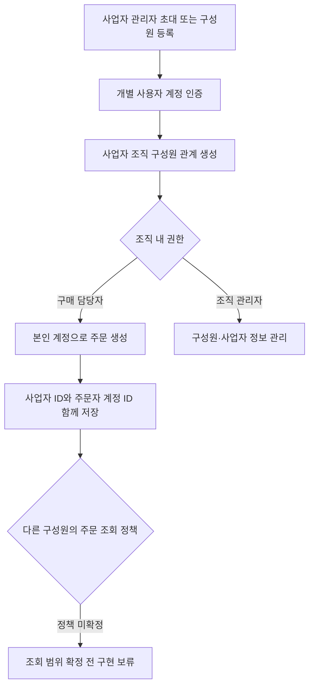

# 계정

## 구현 상태

사용자 프로필·주소 조회/수정 API는 아직 구현되지 않았음. 
현재 계정 관련 endpoint는 관리자 운영 범위이며 [operation.md](operation.md)에 정리했음. 
운영자 계정 생성·동의·프로필·승인 및 role 변경 알고리즘 흐름도는 [operation.md](operation.md)의 관리자 작업 흐름을 기준으로 함. 

향후 사용자 계정 기능을 추가할 때 본인 계정 확인은 인증 subject를 기준으로 하고, 주소를 수정해도 기존 주문의 배송 스냅샷은 바뀌지 않도록 함. 

## 사업자와 구매자 계정 확장 정책

한 사업자에 여러 직원 계정을 연결해 각 직원이 독립적으로 주문을 생성할 수 있도록 하는 정책. 
사람 계정과 사업자 조직을 분리하고, 조직 구성원 관계로 여러 계정을 한 사업자에 연결하는 방향. 
주문은 구매 사업자와 실제 주문한 직원 계정을 함께 기록. 
사업자 조직·구성원·복수 구매자 흐름은 현재 구현되지 않음. 기존 `business_profile`은 계정당 하나인 구조로 확장 필요. 
직원이 다른 직원의 주문을 볼 수 있는 범위, 조직 관리자와 구매 담당자 권한은 정책 미확정. 

사업자 정보와 조직 기본 배송·세금계산서 정보는 개인 연락처·인증 정보와 분리하는 방향. 
장바구니는 직원별로 유지하고 주문 생성 시 사업자 조직을 선택·검증하는 흐름 권장. 
