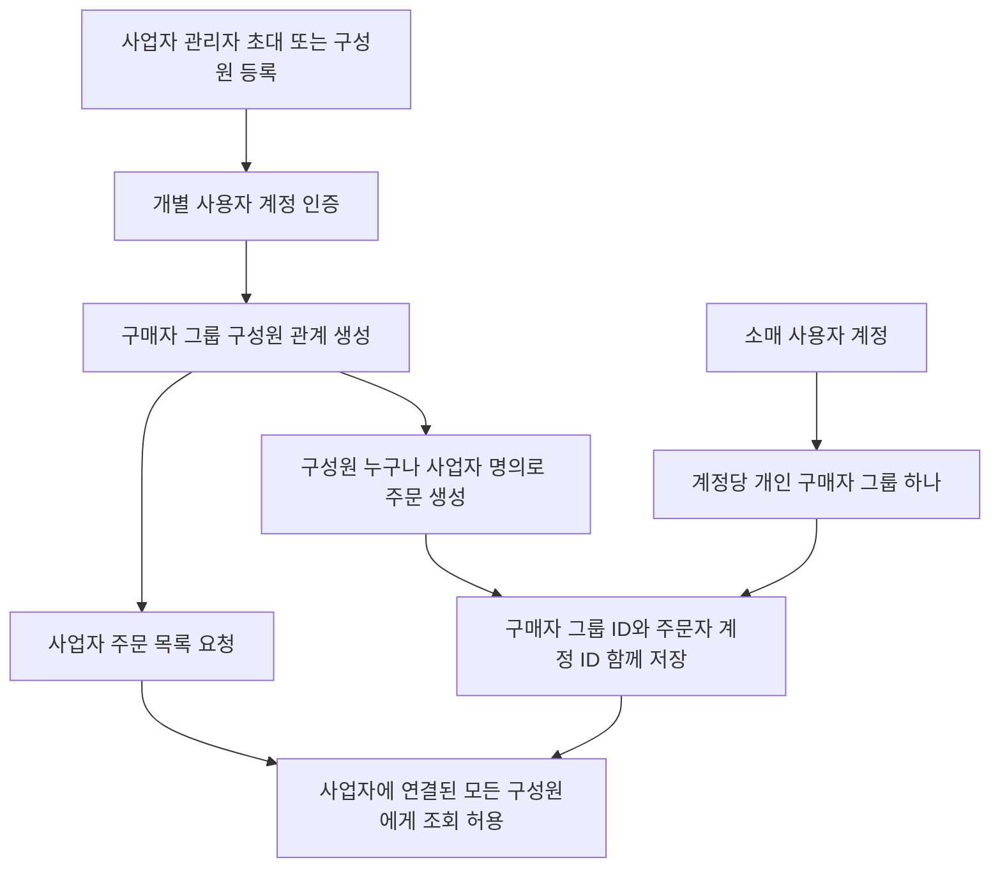
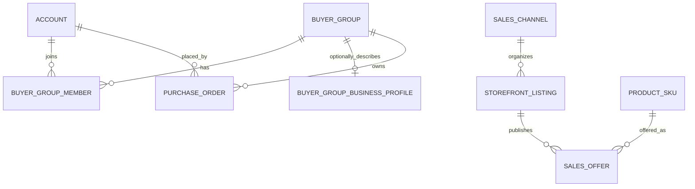

# 계정

## 구현 상태

사용자 프로필·주소 조회/수정 API는 아직 구현되지 않았음. 
현재 계정 관련 endpoint는 관리자 운영 범위이며 [operation.md](operation.md)에 정리했음. 
운영자 계정 생성·동의·프로필·승인 및 role 변경 알고리즘 흐름도는 [operation.md](operation.md)의 관리자 작업 흐름을 기준으로 함. 

향후 사용자 계정 기능을 추가할 때 본인 계정 확인은 인증 subject를 기준으로 하고, 주소를 수정해도 기존 주문의 배송 스냅샷은 바뀌지 않도록 함. 

## 사업자와 구매자 계정 확장 정책

한 사업자에 여러 직원 계정을 연결하고 각 직원이 생성한 주문도 사업자 주문으로 귀속하는 정책. 
사람 계정과 구매자 그룹을 분리하고, 그룹 구성원 관계로 여러 계정을 한 구매 주체에 연결. 
사업자에 연결된 모든 구성원은 다른 구성원이 생성한 주문을 포함해 사업자의 전체 주문 내역을 조회 가능. 
주문에는 구매자 그룹과 실제 주문한 계정을 함께 기록해 주문 주체를 보존. 
소매는 1인 계정당 개인 구매자 그룹 하나를 기본으로 사용. 개인 구매자 그룹도 도매 채널을 이용할 수 있어 구매 유형과 채널은 별도 판정. 
구매자 그룹·구성원·복수 구매자 흐름은 현재 미구현. 기존 `business_profile`은 계정당 하나인 구조로 이전 필요. 
조직 구성원 등록·초대 및 사업자 공통 배송지·세금계산서 정보의 관리 권한은 미확정. 

사업자 정보와 그룹 단위 배송·세금계산서 정보는 개인 연락처·인증 정보와 분리하는 방향. 
장바구니는 계정별로 유지하고 주문 생성 시 인증 계정이 속한 구매자 그룹으로 주문 귀속. 

## 구매자 그룹 DB 설계안

구매 주체는 법적 사업자번호가 아니라 주문·조회 권한의 경계인 `buyer_group`으로 모델링. 
사업자번호가 없는 업체는 `BUSINESS` 그룹과 선택적 사업자 프로필로 관리하고, 사업자번호는 nullable 속성으로 보관. 
개인 대량구매자는 `INDIVIDUAL` 그룹으로 관리. 도매·소매는 구매자 유형이 아니라 별도 판매 채널로 결정. 
소매 구매자는 개인 계정 하나에 개인 그룹 하나를 연결하고, 개인 도매 구매자는 같은 개인 그룹에서 도매 채널을 이용. 
구매자 그룹·구성원·사업자 프로필 테이블과 기존 주문의 그룹 귀속은 V18 migration에 반영됨. 그룹 초대·구성원 관리 및 그룹 단위 주문 조회 기능은 미구현. 

| 테이블 | 주요 데이터 | 기준 |
| --- | --- | --- |
| `buyer_group` | `id`, `public_id`, `group_type`, `display_name`, `status` | 주문 귀속·공유 조회 단위. `BUSINESS` 또는 `INDIVIDUAL` |
| `buyer_group_member` | `buyer_group_id`, `account_id`, `status`, `joined_at` | 개인 계정과 구매 그룹 연결. 사업자 그룹은 구성원 다수 허용 |
| `buyer_group_business_profile` | `buyer_group_id`, 업체명, 사업자번호 nullable, 검증 상태, 대표자·연락처 | 사업자 추가 정보. 개인 그룹에는 행이 없어도 됨 |
| `purchase_order` | `buyer_group_id`, `placed_by_account_id` | 사업자/개인 그룹 소유권과 실제 주문자 구분 |
| `storefront_listing` | `sales_channel`, 채널 카테고리·전시 상태 | 도매/소매별 전시를 공용 상품과 분리 |
| `sales_offer` | `storefront_listing_id`, `product_sku_id`, 판매 단위·가격·상태 | 채널별 판매 조건을 구매자 유형 및 공용 SKU와 분리 |

사업자번호는 그룹 식별자나 필수 FK로 사용하지 않음. 제공·검증 상태를 별도 관리하고 임의로 그룹을 합치는 근거로 사용하지 않음. 
구성원 주문 목록은 인증 계정의 유효한 그룹 소속을 확인한 뒤 `buyer_group_id`로 조회. 전체 전화번호는 공유하지 않고 주문자 계정의 이름과 마스킹된 휴대폰 끝자리만 표시. 
상품 채널 접근 정책은 사업자번호 보유 여부가 아닌 별도 판매 권한·오퍼 정책으로 판정. 구매자 그룹 유형과 판매 채널을 직접 연결하지 않음. 
기존 `business_profile.account_id` 일대일 구조는 그룹 프로필로 이전 필요. 기존 주문은 주문 계정의 그룹으로 backfill하되 검증되지 않은 사업자번호만으로 그룹 자동 병합 금지. 
