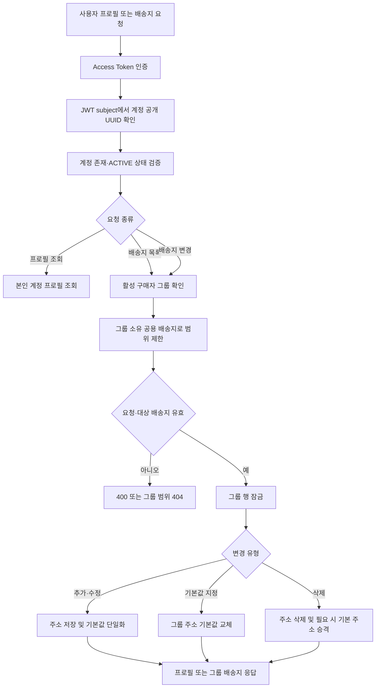

# 계정

## 구현 상태

사용자 프로필은 인증 subject에서 확인한 활성 계정 기준으로 조회. 
배송지는 계정이 아니라 활성 구매자 그룹 소유. 그룹 구성원은 공용 배송지를 모두 조회·추가·수정·삭제·기본값 지정 가능. 
첫 공용 배송지는 자동 기본 배송지로 지정. 기본 배송지를 삭제하면 남은 주소 중 가장 오래된 주소를 기본값으로 승격. 
주문 생성 시 현재 그룹 공용 주소를 선택하고 수령 정보를 주문에 snapshot으로 저장. 이후 주소 변경·삭제는 기존 주문 정보에 영향을 주지 않음. 
기존 계정별 배송지는 V20에서 현재 계정의 구매자 그룹 공용 주소로 이관. 한 그룹에 여러 기본 배송지가 있으면 기존 기본 주소 중 하나만 승격. 
구성원 초대·그룹별 권한 차등과 세금계산서 정보 공유 정책은 별도 미구현 범위. 

## 사용자 계정·공용 배송지 흐름

### Endpoint

- `GET /api/account/profile`
- `GET /api/account/addresses`
- `POST /api/account/addresses`
- `PUT /api/account/addresses/{addressId}`
- `PUT /api/account/addresses/{addressId}/default`
- `DELETE /api/account/addresses/{addressId}`

모든 endpoint는 Access Token의 subject가 가리키는 활성 계정을 사용. 계정 ID를 요청에서 받지 않음. 
배송지 목록·수정 범위는 인증 계정이 속한 활성 구매자 그룹으로 제한. 
주문 생성은 `shippingAddressId`를 필수 입력으로 받고 주문 요청의 구매자 그룹 배송지인지 확인. 

운영자 계정 생성·동의·프로필·승인 및 role 변경 흐름은 [operation.md](operation.md)를 기준으로 함. 

## 구매자 그룹과 계정 관계

구매자 그룹은 `BUSINESS` 또는 `INDIVIDUAL` 유형이며 사업자번호 보유 여부와 별개로 주문·공용 배송지의 공유 경계를 형성. 
그룹은 여러 계정을 구성원으로 가질 수 있고, 계정은 한 번에 하나의 활성 그룹에만 소속. 
도매·소매는 그룹 유형이 아니라 판매 채널 정책으로 판정. 사업자번호 없는 업체와 개인 대량구매자도 그룹을 이용 가능. 
운영자는 계정을 사업자 그룹에 명시적으로 연결하며 사업자번호만으로 그룹을 자동 병합하지 않음. 
구성원 초대·가입 요청·역할과 그룹 프로필 관리 흐름은 이 문서의 단일 기준. 주문 소유권, 실제 주문자와 주문 조회 범위는 [주문 문서](order.md)를 기준으로 함. 
현재 DB 테이블과 관계는 [database-erd.md](../database-erd.md)를 기준으로 함. 
