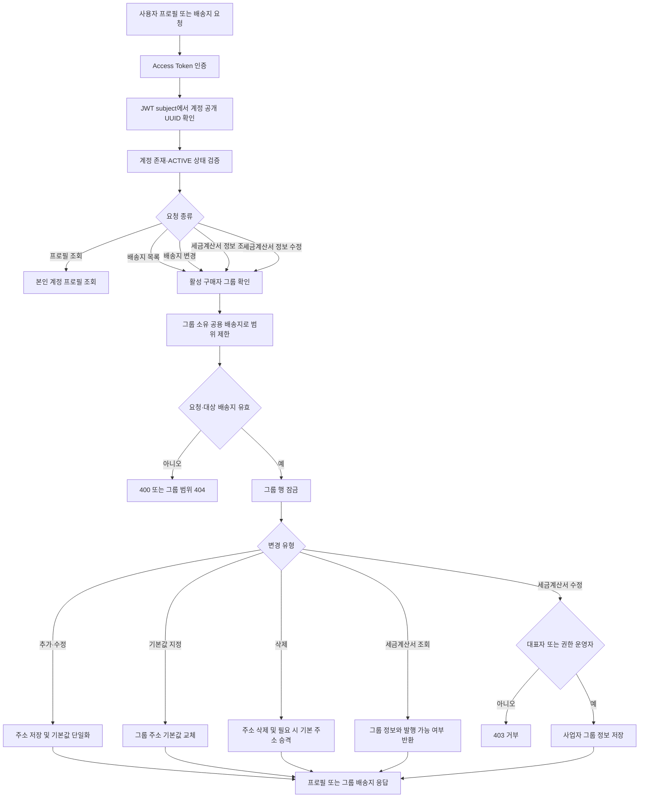
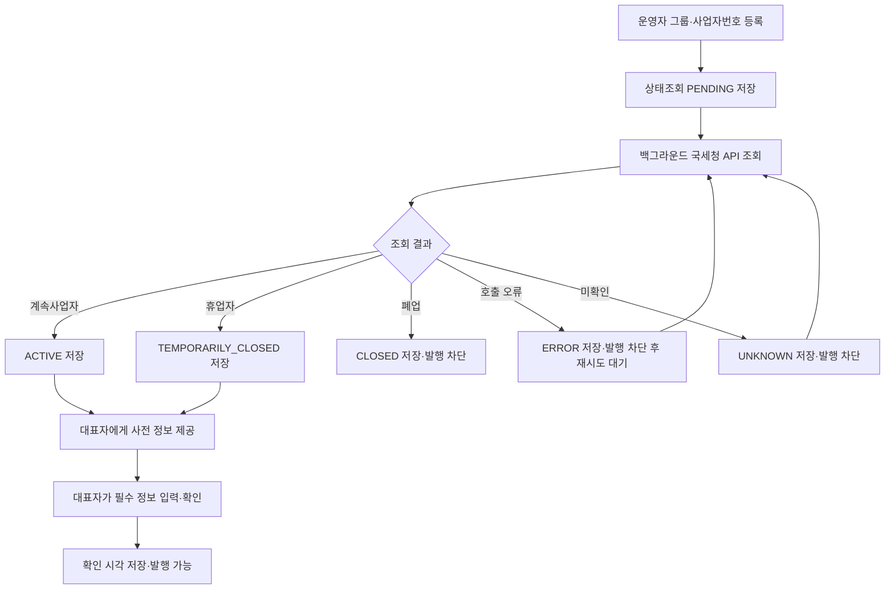
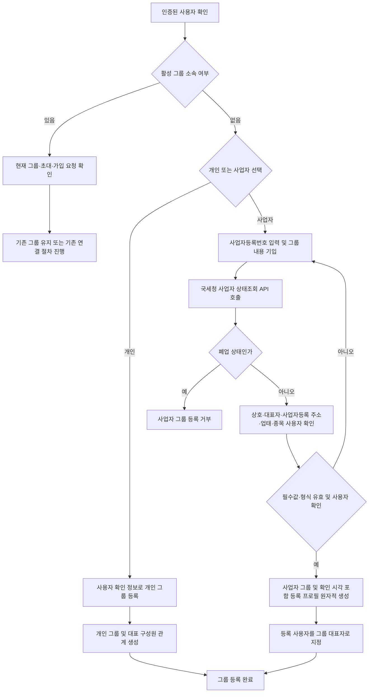
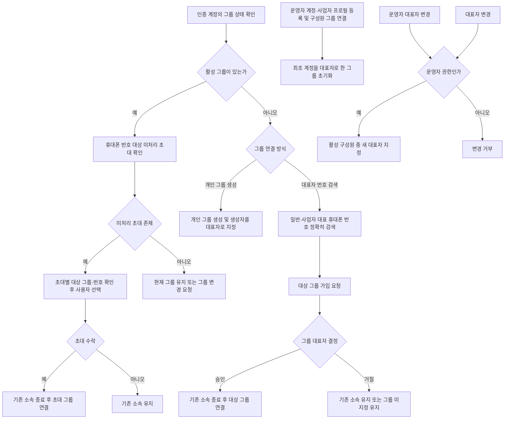

# 계정

## 구현 상태

사용자 프로필은 인증 subject에서 확인한 활성 계정 기준으로 조회. 
배송지는 계정이 아니라 활성 구매자 그룹 소유. 그룹 구성원은 공용 배송지를 모두 조회·추가·수정·삭제·기본값 지정 가능. 
첫 공용 배송지는 자동 기본 배송지로 지정. 기본 배송지를 삭제하면 남은 주소 중 가장 오래된 주소를 기본값으로 승격. 
주문 생성 시 현재 그룹 공용 주소를 선택하고 수령 정보를 주문에 snapshot으로 저장. 이후 주소 변경·삭제는 기존 주문 정보에 영향을 주지 않음. 
기존 계정별 배송지는 V20에서 현재 계정의 구매자 그룹 공용 주소로 이관. 한 그룹에 여러 기본 배송지가 있으면 기존 기본 주소 중 하나만 승격. 
대표자는 전화번호 초대와 가입 요청 처리를 수행. 대표자 지정·변경은 운영자 권한으로 제한. 
최초 가입 계정은 그룹 onboarding 조회에서 현재 그룹과 전화번호가 일치하는 대기 초대를 확인하고, 초대 수락 후에만 그룹에 연결. 
그룹이 없는 계정은 개인 그룹을 만들거나 휴대폰 번호로 그룹을 찾아 가입 요청 가능. 그룹 이동 전 주문의 귀속은 유지. 
공급받는자 세금계산서 정보는 `buyer_group_business_profile`을 단일 원본으로 사용하며, 사업자등록번호·상호·성명·사업자주소·업태·종목은 필수. 이메일은 선택이며 그룹 구성원이 공유. 
활성 그룹 구성원은 세금계산서 정보를 조회할 수 있고, 대표자와 `ADMIN_ACCOUNT_MANAGE` 운영자만 수정 가능. 개인 그룹은 세금계산서 정보를 등록하거나 발행 요청할 수 없음. 
공급받는자 정보 완성 기준은 활성 `BUSINESS` 그룹과 사업자등록번호·상호·성명·사업자주소·업태·종목 입력. 이메일은 선택 항목. 
주문별 발행 선택과 계정별 기본 발행 선택은 기존 계약을 유지. 발행을 요청한 주문에는 주문 시점의 그룹 세금계산서 정보를 snapshot하고, 이후 프로필 변경은 기존 주문을 변경하지 않음. 

## 사용자 계정·공용 배송지 흐름

### Endpoint

- `GET /api/account/profile`
- `GET /api/account/addresses`
- `POST /api/account/addresses`
- `PUT /api/account/addresses/{addressId}`
- `PUT /api/account/addresses/{addressId}/default`
- `DELETE /api/account/addresses/{addressId}`
- `GET /api/account/groups/current/tax-invoice-profile`
- `PUT /api/account/groups/current/tax-invoice-profile` (활성 그룹 대표자 전용)
- `GET /api/account/groups/onboarding`
- `GET /api/account/groups/current`
- `POST /api/account/groups/individual`
- `POST /api/account/groups` (유형 선택형 최초 그룹 등록, 사업자 선택 시 국세청 폐업 상태 확인)
- `GET /api/account/groups/search?phone=`
- `POST /api/account/groups/invitations`
- `GET /api/account/groups/invitations`
- `POST /api/account/groups/invitations/{invitationId}/response`
- `POST /api/account/groups/join-requests`
- `GET /api/account/groups/join-requests`
- `POST /api/account/groups/join-requests/{requestId}/response`
- `PUT /api/operation/buyer-groups/{groupId}/representative`

모든 endpoint는 Access Token의 subject가 가리키는 활성 계정을 사용. 계정 ID를 요청에서 받지 않음. 
배송지 목록·수정 범위는 인증 계정이 속한 활성 구매자 그룹으로 제한. 
주문 생성은 `shippingAddressId`를 필수 입력으로 받고 주문 요청의 구매자 그룹 배송지인지 확인. 
세금계산서 정보 조회·수정은 인증 계정의 현재 활성 그룹을 사용하며 그룹 ID를 사용자 요청에서 받지 않음. 조회는 활성 구성원, 수정은 대표자만 허용. 
`GET /api/account/groups/current/tax-invoice-profile` 응답은 `businessRegistrationVerificationStatus`, `businessRegistrationVerifiedAt`, `businessRegistrationConfirmedAt`, `complete`를 포함. 상태가 `ACTIVE` 또는 `TEMPORARILY_CLOSED`이면 화면에서 기존 사업자 정보를 입력·확인 단계로 노출. `complete`는 필수 정보·상태 확인·대표자 확인이 모두 완료된 경우에만 참. 
운영자 수정 endpoint는 [operation.md](operation.md)의 `ADMIN_ACCOUNT_MANAGE` 권한을 요구. 

운영자 계정 생성·동의·프로필·승인 및 role 변경 흐름은 [operation.md](operation.md)를 기준으로 함. 

## 구매자 그룹과 계정 관계

구매자 그룹은 `BUSINESS` 또는 `INDIVIDUAL` 유형이며 사업자번호 보유 여부와 별개로 주문·공용 배송지의 공유 경계를 형성. 
그룹은 여러 계정을 구성원으로 가질 수 있고, 계정은 한 번에 하나의 활성 그룹에만 소속. 
도매·소매는 그룹 유형이 아니라 판매 채널 정책으로 판정. 사업자번호 없는 업체와 개인 대량구매자도 그룹을 이용 가능. 
운영자는 계정을 사업자 그룹에 명시적으로 연결하며 사업자번호만으로 그룹을 자동 병합하지 않음. 
구성원 초대·가입 요청·역할과 그룹 프로필 관리 흐름은 이 문서의 단일 기준. 주문 소유권, 실제 주문자와 주문 조회 범위는 [주문 문서](order.md)를 기준으로 함. 
현재 DB 테이블과 관계는 [database-erd.md](../database-erd.md)를 기준으로 함. 

## 대표자·일반구성원 화면 권한 설계

현재 대표자는 `buyer_group.representative_account_id`와 활성 `buyer_group_member` 소속으로 식별. 활성 구성원 중 해당 계정만 대표자이며 나머지는 일반구성원. 대표 여부를 계정 role에 복제하지 않아 대표자 변경 시 역할 데이터가 어긋나는 것을 방지. 

목표 설계에서는 `buyer_group_role_permission`이 `REPRESENTATIVE`·`MEMBER`별 permission을 설정하고, `ui_screen_permission`이 각 사용자 화면을 보기 위한 permission을 지정. 그룹 onboarding/current 조회가 현재 그룹 역할, 허용 screen code, capability를 반환해 React가 화면·버튼을 표시. 
그룹 미소속 계정은 `UNASSIGNED` 역할로 onboarding 화면만 접근. `REPRESENTATIVE`와 `MEMBER`는 그룹 주문·공용 주소·거래 이력을 공유하며, 초대·가입 요청 관리 화면과 action은 대표자만 허용. 

| 사용자 역할 | 노출 screen code 예시 | permission code 예시 |
| --- | --- | --- |
| `UNASSIGNED` | `BUYER_GROUP_ONBOARDING` | `BUYER_GROUP_ONBOARDING_READ`, `BUYER_GROUP_CREATE`, `BUYER_GROUP_SEARCH`, `BUYER_GROUP_JOIN_REQUEST_CREATE` |
| `REPRESENTATIVE` | 주문·공용 주소·구성원 관리 화면 | `BUYER_GROUP_ORDER_READ`, `BUYER_GROUP_ORDER_CREATE`, `BUYER_GROUP_ADDRESS_MANAGE`, `BUYER_GROUP_INVITE`, `BUYER_GROUP_JOIN_REQUEST_MANAGE` |
| `MEMBER` | 주문·공용 주소 화면 | `BUYER_GROUP_ORDER_READ`, `BUYER_GROUP_ORDER_CREATE`, `BUYER_GROUP_ADDRESS_MANAGE`, `BUYER_GROUP_SEARCH`, `BUYER_GROUP_JOIN_REQUEST_CREATE` |

가입 요청 승인·거절과 전화번호 초대 등 대표자 전용 API는 현재처럼 서버가 그룹 대표 계정을 다시 검증. 화면 목록이나 클라이언트가 전달한 role 값을 신뢰하지 않음. 
사용자가 그룹 소속을 바꾸거나 운영자가 대표자를 변경한 경우 다음 access context 조회부터 새 그룹·역할을 기준으로 권한을 계산. 기존 주문의 귀속 그룹과 주문자 정보는 변경하지 않음. 

화면 permission mapping table 및 API 계약은 [operation.md](operation.md)의 운영자·사용자 화면 권한 설계를 단일 기준으로 함. 

## 그룹 구성원 가입 흐름

구현 흐름. 
대표자는 일반 구성원 초대와 가입 요청 처리를 담당. 대표자 변경은 운영자만 수행. 
운영자는 사업자 프로필을 포함한 계정을 생성해 사업자 그룹을 초기화하고, 기존 계정 연결 기능으로 초기 구성원을 지정. 최초 계정은 초기 대표자로 연결되며 운영자가 대표자를 지정·변경 가능. 
그룹 검색은 입력한 휴대폰 번호와 정확히 일치하는 일반 계정 번호 또는 사업자 대표 계정 번호로 수행. 결과에는 그룹 식별에 필요한 이름·유형만 노출. 
일반 구성원은 검색 결과 그룹에 가입 요청 가능. 대표자가 승인하면 기존 개인 그룹 소속을 종료하고 대상 그룹에 이동. 기존 주문의 그룹 귀속은 변경하지 않음. 
대표자의 사전 등록 초대는 계정 onboarding 조회에서 확인. 여러 그룹의 미처리 초대가 있으면 사용자가 대상을 선택하고, 수락 전에 자동으로 그룹을 이동하지 않음. 
그룹이 없는 최초 계정은 개인·사업자 그룹 등록 또는 대표자 번호 검색 후 가입 요청을 선택. 새 그룹을 등록한 계정은 최초 대표자로 지정. 

## 신규 그룹 등록

신규 가입 후 그룹이 없는 사용자는 개인/사업자 유형을 먼저 선택. 개인 선택도 내부적으로 `INDIVIDUAL` 구매자 그룹과 활성 구성원 관계를 생성. 
사업자 선택은 그룹 표시 정보와 사업자등록 필수 항목 입력·확인 후 `BUSINESS` 그룹과 최초 대표자 관계를 같은 트랜잭션으로 생성. 
사업자등록번호·상호·대표자·사업자등록 주소·업태·종목은 `buyer_group_business_profile`에서 관리. 그룹 공용 배송지는 별도 `buyer_group_address`에 저장하며 사업자등록 주소에서 자동 생성하지 않음. 
사용자가 최초 사업자 그룹을 만드는 경우 사업자등록번호를 국세청 사업자등록 상태조회 API로 확인. 폐업 상태는 거부하고 계속사업자·휴업자는 허용. 상호·대표자·주소·업태·종목은 사용자가 입력·확인. 
상태조회는 국세청 원천 정보에서 30분 간격으로 갱신되며 신규 개업 정보는 반영에 1~2일이 걸릴 수 있음. API 개요는 [공공데이터포털 국세청 사업자등록정보 상태조회](https://www.data.go.kr/data/15081808/openapi.do)를 참고. 
운영자가 그룹 초기값으로 사업자 프로필을 입력한 경우 사용자 그룹 생성 검증은 다시 요구하지 않음. 사업자번호 상태 확인을 백그라운드에서 진행하며 성공 후에만 대표자가 사전 입력 정보를 확인·완성. 폐업 결과는 발행 불가 상태로 노출. 활성 그룹에 소속된 사용자에게도 유형 선택·그룹 생성 흐름을 다시 노출하지 않고 기존 초대·가입 요청 처리를 유지. 

관리자 사전등록 사업자의 상태 확인 및 대표자 확인 흐름. 

