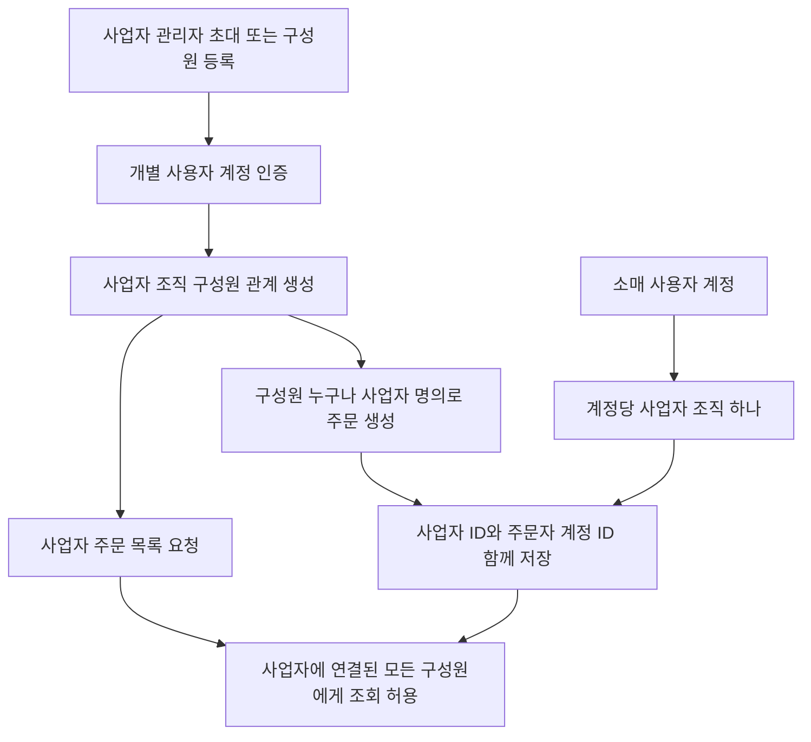

# 계정

## 구현 상태

사용자 프로필·주소 조회/수정 API는 아직 구현되지 않았음. 
현재 계정 관련 endpoint는 관리자 운영 범위이며 [operation.md](operation.md)에 정리했음. 
운영자 계정 생성·동의·프로필·승인 및 role 변경 알고리즘 흐름도는 [operation.md](operation.md)의 관리자 작업 흐름을 기준으로 함. 

향후 사용자 계정 기능을 추가할 때 본인 계정 확인은 인증 subject를 기준으로 하고, 주소를 수정해도 기존 주문의 배송 스냅샷은 바뀌지 않도록 함. 

## 사업자와 구매자 계정 확장 정책

한 사업자에 여러 직원 계정을 연결하고 각 직원이 생성한 주문도 사업자 주문으로 귀속하는 정책. 
사람 계정과 사업자 조직을 분리하고, 조직 구성원 관계로 여러 계정을 한 사업자에 연결. 
사업자에 연결된 모든 구성원은 다른 구성원이 생성한 주문을 포함해 사업자의 전체 주문 내역을 조회 가능. 
주문에는 사업자 조직과 실제 주문한 직원 계정을 함께 기록해 주문 주체를 보존. 
소매 채널은 1인 계정당 사업자 조직 하나를 기준으로 하고, 도매와 동일한 주문 귀속·조회 모델 사용. 
사업자 조직·구성원·복수 구매자 흐름은 현재 구현되지 않음. 기존 `business_profile`은 계정당 하나인 구조로 확장 필요. 
조직 구성원 등록·초대 및 사업자 공통 배송지·세금계산서 정보의 관리 권한은 미확정. 

사업자 정보와 조직 기본 배송·세금계산서 정보는 개인 연락처·인증 정보와 분리하는 방향. 
장바구니는 직원별로 유지하고 주문 생성 시 인증 계정의 사업자 조직으로 주문 귀속. 
