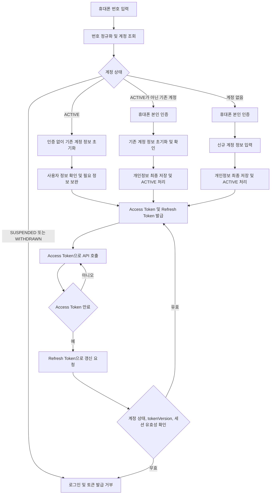

# 인증 서비스

## 책임

휴대폰 번호 단일 로그인, 계정 상태에 따른 휴대폰 본인 인증 여부 판단, 기존 계정 정보 초기화·확인, 신규 계정 정보 등록, Access·Refresh Token 발급·갱신을 담당함. 비밀번호와 소셜 로그인은 사용하지 않음

`ACTIVE` 계정은 휴대폰 번호만으로 로그인할 수 있음. `ACTIVE`가 아닌 기존 계정과 신규 휴대폰 번호는 휴대폰 본인 인증 성공 후 개인정보를 저장하고 `ACTIVE` 처리한 뒤에만 토큰을 발급함

## 로그인 알고리즘



`SUSPENDED`, `WITHDRAWN` 계정은 로그인 및 토큰 갱신을 거부함. 운영자가 계정 상태를 변경할 때는 처리자·변경 전후 값·시각·traceId를 감사 로그로 남김

## 현재 임시 정책

인증 세부 플로우 확정 전까지 로컬 개발 환경은 `umji.security.authentication.mode=BYPASS`로 모든 요청을 통과시킴. 기본값과 운영 환경은 `REQUIRED`이며, `BYPASS`를 운영·스테이징 설정에 넣지 않음

인증 재도입 시 휴대폰 OTP, 개인정보 동의·서면 동의 이력, 계정 활성화, Access·Refresh Token 흐름을 함께 구현함. 임시 BYPASS 모드에 계정 식별·권한 검사를 의존하지 않음

## Controller

```text
POST /api/auth/login
POST /api/auth/phone/challenges
POST /api/auth/phone/challenges/{challengeId}/verify
GET  /api/auth/activation
POST /api/auth/consents
POST /api/auth/token/refresh
POST /api/auth/tokens/revoke
```

## 핵심 규칙

- 로그인 식별자는 정규화한 휴대폰 번호이며 비밀번호를 사용하지 않음
- `ACTIVE` 계정은 휴대폰 본인 인증 없이 로그인하고, `ACTIVE`가 아닌 계정은 휴대폰 본인 인증이 필요함
- OTP 원문 대신 해시와 만료 시각을 저장하고, 전화번호·IP별 발송·검증 제한을 적용함
- 기존 계정은 서버 저장 정보를 초기값으로 제공하고, 사용자의 확인·보완 뒤 최종 저장함
- 기존 비활성 계정과 신규 계정은 개인정보 최종 저장 시 `ACTIVE` 처리함
- Access Token은 짧게 유지하고, Refresh Token은 명시적 삭제·무효화, 계정 상태 변경, `tokenVersion` 증가 전까지 기기별 영속 세션으로 유지함
- Refresh Token은 기기별 저장·회전하며, 원문은 클라이언트 보관·서버 SHA-256 hash 저장 방식임
- 갱신마다 계정 상태·권한·`tokenVersion`을 재검증하며, 정지·탈퇴·불일치 시 세션을 폐기함

전체 사용자 흐름: `E:\buyeong_dev\umji-market\SERVICE_FLOW.md`
