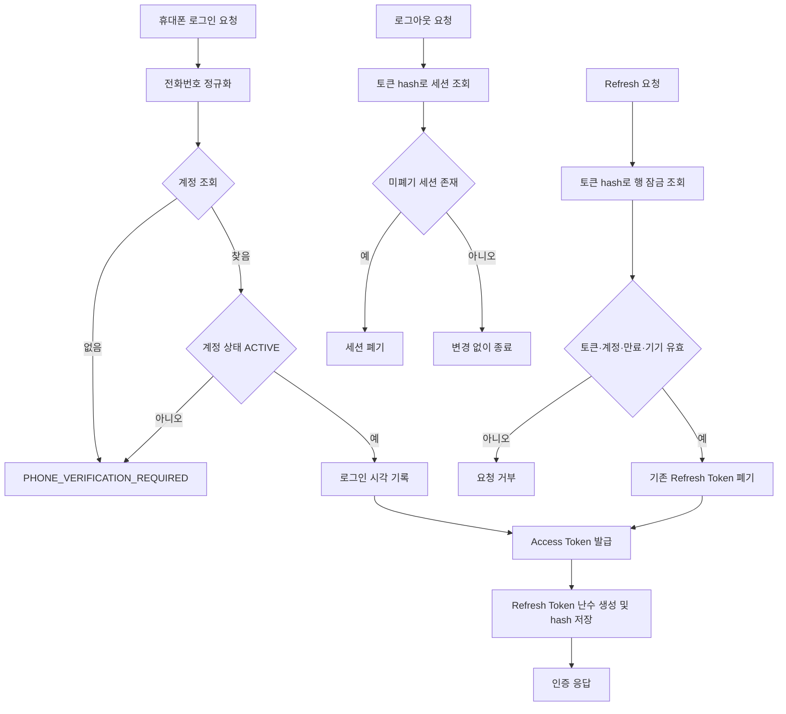
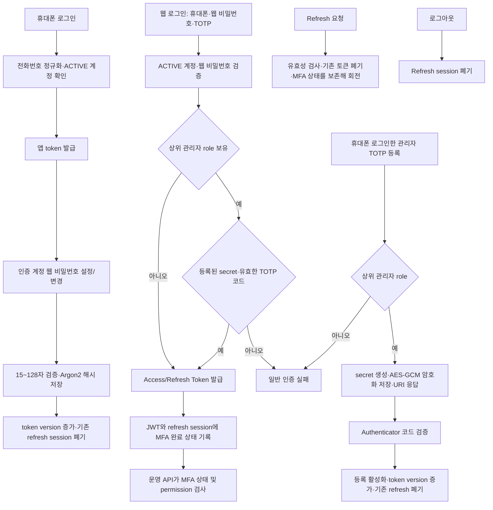

# 인증

## 구현 상태

휴대폰 번호 로그인과 웹 전용 비밀번호 인증, Access/Refresh Token 발급·갱신·폐기를 구현했음. 
`ADMIN`, `SUPER_ADMIN`, 상품·주문·재고 관리자 role에는 Google Authenticator 호환 TOTP 2차 인증을 적용했음. 
SMS 휴대폰 본인 확인과 고객 셀프 가입·활성화 API는 아직 없음. 
운영자 계정 관리 API의 동의 이력 기록과 승인을 통한 활성화는 제공됨. 
ACTIVE 계정의 일반 로그인마다 코드를 요구하지 않음. 
운영자가 기존 회원의 오프라인 서면 동의를 기록하고 계정을 승인해 `ACTIVE`로 전환하면 사용자는 휴대폰 번호만으로 로그인 가능. 
신규 앱 신청 등 그 외 신규·비활성 계정 활성화를 위한 SMS 본인 확인은 아직 미구현. 

## 알고리즘 흐름

```mermaid
flowchart TD
    A[휴대폰 로그인 요청] --> B[전화번호 정규화]
    B --> C{계정 조회}
    C -- 없음 --> V[PHONE_VERIFICATION_REQUIRED]
    C -- 찾음 --> D{계정 상태 ACTIVE}
    D -- 아니오 --> V
    D -- 예 --> E[로그인 시각 기록]
    E --> F[Access Token 발급]
    F --> G[Refresh Token 난수 생성 및 hash 저장]
    G --> H[인증 응답]

    I[Refresh 요청] --> J[토큰 hash로 행 잠금 조회]
    J --> K{토큰·계정·만료·기기 유효}
    K -- 아니오 --> X[요청 거부]
    K -- 예 --> L[기존 Refresh Token 폐기]
    L --> F

    M[로그아웃 요청] --> N[토큰 hash로 세션 조회]
    N --> O{미폐기 세션 존재}
    O -- 예 --> P[세션 폐기]
    O -- 아니오 --> Q[변경 없이 종료]
```

Access Token 유효성 검사 시 계정 상태와 token version을 현재 저장값과 대조. 
토큰 해시는 SHA-256으로 저장하며 원문은 저장하지 않음. 

## Endpoint

- `POST /api/auth/login`
- `POST /api/auth/web-password`
- `POST /api/auth/web/login`
- `POST /api/auth/admin/totp/setup`
- `POST /api/auth/admin/totp/confirm`
- `POST /api/operation/accounts/{id}/totp/reset`
- `POST /api/auth/token/refresh`
- `POST /api/auth/tokens/revoke`

로그인 번호를 정규화해 계정을 조회함. 
`ACTIVE` 계정은 토큰을 발급하고, 비활성 또는 미등록 계정은 `PHONE_VERIFICATION_REQUIRED` 결과를 수신. 
정지·탈퇴 계정은 로그인할 수 없음. 

## 웹 비밀번호 및 관리자 2차 인증

앱·웹은 같은 계정을 사용하며 기존 `password_hash`에 웹 전용 비밀번호를 저장함. 
기존 휴대폰 로그인 token으로 웹 비밀번호 최초 설정·변경 가능. 고정 초기 비밀번호·임시 비밀번호·SMS 발송은 사용하지 않음. 
웹 비밀번호는 15~128자로 제한하고 Argon2 해시로 저장. 변경 시 token version 증가와 기존 refresh session 폐기를 수행. 
TOTP 대상은 `ADMIN`, `SUPER_ADMIN`, `PRODUCT_MANAGER`, `ORDER_MANAGER`, `INVENTORY_MANAGER`. `SHIPPING_MANAGER`, `SALES_MANAGER`만 보유한 계정은 제외하며, 상위 관리자 role을 함께 보유하면 TOTP 대상. 
TOTP secret은 AES-GCM으로 암호화 저장. 등록 URI 발급 후 앱 코드 확인 시 활성화하며 token version 증가와 기존 refresh session 폐기 수행. 
등록된 TOTP 분실 시 다른 MFA 완료 운영자가 `ADMIN_ACCOUNT_MANAGE` 권한으로 초기화 가능. 변경 endpoint는 운영 감사 로그에 기록. 
MFA가 필요한 계정은 MFA 미완료 token으로 운영 API를 사용할 수 없음. 기존 관리자 token과 refresh session은 V29 migration에서 무효화. 
Refresh Token은 MFA 완료 상태를 보존함. `UMJI_AUTH_TOTP_ENCRYPTION_KEY`에 32바이트 Base64 키를 외부 주입하며 키를 잃거나 변경하면 등록 TOTP 재설정 필요. 
동일 전화번호·원격 주소 조합의 15분 내 실패 5회 또는 전화번호 합계 10회에서 웹 로그인을 거부. 저장 값은 hash만 보관하고 매시 1일 초과 window 정리. 
TOTP 등록 계정이 하나뿐인 경우의 운영자 외 recovery 절차는 별도. 

```mermaid
flowchart TD
    PHONE[휴대폰 로그인] --> ACTIVE[전화번호 정규화·ACTIVE 계정 확인]
    ACTIVE --> MOBILETOKEN[앱 token 발급]
    MOBILETOKEN --> SET[인증 계정 웹 비밀번호 설정/변경]
    SET --> HASH[15~128자 검증·Argon2 해시 저장]
    HASH --> REVOKE[token version 증가·기존 refresh session 폐기]

    WEB[웹 로그인: 휴대폰·웹 비밀번호·TOTP] --> CREDENTIAL[ACTIVE 계정·웹 비밀번호 검증]
    CREDENTIAL --> PRIVILEGED{상위 관리자 role 보유}
    PRIVILEGED -- 아니오 --> ISSUE[Access/Refresh Token 발급]
    PRIVILEGED -- 예 --> OTP{등록된 secret·유효한 TOTP 코드}
    OTP -- 아니오 --> DENY[일반 인증 실패]
    OTP -- 예 --> ISSUE
    ISSUE --> MFA[JWT와 refresh session에 MFA 완료 상태 기록]
    MFA --> OP[운영 API가 MFA 상태 및 permission 검사]

    SETUP[휴대폰 로그인한 관리자 TOTP 등록] --> ROLE{상위 관리자 role}
    ROLE -- 아니오 --> DENY
    ROLE -- 예 --> SECRET[secret 생성·AES-GCM 암호화 저장·URI 응답]
    SECRET --> CONFIRM[Authenticator 코드 검증]
    CONFIRM --> ENABLE[등록 활성화·token version 증가·기존 refresh 폐기]

    REFRESH[Refresh 요청] --> ROTATE[유효성 검사·기존 토큰 폐기·MFA 상태를 보존해 회전]
    LOGOUT[로그아웃] --> REVOKESESSION[Refresh session 폐기]
```

기존 상위 관리자 토큰과 refresh session은 V29 migration에서 무효화하며, 재로그인·비밀번호 설정·TOTP 등록 과정 필요. 

## 토큰 정책

Access Token 유효기간은 1시간. 
Refresh Token은 기기별로 발급하며 DB에는 hash와 만료 시각을 저장함. 
Refresh Token은 발급·갱신 시점부터 1년간 사용되지 않으면 만료됨. 
갱신할 때 기존 토큰을 폐기하고 새 토큰을 발급해 만료 시각을 1년 뒤로 연장함. 
최대 세션 수명 제한은 없으므로 유효한 세션을 계속 사용하는 동안 앱 로그인 상태가 유지됨. 
로그아웃은 해당 Refresh Token을 폐기함. 
정지 계정은 새 로그인과 Refresh Token 갱신이 거부됨. 

Access Token 검증 시 계정 상태와 token version을 DB의 현재 값과 대조함. 
계정 정지 또는 token version 변경 시 기존 Access Token은 즉시 인증 실패 처리되며, 정지 계정의 Refresh Token 갱신도 거부됨. 
인증할 수 없는 토큰은 `401`, 인증은 유효하나 endpoint 권한이 부족한 요청은 `403`을 반환함. 
상위 관리자 role의 운영 API는 `mfaRequired` 및 `mfaVerified` JWT claim도 검사함. 

## 보안 모드

기본 모드는 `REQUIRED`이며, 로컬 프로필은 `BYPASS`를 사용함. 
BYPASS는 모든 요청의 인증을 우회하므로 운영 환경에서 사용하지 않음. 
