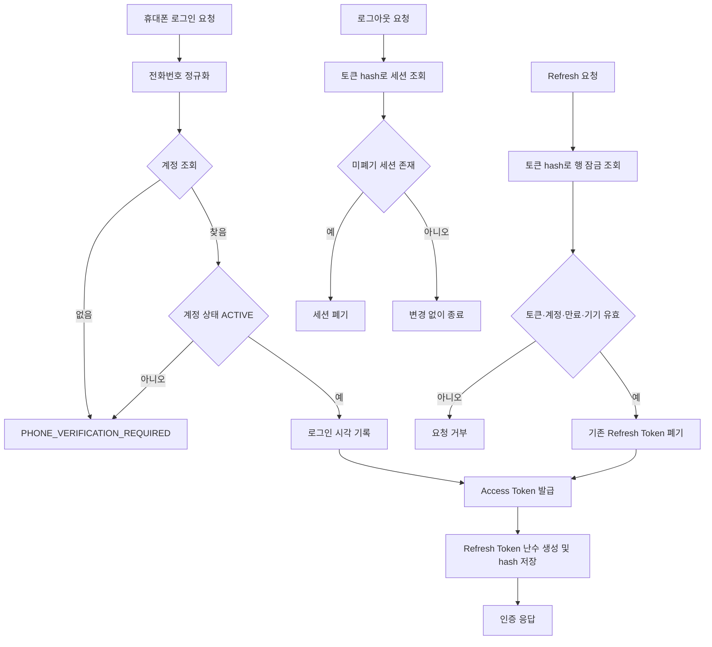
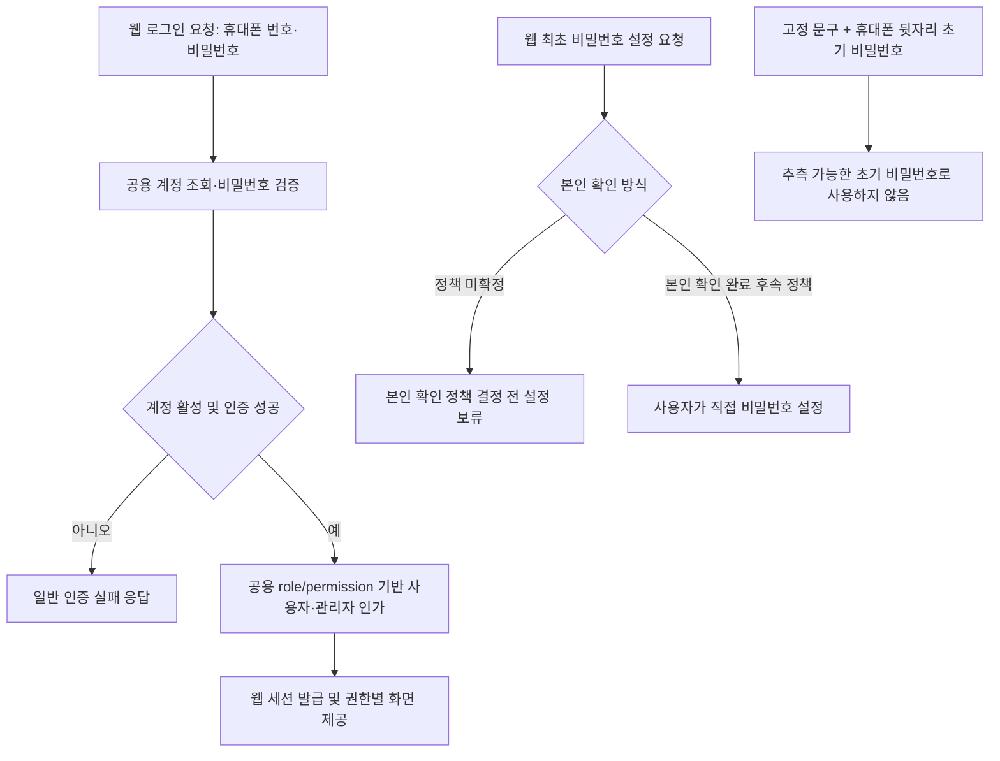

# 인증

## 구현 상태

휴대폰 번호 로그인과 Access/Refresh Token 발급·갱신·폐기를 구현했음. 
비밀번호·소셜 로그인을 제공하지 않음. 
SMS 휴대폰 본인 확인과 고객 셀프 가입·활성화 API는 아직 없음. 
운영자 계정 관리 API의 동의 이력 기록과 승인을 통한 활성화는 제공됨. 
ACTIVE 계정의 일반 로그인마다 코드를 요구하지 않음. 
운영자가 기존 회원의 오프라인 서면 동의를 기록하고 계정을 승인해 `ACTIVE`로 전환하면 사용자는 휴대폰 번호만으로 로그인 가능. 
신규 앱 신청 등 그 외 신규·비활성 계정 활성화를 위한 SMS 본인 확인은 아직 미구현. 

## 알고리즘 흐름

```mermaid
flowchart TD
    A[휴대폰 로그인 요청] --> B[전화번호 정규화]
    B --> C{계정 조회}
    C -- 없음 --> V[PHONE_VERIFICATION_REQUIRED]
    C -- 찾음 --> D{계정 상태 ACTIVE}
    D -- 아니오 --> V
    D -- 예 --> E[로그인 시각 기록]
    E --> F[Access Token 발급]
    F --> G[Refresh Token 난수 생성 및 hash 저장]
    G --> H[인증 응답]

    I[Refresh 요청] --> J[토큰 hash로 행 잠금 조회]
    J --> K{토큰·계정·만료·기기 유효}
    K -- 아니오 --> X[요청 거부]
    K -- 예 --> L[기존 Refresh Token 폐기]
    L --> F

    M[로그아웃 요청] --> N[토큰 hash로 세션 조회]
    N --> O{미폐기 세션 존재}
    O -- 예 --> P[세션 폐기]
    O -- 아니오 --> Q[변경 없이 종료]
```

Access Token 유효성 검사 시 계정 상태와 token version을 현재 저장값과 대조. 
토큰 해시는 SHA-256으로 저장하며 원문은 저장하지 않음. 

## Endpoint

- `POST /api/auth/login`
- `POST /api/auth/token/refresh`
- `POST /api/auth/tokens/revoke`

로그인 번호를 정규화해 계정을 조회함. 
`ACTIVE` 계정은 토큰을 발급하고, 비활성 또는 미등록 계정은 `PHONE_VERIFICATION_REQUIRED` 결과를 수신. 
정지·탈퇴 계정은 로그인할 수 없음. 

## 웹 비밀번호 인증 계획

웹 로그인은 휴대폰 번호를 ID로 사용하고 비밀번호 인증을 추가하는 정책 방향. 앱과 웹은 동일한 사람 계정을 사용. 
관리자는 별도 계정 저장소 대신 공용 계정의 role/permission으로 웹 운영 기능을 인가. 
앱 비밀번호 로그인, 웹 비밀번호 로그인, 초기 웹 비밀번호 설정은 현재 인증 구현에 미포함. 
기존 고객의 최초 비밀번호 설정을 위한 본인 확인 방식과 초대·복구 절차는 미확정. 

```mermaid
flowchart TD
    WEB[웹 로그인 요청: 휴대폰 번호·비밀번호] --> ACCOUNT[공용 계정 조회·비밀번호 검증]
    ACCOUNT --> ACTIVE{계정 활성 및 인증 성공}
    ACTIVE -- 아니오 --> DENY[일반 인증 실패 응답]
    ACTIVE -- 예 --> ROLE[공용 role/permission 기반 사용자·관리자 인가]
    ROLE --> SESSION[웹 세션 발급 및 권한별 화면 제공]
    FIRST[웹 최초 비밀번호 설정 요청] --> VERIFY{본인 확인 방식}
    VERIFY -- 정책 미확정 --> HOLD[본인 확인 정책 결정 전 설정 보류]
    DEFAULT[고정 문구 + 휴대폰 뒷자리 초기 비밀번호] --> REJECT[추측 가능한 초기 비밀번호로 사용하지 않음]
    VERIFY -- 본인 확인 완료 후속 정책 --> SET[사용자가 직접 비밀번호 설정]
```

고정 문자열·휴대폰 번호 일부를 조합한 초기 비밀번호는 추측하기 쉬우므로 사용하지 않는 권고안. 
초기 설정과 복구는 본인 확인 후 사용자가 직접 새 비밀번호를 정하는 단회·만료형 등록 절차 권고. 구체적인 본인 확인 채널과 만료 시간은 미확정. 
신규 비밀번호는 흔하거나 유출된 비밀번호 차단, 로그인 실패 제한, 안전한 비밀번호 해시 저장을 포함해 설계 필요. 
현재 ACTIVE 계정의 앱 로그인은 휴대폰 번호만으로 처리되므로 웹 비밀번호 설정 전에 운영 인증 흐름의 보안 강도 점검 필요. 

## 토큰 정책

Access Token 유효기간은 1시간. 
Refresh Token은 기기별로 발급하며 DB에는 hash와 만료 시각을 저장함. 
Refresh Token은 발급·갱신 시점부터 1년간 사용되지 않으면 만료됨. 
갱신할 때 기존 토큰을 폐기하고 새 토큰을 발급해 만료 시각을 1년 뒤로 연장함. 
최대 세션 수명 제한은 없으므로 유효한 세션을 계속 사용하는 동안 앱 로그인 상태가 유지됨. 
로그아웃은 해당 Refresh Token을 폐기함. 
정지 계정은 새 로그인과 Refresh Token 갱신이 거부됨. 

Access Token 검증 시 계정 상태와 token version을 DB의 현재 값과 대조함. 
계정 정지 또는 token version 변경 시 기존 Access Token은 즉시 인증 실패 처리되며, 정지 계정의 Refresh Token 갱신도 거부됨. 
인증할 수 없는 토큰은 `401`, 인증은 유효하나 endpoint 권한이 부족한 요청은 `403`을 반환함. 

## 보안 모드

기본 모드는 `REQUIRED`이며, 로컬 프로필은 `BYPASS`를 사용함. 
BYPASS는 모든 요청의 인증을 우회하므로 운영 환경에서 사용하지 않음. 
