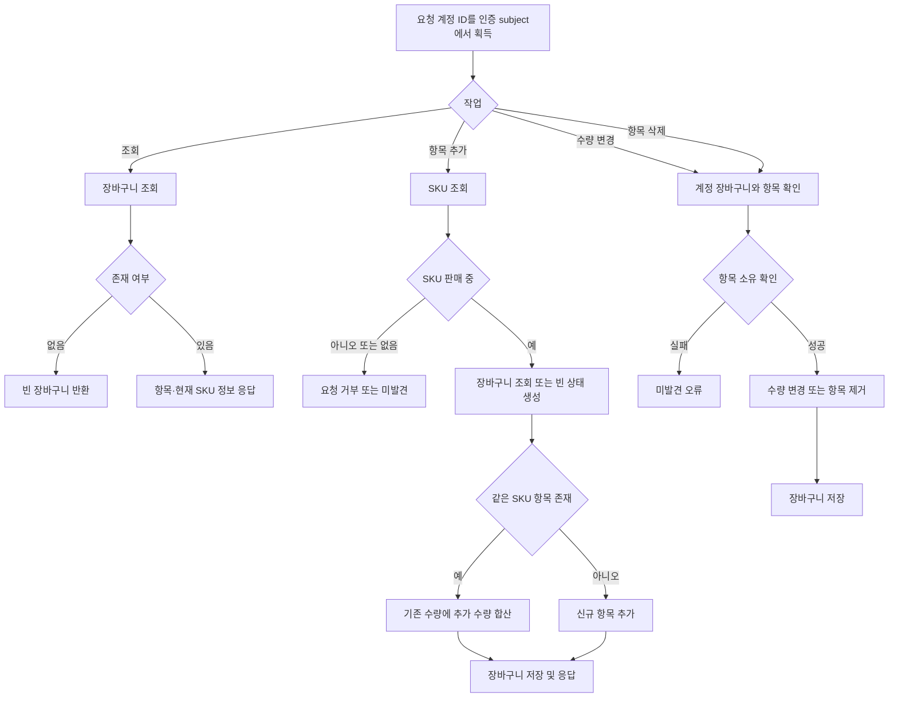

# 장바구니

## Endpoint

- `GET /api/cart`
- `POST /api/cart/items`
- `PATCH /api/cart/items/{itemId}`
- `DELETE /api/cart/items/{itemId}`

## 알고리즘 흐름

## 동작

- 활성 계정별 장바구니를 사용함.
  계정은 요청 본문이 아니라 인증 정보에서 조회.
- 항목은 SKU 기준으로 중복을 막고, 기존 SKU를 다시 추가하면 수량을 합산함.
- 판매 가능한 SKU만 추가할 수 있음.
- 장바구니 가격은 현재 카탈로그 가격이며 주문 가격을 확정하지 않음.
- 주문 생성 시 상품/SKU/가격을 주문 항목에 복사하고 재고를 예약한 뒤 장바구니를 초기화.

application UseCase는 장바구니 Port에 의존하고 JPA adapter가 저장 모델을 변환함.
