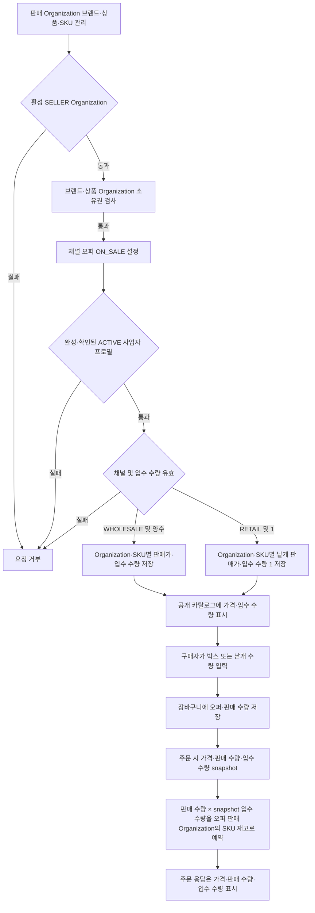

# 카탈로그

## 판매 채널 기준

판매 Organization이 브랜드와 상품을 소유하고, 상품의 SKU·이미지·옵션은 해당 상품에 종속. 판매 채널은 `WHOLESALE`·`RETAIL`로 분리. 
판매 채널별 카테고리는 별도 계층으로 관리하고, `channel_product_listing`이 상품의 채널 카테고리·노출·순서를 보유. 
채널별 상품 판매는 `sales_offer`가 판매 Organization·실물 SKU·채널·판매가·정가·판매 상태·판매 단위당 입수 수량을 보유. 같은 실물 SKU를 여러 판매 Organization이 각각 판매할 수 있고 가격·판매 상태는 서로 독립. 
클라이언트가 채널을 명시. 기존 API 호출은 호환성을 위해 `WHOLESALE` 기본값 사용. 구매자 그룹 유형으로 판매 채널을 추정하지 않음. 
오퍼는 실물 SKU 하나와 해당 채널의 판매 단위를 연결. `WHOLESALE` 오퍼는 박스 입수 수량을 보유하고 `RETAIL` 오퍼는 낱개 단위(입수 수량 1)를 사용. 

## 공개 조회

### 알고리즘 흐름

- 공개 조회 조건과 응답 구성은 `CatalogService`가 적용하고 `CatalogJpaEntityService`가 조회함. 상품은 소유 Organization에 속한 활성 판매 오퍼가 있는 경우에만 공개 카탈로그에 표시. 
- 관리자 카탈로그 변경 흐름은 [operation.md](operation.md)의 관리자 카탈로그 흐름을 기준으로 함. 

- `GET /api/categories?channel=WHOLESALE|RETAIL`
- `GET /api/products?channel=WHOLESALE|RETAIL&page=&size=`
- `GET /api/products/{productId}?channel=WHOLESALE|RETAIL`

공개 조회는 요청 채널의 노출 listing과 판매 가능한 오퍼가 있는 조직 소유 상품·SKU만 반환함. 
조회 응답의 판매가·정가·상태는 해당 채널과 판매 Organization의 오퍼 기준. 판매 Organization별 재고 원장은 `organization_id + sku_id`로 구분하고, 같은 Organization의 채널별 오퍼는 해당 재고를 공유. 

## 관리자 관리

- `GET /api/operation/categories`
- `POST /api/operation/categories`
- `GET /api/operation/brands?page=&size=`
- `POST /api/operation/brands`
- `GET /api/operation/products?page=&size=`
- `GET /api/operation/products/{productId}`
- `POST /api/operation/products`
- `PATCH /api/operation/products/{productId}`
- `PATCH /api/operation/products/{productId}/status`
- `POST /api/operation/products/{productId}/images`
- `POST /api/operation/products/{productId}/options`
- `POST /api/operation/products/{productId}/skus`
- `GET /api/operation/channels/{channel}/categories`
- `POST /api/operation/channels/{channel}/categories`
- `PUT /api/operation/channels/{channel}/products/{productId}/listing`
- `PUT /api/operation/channels/{channel}/skus/{skuId}/offer`

## 판매자 판매 관리

- `GET /api/seller/brands?page=&size=`
- `POST /api/seller/brands`
- `GET /api/seller/products?page=&size=`
- `POST /api/seller/products`
- `PATCH /api/seller/products/{productId}`
- `GET /api/seller/products/{productId}`
- `GET /api/seller/skus?page=&size=`
- `PUT /api/seller/channels/{channelCode}/skus/{skuId}/offer`
- `GET /api/seller/inventory/skus/{skuId}`
- `PATCH /api/seller/inventory/skus/{skuId}`
- `GET /api/seller/inventory/skus/{skuId}/movements?page=&size=`

판매자 endpoint는 인증 계정의 활성 Organization에 `SELLER` capability가 있는지 확인. 판매 오퍼의 `ON_SALE` 설정과 주문 생성 시에는 완성·대표자 확인된 ACTIVE 사업자 프로필을 추가 검증. 
브랜드와 상품은 판매 Organization 소유. 상품 생성 시 같은 Organization의 브랜드와 채널 카테고리를 사용하며 이미지·옵션·SKU도 그 상품에 종속. 

운영자 카탈로그 API는 소유 Organization이 없는 레거시 상품·브랜드 관리용. 신규 판매 상품·브랜드는 판매자 API에서 생성. 
채널별 listing은 상품마다 채널 카테고리·노출·순서를 관리. 판매 오퍼는 상품 소유 Organization과 일치해야 하며, 오퍼 상태는 상품의 공용 상태를 변경하지 않음. 
별도 SKU 추가 시 옵션값은 해당 상품에 속한 값이어야 함. 재고는 Organization과 SKU별 원장으로 관리하고, 한 Organization의 여러 채널 오퍼가 같은 SKU 원장을 공유. 
HTTP 응답은 response DTO로 변환하며 JPA Entity를 외부 계약에 직접 노출하지 않음. 

## 박스 단위 오퍼와 구매 흐름

WHOLESALE·RETAIL 채널별 카테고리·listing·offer 분리 및 도매 박스 단위 주문 구현. 
오퍼 수정에서 입수 수량 생략 시 기존 값을 유지하며, 신규 오퍼는 1개 단위로 시작. 
도매 고객에게 박스 구성 변경 선택지는 제공하지 않음. 상품별 박스 구성은 운영 데이터로 설정하고, 고객은 구매할 박스 수만 입력. 
예: `12개입 박스` 상품은 상품 상세와 목록에 박스당 가격·입수 수량을 표시하며, 주문 수량은 박스 단위. 
향후 소매 채널에서는 동일 실물 SKU를 낱개 단위 판매 조건으로 별도 노출 가능. 

반응형 화면은 공통 상품 정보를 사용하되 모바일 구매, 데스크톱 운영, 태블릿 주요 작업에 맞는 화면 구성을 제공하는 계획. 
