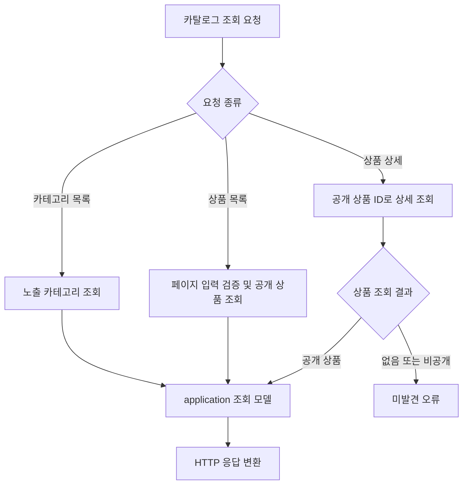
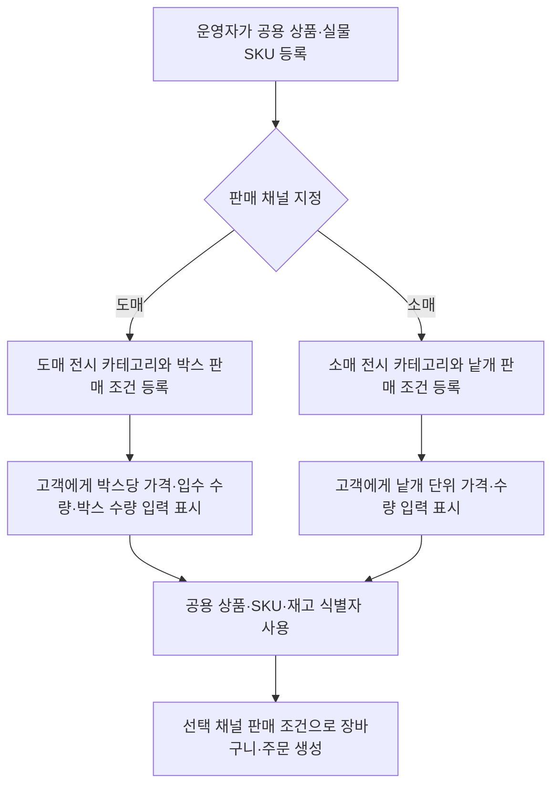

# 카탈로그

## 공개 조회

### 알고리즘 흐름

- 공개 조회 조건과 응답 구성은 catalog query adapter가 적용함. 
- 관리자 카탈로그 변경 흐름은 [operation.md](operation.md)의 관리자 카탈로그 흐름을 기준으로 함. 

- `GET /api/categories`
- `GET /api/products?page=&size=`
- `GET /api/products/{productId}`

공개 조회는 노출·판매 가능한 상품과 SKU를 반환함. 
상품의 판매·재고 단위는 SKU임. 

## 관리자 관리

- `GET /api/operation/categories`
- `POST /api/operation/categories`
- `GET /api/operation/brands?page=&size=`
- `POST /api/operation/brands`
- `GET /api/operation/products?page=&size=`
- `GET /api/operation/products/{productId}`
- `POST /api/operation/products`
- `PATCH /api/operation/products/{productId}`
- `PATCH /api/operation/products/{productId}/status`
- `POST /api/operation/products/{productId}/images`
- `POST /api/operation/products/{productId}/options`
- `POST /api/operation/products/{productId}/skus`

상품 생성 요청은 이미지·옵션·SKU를 함께 포함할 수 있음. 
별도 SKU 추가 시 옵션값은 해당 상품에 속한 값이어야 함. 
JPA Entity는 catalog persistence adapter 밖으로 전달하지 않음. 

## 도매 박스 판매 및 소매 채널 확장 정책

아래는 확정된 판매 정책과 향후 설계 흐름이며, 현재 구현에는 미반영. 
상품·실물 SKU 정보는 공용으로 유지하고, 도매·소매별 전시·카테고리·판매 조건을 분리. 
도매 고객에게 박스 구성 변경 선택지는 제공하지 않음. 상품별 박스 구성은 운영 데이터로 설정하고, 고객은 구매할 박스 수만 입력. 
예: `12개입 박스` 상품은 상품 상세와 목록에 박스당 가격·입수 수량을 표시하며, 주문 수량은 박스 단위. 
향후 소매 채널에서는 동일 실물 SKU를 낱개 단위 판매 조건으로 별도 노출 가능. 

판매 채널용 상품 전시와 판매 오퍼는 현재 상품·SKU 모델과 분리할 설계 대상. 
도매·소매 카테고리는 각 채널의 탐색 구조에 맞게 구성하고, 상품을 채널별 카테고리에 연결. 
도매의 박스 입수 수량은 고객 선택 옵션이 아닌 재고 환산 및 주문 표시 정보. 
반응형 화면은 공통 상품 정보를 사용하되 모바일 구매, 데스크톱 운영, 태블릿 주요 작업에 맞는 화면 구성을 제공하는 계획. 
