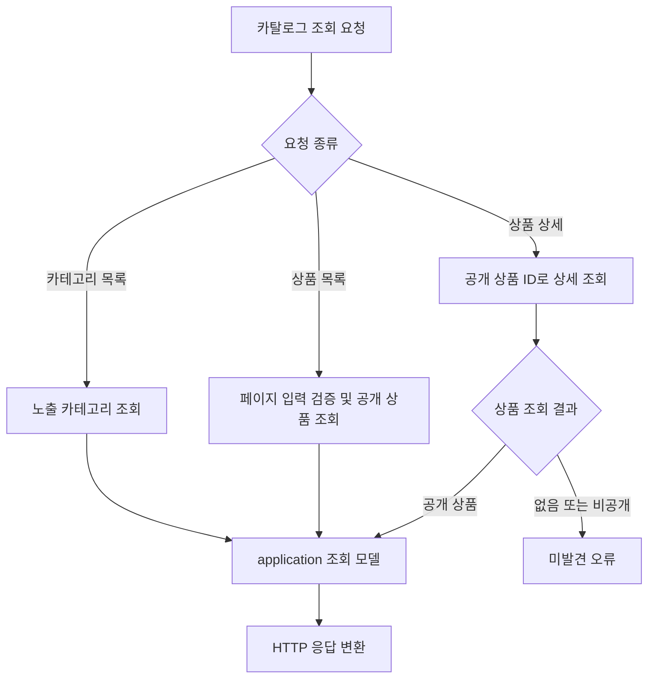

# 카탈로그

## 공개 조회

### 알고리즘 흐름

- 공개 조회 조건과 응답 구성은 catalog query adapter가 적용함.
- 관리자 카탈로그 변경 흐름은 [operation.md](operation.md)의 관리자 카탈로그 흐름을 기준으로 함.

- `GET /api/categories`
- `GET /api/products?page=&size=`
- `GET /api/products/{productId}`

공개 조회는 노출·판매 가능한 상품과 SKU를 반환함.
상품의 판매·재고 단위는 SKU임.

## 관리자 관리

- `GET /api/operation/categories`
- `POST /api/operation/categories`
- `GET /api/operation/brands?page=&size=`
- `POST /api/operation/brands`
- `GET /api/operation/products?page=&size=`
- `GET /api/operation/products/{productId}`
- `POST /api/operation/products`
- `PATCH /api/operation/products/{productId}`
- `PATCH /api/operation/products/{productId}/status`
- `POST /api/operation/products/{productId}/images`
- `POST /api/operation/products/{productId}/options`
- `POST /api/operation/products/{productId}/skus`

상품 생성 요청은 이미지·옵션·SKU를 함께 포함할 수 있음.
별도 SKU 추가 시 옵션값은 해당 상품에 속한 값이어야 함.
JPA Entity는 catalog persistence adapter 밖으로 전달하지 않음.
