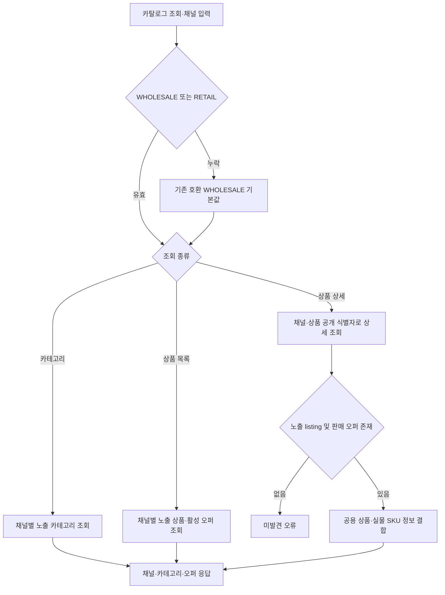
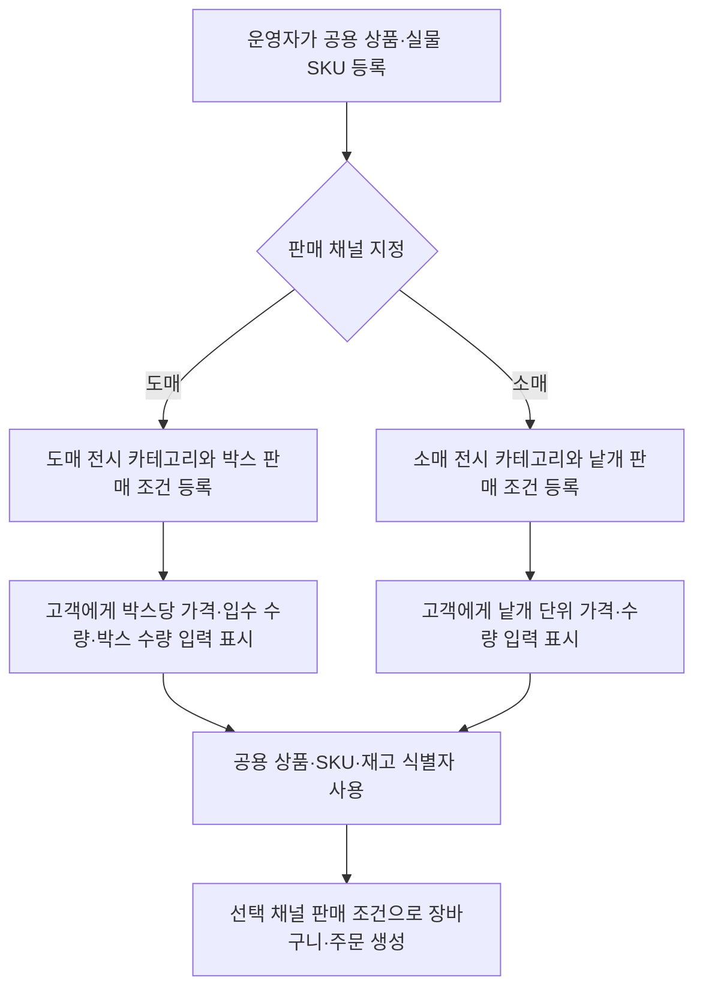

# 카탈로그

## 판매 채널 기준

상품·실물 SKU는 판매 채널과 독립된 공용 원본. 판매 채널은 `WHOLESALE`·`RETAIL`로 분리. 
판매 채널별 카테고리는 별도 계층으로 관리하고, `channel_product_listing`이 상품의 채널 카테고리·노출·순서를 보유. 
채널별 상품 판매는 `sales_offer`가 실물 SKU·채널·판매가·정가·판매 상태를 보유. 같은 실물 SKU에 채널별 오퍼를 둘 수 있고 가격·노출 상태는 서로 독립. 
클라이언트가 채널을 명시. 기존 API 호출은 호환성을 위해 `WHOLESALE` 기본값 사용. 구매자 그룹 유형으로 판매 채널을 추정하지 않음. 
현재 오퍼 단위는 실물 SKU 한 개. 박스 단위 오퍼와 입수 수량 환산은 후속 Task 6 항목에서 추가. 

## 공개 조회

### 알고리즘 흐름

- 공개 조회 조건과 응답 구성은 `CatalogService`가 적용하고 `CatalogJpaEntityService`가 조회함. 
- 관리자 카탈로그 변경 흐름은 [operation.md](operation.md)의 관리자 카탈로그 흐름을 기준으로 함. 

- `GET /api/categories?channel=WHOLESALE|RETAIL`
- `GET /api/products?channel=WHOLESALE|RETAIL&page=&size=`
- `GET /api/products/{productId}?channel=WHOLESALE|RETAIL`

공개 조회는 요청 채널의 노출 listing과 판매 가능한 오퍼가 있는 공용 상품·SKU만 반환함. 
조회 응답의 판매가·정가·상태는 해당 채널의 오퍼 기준. 재고 예약은 오퍼가 참조하는 공용 실물 SKU 기준. 

## 관리자 관리

- `GET /api/operation/categories`
- `POST /api/operation/categories`
- `GET /api/operation/brands?page=&size=`
- `POST /api/operation/brands`
- `GET /api/operation/products?page=&size=`
- `GET /api/operation/products/{productId}`
- `POST /api/operation/products`
- `PATCH /api/operation/products/{productId}`
- `PATCH /api/operation/products/{productId}/status`
- `POST /api/operation/products/{productId}/images`
- `POST /api/operation/products/{productId}/options`
- `POST /api/operation/products/{productId}/skus`
- `GET /api/operation/channels/{channel}/categories`
- `POST /api/operation/channels/{channel}/categories`
- `PUT /api/operation/channels/{channel}/products/{productId}/listing`
- `PUT /api/operation/channels/{channel}/skus/{skuId}/offer`

운영자 등록 상품·SKU는 공용 원본. 기존 상품 생성 API는 기존 운영 흐름 호환을 위해 `WHOLESALE` listing 및 SKU별 오퍼도 함께 생성. 
채널별 listing과 오퍼 API는 카테고리·노출·순서·가격·판매 상태를 분리 변경. 오퍼 상태 변경은 공용 SKU 상태를 변경하지 않음. 
별도 SKU 추가 시 옵션값은 해당 상품에 속한 값이어야 함. 상품의 실제 재고는 SKU별 단일 원장을 공유. 
HTTP 응답은 response DTO로 변환하며 JPA Entity를 외부 계약에 직접 노출하지 않음. 

## 박스 단위 오퍼 후속 범위

WHOLESALE·RETAIL 채널별 카테고리·listing·offer 분리는 구현됨. 
현재 판매 오퍼 단위는 SKU 한 개이며, 박스 입수량 환산과 포장 단위 재고 표시는 후속 범위. 
도매 고객에게 박스 구성 변경 선택지는 제공하지 않음. 상품별 박스 구성은 운영 데이터로 설정하고, 고객은 구매할 박스 수만 입력. 
예: `12개입 박스` 상품은 상품 상세와 목록에 박스당 가격·입수 수량을 표시하며, 주문 수량은 박스 단위. 
향후 소매 채널에서는 동일 실물 SKU를 낱개 단위 판매 조건으로 별도 노출 가능. 

반응형 화면은 공통 상품 정보를 사용하되 모바일 구매, 데스크톱 운영, 태블릿 주요 작업에 맞는 화면 구성을 제공하는 계획. 
