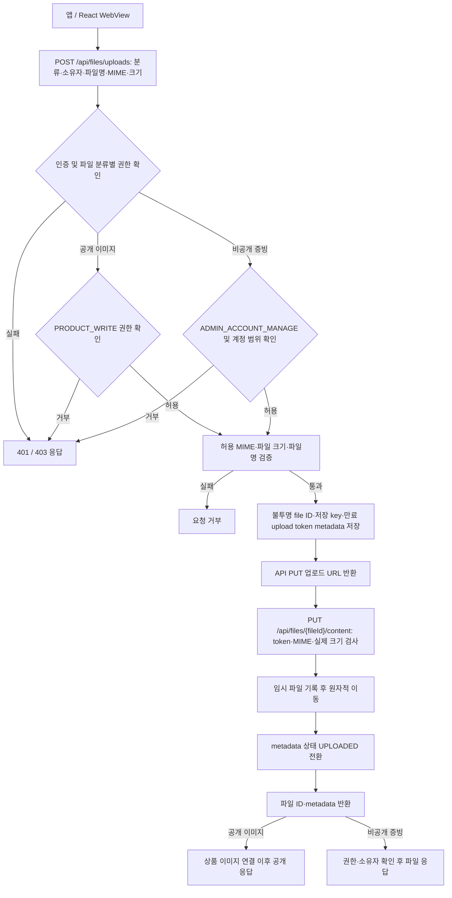

# 파일

## 구현 상태

파일 metadata와 로컬 파일 저장 API를 제공. 기본 저장 경로는 `E:/buyeong_dev/umji-market/data/files`이며 IDC 마운트 경로는 `UMJI_FILE_STORAGE_ROOT`로 지정. 
파일 원본은 로컬 저장소에만 두고 DB에는 파일 분류·소유 계정·불투명 저장 key·MIME·크기·상태 등 metadata만 저장. 

## 파일 분류와 접근 정책

| 분류 | 저장·조회 범위 | 접근 방식 | 권한 기준 |
| --- | --- | --- | --- |
| 공개 상품 이미지 | 공개 카탈로그에서 노출되는 상품 이미지 | 상품에 연결된 파일만 공개 API 응답으로 제공 | 운영자 `PRODUCT_WRITE` 업로드 권한. 미연결 파일은 비공개 |
| 사업자 증빙 및 동의 증빙 파일 | 비공개 로컬 저장소 | API가 권한 확인 후 파일 응답 제공 | 운영자 `ADMIN_ACCOUNT_MANAGE` 권한 및 요청 대상 계정과 소유 계정 일치 |

파일 key는 추측할 수 없는 값으로 발급하며 클라이언트가 전달한 key나 URL만으로 접근을 허용하지 않음. 
공개 이미지와 비공개 증빙은 별도 하위 경로에 저장하고, 저장소 디렉터리는 정적 웹 경로로 노출하지 않음. 
상품 이미지 등록·수정은 기존 운영자 카탈로그 permission을 검사하며, 공개 접근은 표시 가능한 상품에 연결된 파일에만 허용. 
업로드 token은 단회 사용 및 만료 처리. token 원문과 파일 원본은 DB에 저장하지 않음. 

## 업로드 및 파일 접근 흐름

로컬 저장 경로는 `UMJI_FILE_STORAGE_ROOT` 환경 변수로 주입하며 기본 개발 경로는 `E:/buyeong_dev/umji-market/data/files`. 
임시 파일은 검증 완료 후 같은 파일시스템 안에서 원자적으로 저장 경로로 이동. 
