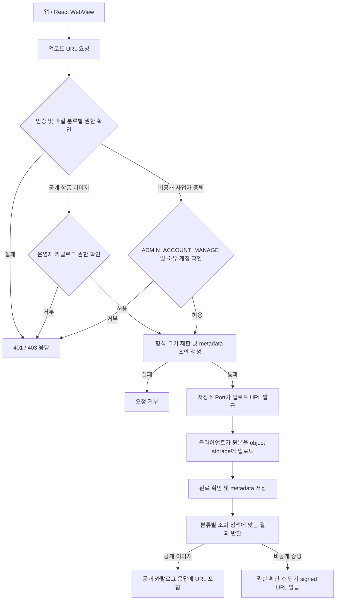

# 파일

## 구현 상태

파일 업로드 API와 object storage 연동은 아직 구현되지 않았음. 
카탈로그 이미지는 현재 `storageKey` 메타데이터만 저장하며, 업로드 URL 발급·파일 접근 권한 관리는 별도 기능임. 

## 파일 분류와 접근 정책

| 분류 | 저장·조회 범위 | 접근 방식 | 권한 기준 |
| --- | --- | --- | --- |
| 공개 상품 이미지 | 공개 카탈로그에서 노출되는 상품 이미지 | 공개 읽기 가능한 object storage 또는 CDN URL | 공개 상품 응답에 포함된 이미지에 한해 비인증 조회 허용 |
| 사업자 증빙 및 동의 증빙 파일 | 비공개 object storage | API가 권한 확인 후 짧은 만료 시간의 signed URL 발급 | 운영자 `ADMIN_ACCOUNT_MANAGE` 권한 필요. 요청 계정과 파일의 소유 계정 일치 여부 확인 |

파일 key는 추측할 수 없는 값으로 발급하며 클라이언트가 전달한 key나 URL만으로 접근을 허용하지 않음. 
공개 이미지 경로와 비공개 증빙 경로를 분리하고, 비공개 파일은 public ACL·공개 CDN origin에 두지 않음. 
상품 이미지 등록·수정도 운영자 카탈로그 권한을 검사하며, 공개 URL은 표시 가능한 상품 이미지에만 응답함. 
원본 파일은 DB에 저장하지 않으며, DB에는 분류·소유자·object key·파일 형식·크기 등 metadata만 저장함. 
스토리지 제공자와 구체적인 보존 기간은 별도 결정 항목이며, 본 접근 정책은 제공자에 종속되지 않음. 

## 예정 흐름

아래 흐름은 미구현 설계이며 현재 제공 endpoint가 아님. 

업로드 URL 발급·metadata 저장·형식 및 크기 검증·저장소 연동의 구체 계약은 해당 구현 task에서 확정. 
