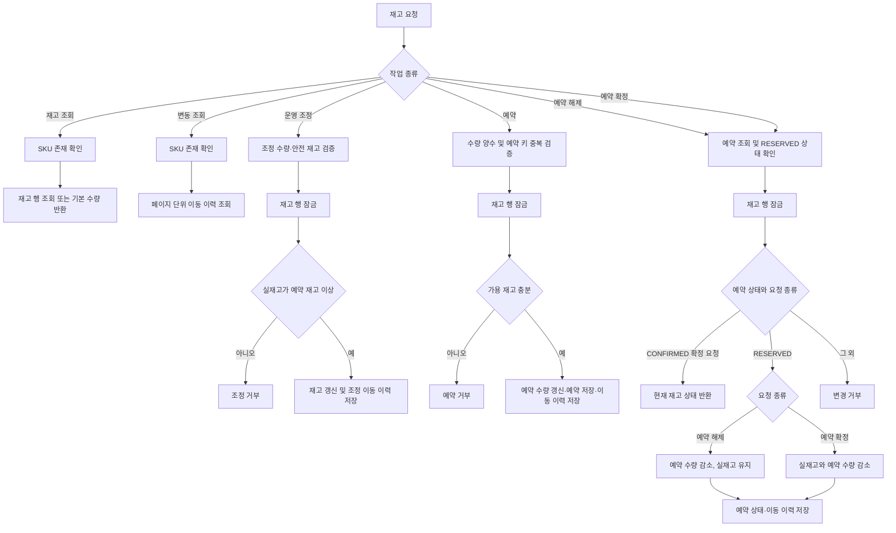

# 재고

## 운영 endpoint

- `GET /api/operation/inventory/skus/{skuId}`
- `PATCH /api/operation/inventory/skus/{skuId}`
- `GET /api/operation/inventory/skus/{skuId}/movements?page=&size=`

## 동작

### 알고리즘 흐름

- 운영 재고 endpoint의 인가 기준은 [operation.md](operation.md)의 권한 매트릭스를 적용.
- 재고 상태, 예약 상태 및 이동 이력은 하나의 유스케이스 트랜잭션으로 처리.
- 주문 생성 시 재고 예약.
  운영자 송장 등록 시점에 해당 주문의 예약을 확정.

- 가용 재고는 실재고에서 예약 재고를 뺀 값임.
- 운영 조정은 재고 이동 이력을 함께 기록함.
- 주문 생성은 재고를 예약하고 예약 식별자를 주문 항목에 보관함.
- 예약 확정·해제 use case는 제공됨.
- 이미 확정된 예약의 확정 요청은 중복 차감 없이 현재 재고를 반환함.
- 입금 상태와 발송 상태는 독립적으로 관리.
  미입금 만료 때 예약을 확정·해제할 조건은 정책 미확정.

재고 UseCase는 SKU 식별자와 재고 Port를 사용함.
카탈로그 SKU 저장 구현은 outbound adapter를 통해 조회함.
