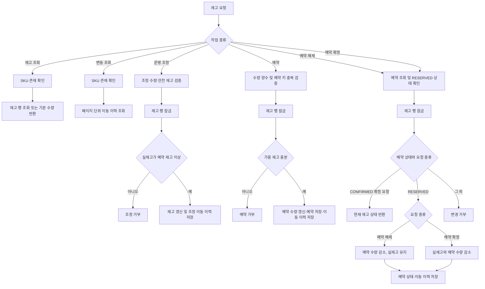
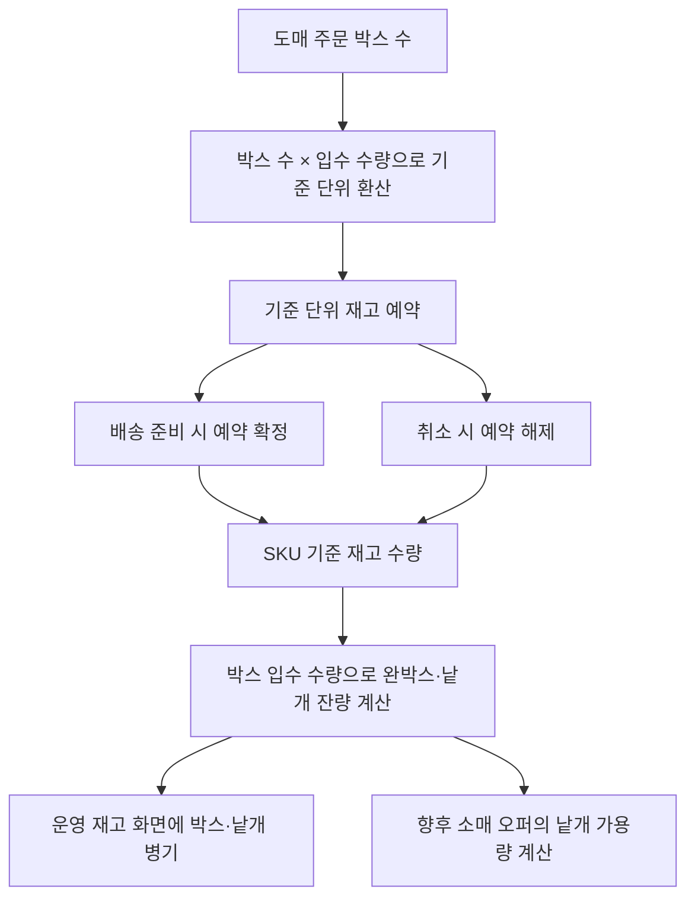

# 재고

## 운영 endpoint

- `GET /api/operation/inventory/skus/{skuId}`
- `PATCH /api/operation/inventory/skus/{skuId}`
- `GET /api/operation/inventory/skus/{skuId}/movements?page=&size=`

## 동작

### 알고리즘 흐름

- 운영 재고 endpoint의 인가 기준은 [operation.md](operation.md)의 권한 매트릭스를 적용. 
- 재고 상태, 예약 상태 및 이동 이력은 하나의 유스케이스 트랜잭션으로 처리. 
- 주문 생성 시 재고 예약. 
  운영자 송장 등록 시점에 해당 주문의 예약을 확정. 

- 가용 재고는 실재고에서 예약 재고를 뺀 값임. 
- 운영 조정은 재고 이동 이력을 함께 기록함. 
- 주문 생성은 재고를 예약하고 예약 식별자를 주문 항목에 보관함. 
- 예약 확정·해제 use case는 제공됨. 
- 이미 확정된 예약의 확정 요청은 중복 차감 없이 현재 재고를 반환함. 
- 입금 상태와 발송 상태는 독립적으로 관리. 
  미입금 만료 때 예약을 확정·해제할 조건은 정책 미확정. 

`InventoryService`가 `CatalogJpaEntityService`와 `InventoryJpaEntityService`를 직접 호출해 SKU·재고·예약·변동 이력을 처리함. 

## 도매 박스 및 재고 표시 확장 정책

아래는 향후 판매 채널 확장을 위한 정책 흐름이며, 현재 재고 모델에는 미반영. 
재고 원장은 상품별 기준 단위 수량 하나를 기준으로 관리하고, 박스 수와 낱개 잔량 표시는 해당 수량에서 계산. 
박스 입수 수량은 SKU 또는 판매 포장 조건으로 설정. 도매 주문의 박스 수는 기준 재고 단위로 환산해 예약·확정·해제. 
관리 화면은 완박스 수와 낱개 잔량을 함께 표시하되 두 값을 독립 재고로 저장하지 않음. 

박스 환산은 고객이 선택하는 판매 단위 변경이 아니라 서버의 재고 계산 규칙. 
실재고 원장과 표시용 환산값을 분리 저장해 합계 불일치 방지. 
입수 수량 변경은 기존 주문·예약의 환산 기준을 바꾸지 않도록 주문 시점의 판매 단위 정보를 보존하는 설계 필요. 
