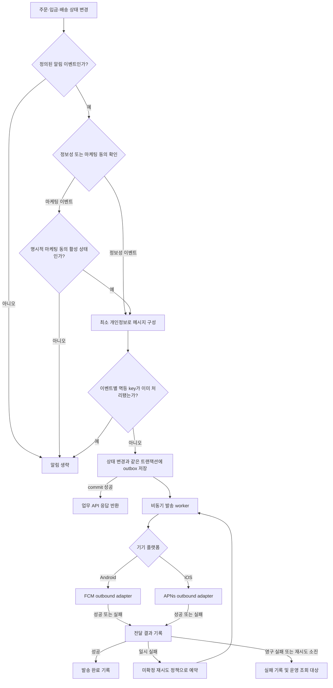

# 알림

## 구현 상태

알림 발송 API, 메시지 제공자 연동, 발송 이력은 아직 구현되지 않았음. 
SMS 본인 확인 코드 발송도 미구현임. 

## 발송 정책

모바일 앱의 정보성 push 채널은 Android FCM, iOS APNs로 통일. 
Flutter 앱이 OS push token을 획득·갱신하고, 인증된 앱이 알림 API에 token 등록·해제를 요청. 
알림 기능은 통합 API 안에서 독립 notification application 및 adapter 경계로 구현하며, 초기에는 별도 배포 서비스로 분리하지 않음. 
주문·결제·배송 API는 상태 변경과 outbox 기록까지만 담당하고, commit 이후 worker가 FCM/APNs outbound adapter를 호출. 
클라이언트에는 기기 token 등록·해제 API만 제공하고 임의 메시지 발송 API는 노출하지 않음. 
웹 브라우저 push는 현재 범위에 포함하지 않음. 
서비스 알림은 주문·입금·배송 진행에 필요한 정보성 알림으로 한정하며, 광고·쿠폰·재구매 권유는 발송하지 않음. 
마케팅 알림은 정보성 알림과 동의를 분리하고, 명시적인 선택 동의가 확인된 경우에만 별도 발송. 
OS push permission과 마케팅 수신 동의는 별개로 처리. 마케팅 push는 OS permission과 명시적 마케팅 동의가 모두 활성인 경우에만 발송. 
현재 계정 동의 이력은 개인정보 처리 동의 중심이며 알림 수신 동의 조회·철회 기능은 없음. 알림 구현 시 마케팅 동의의 획득·철회 이력을 별도 관리해야 함. 

| 업무 이벤트 | 정보성 알림 조건 |
| --- | --- |
| 주문 생성 | 주문 생성이 성공적으로 완료된 경우 활성 기기로 주문 접수 사실 발송 |
| 입금 상태 변경 | 입금 대기에서 부분 확인·전액 확인·일반 이슈 검토 필요로 전이되거나, 환불 대기·환불 완료로 전이된 경우 발송 |
| 배송 준비 | 주문 배송 상태가 `PREPARING`으로 전이된 경우 발송 |
| 송장 등록 | 배송 상태가 `IN_TRANSIT`으로 전이되고 택배사·송장번호가 저장된 경우 발송 |
| 배송 완료 | 배송 상태가 `DELIVERED`로 처음 전이된 경우 발송 |
| 취소 | 취소가 확정되어 주문이 취소 상태로 전이된 경우 결과 발송. 취소 요청 접수는 요청 정책이 확정된 뒤 별도 이벤트로 취급 |

중복 요청·재처리로 같은 주문 이벤트가 반복되어도 같은 알림을 중복 발송하지 않도록 이벤트별 멱등 key를 사용. 
잠금 화면에 표시될 수 있는 push에는 주문번호·금액·사업자번호·주소·입금 계좌·상세 주문 내역을 넣지 않고, 알림 종류와 안전한 앱 이동 정보만 포함. 
알림 전달 기록은 주문·입금·배송 상태 변경과 같은 DB 트랜잭션에서 outbox에 저장해 상태 변경 commit 후 발송되도록 연계. 
업무 API는 DB commit 후 알림 전송 완료를 기다리지 않고 응답. 배송 관리자는 배송 상태·송장 정보 저장이 끝나면 작업을 이어갈 수 있음. 
worker의 push 전송은 비동기이며, provider 전송 결과는 별도 알림 전달 상태로 추적. push provider의 접수 성공은 단말 표시·열람을 보장하지 않음. 
FCM/APNs 장애는 주문·입금·배송 상태 변경을 rollback하지 않으며, outbox worker가 실패 메시지를 재시도. 
재시도 간격·횟수는 미확정. 초기 제안은 첫 발송 실패 후 1분·5분·15분 간격으로 최대 3회 재시도하는 방식. 
재시도 소진 후에는 `FAILED` 상태로 남겨 운영 확인 대상으로 분류하는 방향이며, 영구 실패 분류와 복구 방법은 미확정. 
FCM/APNs 자격 증명은 secret 설정으로 주입. 운영자 수동 재발송 경로는 별도 설계 결정 항목. 

## 예정 흐름

아래 흐름은 미구현 설계이며 현재 발송 endpoint나 제공자 연동이 아님. 

발송 조건·정보성/마케팅 동의·outbox·재시도 정책은 위 기준을 따름. 
기기 token 등록·갱신·해제 API, FCM/APNs 요청 계약, token 만료·무효화 처리는 구현 task에서 확정. 
별도 배포 서비스 분리는 발송량·장애 격리 요구가 발생할 때 검토하며, outbox 경계는 추후 분리를 지원하도록 유지. 
