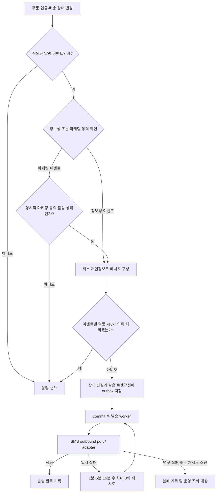

# 알림

## 구현 상태

알림 발송 API, 메시지 제공자 연동, 발송 이력은 아직 구현되지 않았음. 
SMS 본인 확인 코드 발송도 미구현임. 

## 발송 정책

초기 알림 채널은 SMS로 하며, 메시지 제공자는 구현 착수 시 별도 결정. 
서비스 알림은 주문·입금·배송 진행에 필요한 정보성 알림으로 한정하며, 광고·쿠폰·재구매 권유는 발송하지 않음. 
마케팅 알림은 정보성 알림과 동의를 분리하고, 명시적인 선택 동의가 확인된 경우에만 별도 발송. 
현재 계정 동의 이력은 개인정보 처리 동의 중심이며 알림 수신 동의 조회·철회 기능은 없음. 알림 구현 시 마케팅 동의의 획득·철회 이력을 별도 관리해야 함. 

| 업무 이벤트 | 정보성 알림 조건 |
| --- | --- |
| 주문 생성 | 주문 생성이 성공적으로 완료된 경우 주문자 연락처로 주문번호·접수 사실 발송 |
| 입금 상태 변경 | 입금 대기에서 부분 확인·전액 확인·일반 이슈 검토 필요로 전이되거나, 환불 대기·환불 완료로 전이된 경우 발송 |
| 배송 준비 | 주문 배송 상태가 `PREPARING`으로 전이된 경우 발송 |
| 송장 등록 | 배송 상태가 `IN_TRANSIT`으로 전이되고 택배사·송장번호가 저장된 경우 발송 |
| 배송 완료 | 배송 상태가 `DELIVERED`로 처음 전이된 경우 발송 |
| 취소 | 취소가 확정되어 주문이 취소 상태로 전이된 경우 결과 발송. 취소 요청 접수는 요청 정책이 확정된 뒤 별도 이벤트로 취급 |

중복 요청·재처리로 같은 주문 이벤트가 반복되어도 같은 알림을 중복 발송하지 않도록 이벤트별 멱등 key를 사용. 
알림 본문에는 주문 식별에 필요한 최소 정보만 포함하며 사업자번호·주소·입금 계좌·상세 주문 내역은 포함하지 않음. 
알림 전달 기록은 주문·입금·배송 상태 변경과 같은 DB 트랜잭션에서 outbox에 저장해 상태 변경 commit 후 발송되도록 연계. 
SMS 제공자 장애는 주문·입금·배송 상태 변경을 rollback하지 않으며, outbox worker가 실패 메시지를 재시도. 
첫 발송 실패 후 1분·5분·15분 간격으로 최대 3회 재시도하고, 모두 실패하면 `FAILED` 상태로 남겨 운영 확인 대상으로 분류. 
메시지 제공자 이름·인증 방식과 운영자 수동 재발송 경로는 구현 전에 확정할 설계 결정 항목. 

## 예정 흐름

아래 흐름은 미구현 설계이며 현재 발송 endpoint나 제공자 연동이 아님. 

발송 조건·정보성/마케팅 동의·outbox·재시도 정책은 위 기준을 따름. 
메시지 제공자별 요청·응답 계약과 실패 코드 분류는 외부 adapter 구현 시 확정. 
