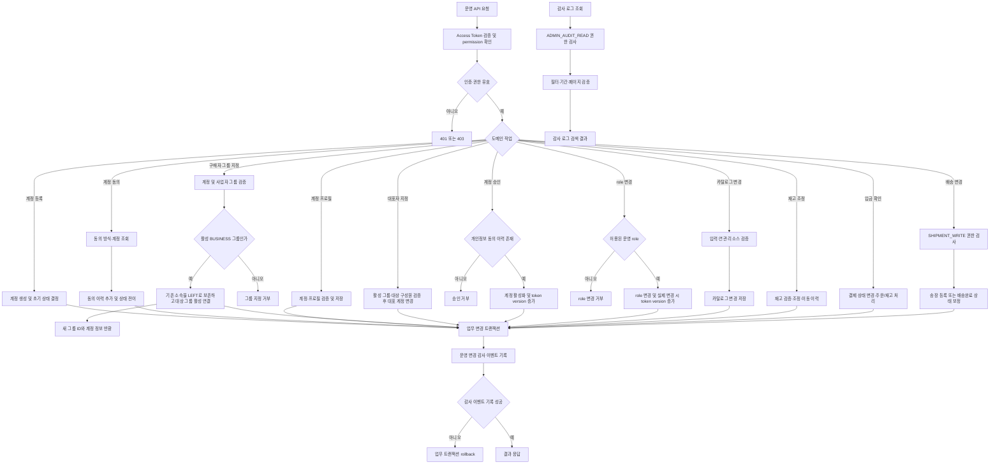
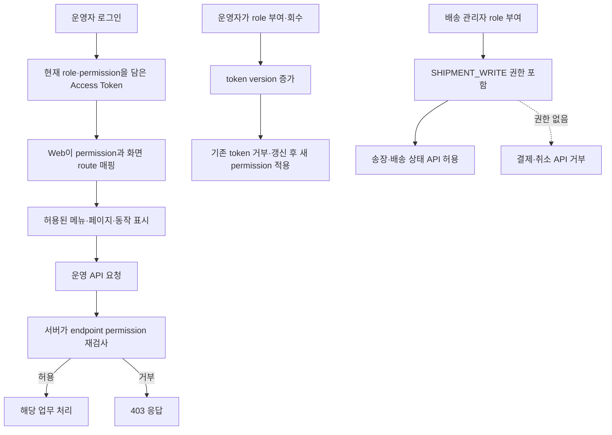
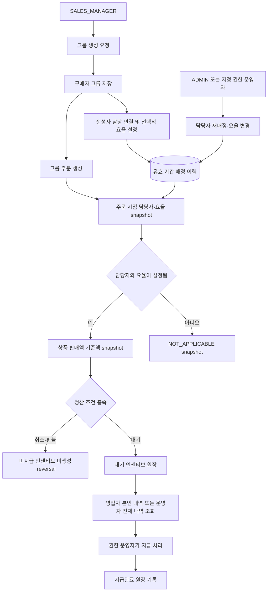

# 관리자 운영

## 관리자 작업 알고리즘 흐름



endpoint별 권한, 실제 감사 대상, 개인정보 제외, role bootstrap과 보존 정책은 이 문서의 각 계약 절을 기준으로 함.<br>
모든 조회 요청이 감사 로그를 생성하는 것은 아니며, 정의된 성공 변경 요청만 기록.<br>

관리자 endpoint는 `/api/operation/**` 아래에 있음.<br>
`REQUIRED` 모드에서는 Access Token의 permission claim으로 endpoint별 인가를 적용함.<br>
MFA 대상 관리자 role은 Access Token에 MFA 완료 claim이 있어야 permission 인가를 통과함.<br>
관리자 TOTP 초기화는 `ADMIN_ACCOUNT_MANAGE` 권한이 필요하며 대상 계정 token version·refresh session 무효화와 운영 감사 기록을 수행함.<br>
MFA 대상 상위 관리자 role은 token의 `mfaRequired`·`mfaVerified` claim도 만족해야 운영 API를 사용할 수 있음.<br>
인증 정보가 없거나 유효하지 않은 요청은 `401`, 인증됐지만 권한이 없는 요청은 `403`으로 거절함.<br>
로컬 전용 `BYPASS`는 권한 검사를 포함한 보안 검사를 생략함.<br>
운영 환경에서 `BYPASS` 사용 금지.<br>

## 권한 매트릭스

| Role | Permission |
| --- | --- |
| `ADMIN` | `ADMIN_AUDIT_READ`를 제외한 운영 permission |
| `SUPER_ADMIN` | 전체 permission (`ADMIN_AUDIT_READ` 포함) |
| `PRODUCT_MANAGER` | `PRODUCT_READ`, `PRODUCT_WRITE` |
| `ORDER_MANAGER` | `ORDER_READ`, `ORDER_WRITE` |
| `INVENTORY_MANAGER` | `INVENTORY_READ`, `INVENTORY_WRITE` |
| `SHIPPING_MANAGER` | `SHIPMENT_WRITE` |

## 운영자 화면·업무영역 권한 설계

배송 role과 인가 범위는 현재 구현이며, 화면별 접근 설정과 영업 role·permission은 미구현 설계 범위.<br>
현재는 `ADMIN`, `SUPER_ADMIN`, `PRODUCT_MANAGER`, `ORDER_MANAGER`, `INVENTORY_MANAGER`, `SHIPPING_MANAGER`가 존재함. `SHIPPING_MANAGER`는 배송 변경 권한만 보유하며, 영업 전용 role·permission은 미구현.<br>

| 운영 role | 책임 화면·업무 | 목표 permission |
| --- | --- | --- |
| `ADMIN` | 전체 운영 화면과 업무 관리. 감사 로그 조회는 제외 | 기존 전체 운영 permission |
| `SUPER_ADMIN` | 전체 운영 화면, role bootstrap 및 감사 로그 조회 | 전체 permission |
| `SHIPPING_MANAGER` | 송장 등록, 배송 상태 보정 | `SHIPMENT_WRITE` |
| `SALES_MANAGER` | 그룹 등록, 본인 담당 그룹 조회, 본인 인센티브 조회 | `SALES_GROUP_CREATE`, `SALES_GROUP_READ`, `SALES_COMMISSION_READ` |

| screen code 예시 | audience | 화면 조회 permission | 화면 action permission |
| --- | --- | --- | --- |
| `ADMIN_SHIPMENT_LIST`, `ADMIN_SHIPMENT_DETAIL` | `ADMIN` | `SHIPMENT_READ` | 송장·배송 상태 변경에 `SHIPMENT_WRITE` |
| `ADMIN_SALES_GROUP_LIST` | `ADMIN` | `SALES_GROUP_READ` | 담당 재배정·요율 변경에 `SALES_GROUP_ASSIGN` |
| `ADMIN_SALES_COMMISSION_LIST` | `ADMIN` | `SALES_COMMISSION_READ` | 지급 확정에 `SALES_COMMISSION_SETTLE` |
| `ADMIN_ACCOUNT_ROLE_SETTINGS` | `ADMIN` | `ADMIN_ACCOUNT_MANAGE` | role 부여·회수에 `ADMIN_ACCOUNT_MANAGE` |

상품·주문·재고 전용 기존 role은 호환을 위해 유지. 배송 정보 변경 endpoint는 `SHIPMENT_WRITE`만 요구하고 결제·취소·휴무일 endpoint는 계속 `ORDER_WRITE`를 요구해 배송 담당자에게 결제·취소 권한이 열리지 않도록 구성.<br>
영업 인센티브 확정·지급 처리는 별도 permission으로 제한하고, 담당 영업자 본인은 자신에게 귀속된 내역만 조회.<br>

화면별 조회 권한을 명시적으로 설정할 수 있도록 화면 리소스와 permission 연결을 DB에 둠. 화면 구성·route 구현은 React에 두고, DB는 안정적인 `screen_code`와 필요한 permission 연결을 관리.<br>
운영자 화면은 `account_role → role_permission → screen` 관계로 계산. 운영자 한 계정에 여러 role을 부여할 수 있으며 permission은 role 전체의 합집합으로 계산하므로 운영자별 화면 구분 가능. 사용자 화면은 활성 구매자 그룹의 역할을 `REPRESENTATIVE` 또는 `MEMBER`로 판정한 뒤 `buyer_group_role_permission → screen` 관계로 계산.<br>
대표자 역할은 `buyer_group.representative_account_id`로 판정하므로 사용자별 role을 `account_role`에 복제하지 않음. 가입·그룹 이동·대표자 변경 이후 화면 권한은 활성 그룹 기준으로 다시 계산.<br>
화면 조회 권한과 버튼/action permission을 구분해 설정하되, 각 화면 내부의 동작과 모든 API는 같은 permission code로 서버에서 재검사. UI에 노출되지 않는 API 직접 호출도 거부.<br>

설계 테이블(미구현):<br>

| Table | 핵심 필드·관계 | 목적 |
| --- | --- | --- |
| `ui_screen` | `id`, `screen_code`, `audience`(`ADMIN`/`BUYER`), `route_key`, `permission_match_mode`(`ALL`/`ANY`), `active`, `display_order` | 화면 코드·프론트엔드 route 식별 및 permission 결합 방식 |
| `ui_screen_permission` | `ui_screen_id`, `permission_id` 복합 PK | 화면을 보기 위해 필요한 permission 연결 |
| `buyer_group_role_permission` | `membership_role`, `permission_id` 복합 PK | 미소속·대표자·일반구성원 역할별 사용자 화면/API permission 설정 |

제안 컬럼·제약:<br>

| Table | 컬럼·타입·제약 |
| --- | --- |
| `ui_screen` | `id BIGINT PK`, `screen_code VARCHAR(100) UK`, `audience VARCHAR(20)`, `route_key VARCHAR(150)`, `permission_match_mode VARCHAR(10)`, `active BOOLEAN`, `display_order INT` |
| `ui_screen_permission` | `ui_screen_id BIGINT FK`, `permission_id BIGINT FK`, 복합 PK. 같은 화면 permission 중복 연결 금지 |
| `buyer_group_role_permission` | `membership_role VARCHAR(30)`, `permission_id BIGINT FK`, 복합 PK. role은 `UNASSIGNED`, `REPRESENTATIVE`, `MEMBER` |

`audience`·`membership_role`·`permission_match_mode`에는 DB check constraint를 적용. 화면별 permission 결합은 기본 all-of이며 필요한 경우에만 명시적으로 any-of 사용.<br>
`UNASSIGNED`는 그룹 미소속 계정의 초대 확인·개인 그룹 생성·휴대폰 검색·가입 요청 onboarding 화면 접근에 사용.<br>
미구현 access context 계약 제안: `GET /api/access-context?audience=ADMIN|BUYER`가 현재 role·permission·허용 `screen_code`를 반환. `BUYER` 응답은 활성 그룹이 없으면 `UNASSIGNED`, 있으면 `REPRESENTATIVE`/`MEMBER`와 활성 그룹 ID를 반환. 화면 코드는 실제 React page inventory와 대조해 등록.<br>
screen 및 screen-permission mapping은 검토된 migration/운영 설정으로만 변경하고 임의 운영자가 자기 화면 권한을 확장하는 API는 제공하지 않음. 운영자 개인별 차이는 기존 `account_role`에 허용 role을 부여해 계산하며, 사용자 개인 권한은 활성 그룹 역할에서 계산.<br>

관리자 측 `role_permission`과 사용자 측 `buyer_group_role_permission`을 같은 `permission` 코드에 연결해 화면 권한 및 API 권한 코드의 의미를 통일. 화면별 `permission_match_mode`에 따라 연결된 권한을 all-of 또는 any-of로 판정.<br>
`ui_screen`은 메뉴 문구·레이아웃·권한 경계를 대신하지 않으며 프론트엔드가 모르는 `screen_code`는 응답에서 사용하지 않음.<br>
Access context API는 현재 audience·화면별 permission 통과 여부·대표자/구성원 유형을 응답. access context 응답은 표시 편의용이며 업무 API에서 별도 인가 필수.<br>



## 영업 담당 그룹 및 인센티브 DB 설계안

아래 구조는 설계안이며 현재 schema·API에는 미적용.<br>
기존 `buyer_group` 행에 현재 담당자와 요율을 덮어쓰지 않고 배정 이력과 주문별 확정 금액을 분리해 과거 정산 근거를 보존.<br>

| 설계 테이블 | 주요 데이터 | 규칙 |
| --- | --- | --- |
| `buyer_group_sales_assignment` | 구매자 그룹, 영업 계정, 선택적 요율(basis points), 적용 시작·종료, 배정 사유·설정 운영자 | 그룹당 시점별 담당 영업자 1명. 수수료 없는 담당 연결도 허용. 직원·그룹 연결별 요율이 다를 수 있으며 재배정은 기존 행 종료 후 새 행 추가 |
| `sales_commission` | 주문·그룹·담당 영업자·배정 ID, 적용 요율·상품 판매 기준액·인센티브액 snapshot, 상태(`NOT_APPLICABLE`, `WAITING`, `PAYABLE`, `PAID`, `REVERSED`), 확정·지급 시각 | 주문당 attribution/정산 요약 한 건. 담당자나 요율이 없어도 `NOT_APPLICABLE`로 snapshot해 미지급 근거를 보존. 취소·환불은 event로 보정 |
| `sales_commission_event` | 원장 ID, `ACCRUED`·`REVERSED`·`PAID` 이벤트, 금액 증감, 처리 계정, 사유, 발생 시각 | 인센티브 상태 변경을 append-only로 기록. 중복 주문 이벤트 재처리 방지 key 보유 |

제안 컬럼·제약:<br>

| Table | 컬럼·타입·제약 |
| --- | --- |
| `buyer_group_sales_assignment` | `id BIGINT PK`, `public_id BINARY(16) UK`, `buyer_group_id BIGINT FK`, `sales_account_id BIGINT FK`, `commission_rate_bps INT NULL`, `assignment_reason VARCHAR(30)`, `valid_from DATETIME(3)`, `valid_until DATETIME(3) NULL`, `assigned_by_account_id BIGINT FK`, `created_at DATETIME(3)`. 요율 `NULL`은 수수료 없음, 양수 요율은 해당 그룹 담당자의 판매 인센티브. `CHECK (commission_rate_bps IS NULL OR commission_rate_bps BETWEEN 1 AND 10000)`. 활성 그룹당 담당자 한 명을 generated active key unique로 보장하고, 재배정은 그룹 행 잠금으로 기간 중복 방지 |
| `sales_commission` | `id BIGINT PK`, `public_id BINARY(16) UK`, `order_id BIGINT FK UK`, `buyer_group_id BIGINT FK`, `assignment_id BIGINT FK NULL`, `sales_account_id BIGINT FK NULL`, `rate_bps_snapshot INT NULL`, `basis_snapshot VARCHAR(30)` (`NET_ITEM_SALES`), `basis_amount BIGINT`, `commission_amount BIGINT`, `status VARCHAR(30)`, `qualified_at DATETIME(3) NULL`, `created_at DATETIME(3)`, `updated_at DATETIME(3)`. 주문 생성 시 담당/요율 부재면 `NOT_APPLICABLE`, 요율이 있으면 `WAITING` |
| `sales_commission_event` | `id BIGINT PK`, `commission_id BIGINT FK`, `event_type VARCHAR(30)`, `amount_delta BIGINT`, `idempotency_key VARCHAR(150) UK`, `processed_by_account_id BIGINT FK NULL`, `reason_code VARCHAR(50) NULL`, `created_at DATETIME(3)` |

`buyer_group`에는 `created_by_account_id BIGINT FK NULL`을 추가해 그룹 생성 주체를 기록. 영업자가 그룹을 생성하면 그룹·작성자·생성자를 초기 담당자로 한 배정 row를 한 트랜잭션으로 저장. 초기 요율은 `NULL`(미지급)이며 `SALES_GROUP_ASSIGN` 권한 운영자가 요율을 설정할 때 별도 유효기간 배정 row를 추가.<br>
요율은 `commission_rate_bps`에 basis points로 저장. 예를 들어 `30`은 0.3%이며 고정 기본값을 강제하지 않음. 생성 영업자의 본인 담당 연결은 자동화하되, 요율 설정·담당자 재배정은 `SALES_GROUP_ASSIGN` permission에 제한.<br>
주문 snapshot은 주문 생성 시점의 담당자·선택 요율·상품 판매 기준액을 고정. 주문 한 건당 요약 원장 한 건이며 `sales_commission_event`가 발생·reversal·지급 이력을 보존.<br>

금액 계산은 정수 원화와 basis points 사용. `0.3%`는 `30 / 10,000`으로 저장해 부동소수점 반올림 차이를 방지.<br>
인센티브 기준액은 상품 판매액으로 제안. 주문 상품 금액에서 상품 할인·취소·환불 금액을 차감하고 배송비는 제외. 판매가가 세금 포함 가격인지 별도 가격인지는 결제·세금계산 정책과 함께 확정 필요.<br>
주문 시점의 담당자·선택 요율을 snapshot. 요율 `NULL` 또는 담당자 미배정 주문은 `NOT_APPLICABLE`이며 정산 대상에 포함하지 않음.<br>

### 정책 추천안·미확정 사항

- 그룹별 활성 담당자는 한 명으로 제한하는 안을 기준으로 설계. 다수 담당자 동시 배정이 필요하면 주문 인센티브 분배 규칙을 별도 추가.<br>
- 0.3%는 판매액 기준의 예시 요율이며, 실제 rate는 직원·업체 연결마다 선택적으로 설정. 미지급 그룹은 요율 `NULL`로 구분하고, 영업 관리자가 임의로 본인 요율을 정하지 않도록 별도 운영자 권한으로 설정하는 안을 추천.<br>
- 기준액은 주문 상품 순판매액으로 제안하고 배송비는 제외. 취소·환불은 상품 판매액에서 차감하거나 기존 인센티브를 reversal.<br>
- 인센티브 확정은 배송완료와 전액 입금 확인이 모두 끝난 시점으로 제안. 배송 후 미입금 주문은 `WAITING` 상태를 유지. 두 조건 충족 시 `PAYABLE`로 전환하고, 지급 시 `PAID`.<br>
- 전체 취소·환불은 미지급 인센티브를 무효화하고, 지급 후 환불은 별도 음수 reversal event로 다음 정산에 반영.<br>
- 영업 관리자는 담당 그룹·본인 인센티브 조회 가능. 지급 확정은 본인과 분리해 전체 관리자 또는 별도 정산 권한자만 수행하도록 제안.<br>
- 적용 요율 변경은 효력 발생 이후 생성된 주문에만 적용. 주문별 snapshot은 이후 그룹 담당자·요율 변경으로 수정하지 않음.<br>

배송비·세금 포함 여부, 발생 시점 및 지급 권한은 설계 제안이며 schema migration·정산 API 착수 전 확정 필요.<br>



| Endpoint | Required permission |
| --- | --- |
| `/api/operation/accounts/**` | `ADMIN_ACCOUNT_MANAGE` |
| `GET /api/operation/audit-logs` | `ADMIN_AUDIT_READ` |
| `/api/operation/payments/**` | `ORDER_WRITE` |
| `/api/operation/orders/{orderId}/shipment/**` | `ORDER_WRITE` |
| 카탈로그 조회 endpoint | `PRODUCT_READ` |
| 카탈로그 생성·수정 endpoint | `PRODUCT_WRITE` |
| 재고 조회·변동 조회 endpoint | `INVENTORY_READ` |
| 재고 조정 endpoint | `INVENTORY_WRITE` |

기본 role-permission 매핑은 Flyway V10, 감사 로그 조회 permission은 V11에서 적용함.<br>
`ADMIN_ACCOUNT_MANAGE` 권한으로 role 관리 endpoint를 이용할 수 있음.<br>
운영 API에서 관리 가능한 role은 `PRODUCT_MANAGER`, `ORDER_MANAGER`, `INVENTORY_MANAGER`로 제한하며 `ADMIN`, `SUPER_ADMIN`, `CUSTOMER`는 API로 부여·회수할 수 없음.<br>
중복 부여와 이미 회수된 role의 회수는 멱등 처리.<br>
role이 실제 변경되면 대상 계정의 token version을 증가시켜 기존 Access Token을 즉시 거부하며, 새 토큰에 변경된 권한을 반영함.<br>
Access Token에 발급 당시 permission을 담음.<br>
매 요청 시 token version을 DB와 대조하므로 token version 변경 시 기존 Access Token은 즉시 인증 실패하고, 새 토큰부터 변경된 permission이 반영됨.<br>
계정 정지는 상태 검사로 즉시 인증 실패 처리됨.<br>
인증 불가 응답은 `401`, 권한 부족 응답은 `403`임.<br>

### 초기 관리자 role bootstrap

초기 최고 관리자 계정 지정은 운영 DB 접근 권한을 가진 담당자가 수행.<br>
`phone_normalized`는 평문 전화번호 대신 정규화된 번호를 사용하며, 계정 상태가 `ACTIVE`인지 먼저 확인.<br>

```sql
SET @admin_account_id = (
    SELECT id
    FROM account
    WHERE phone_normalized = '<정규화된 관리자 전화번호>'
      AND status = 'ACTIVE'
);

START TRANSACTION;

INSERT INTO account_role (account_id, role_id, granted_by)
SELECT @admin_account_id, id, NULL
FROM role
WHERE code = 'SUPER_ADMIN'
  AND @admin_account_id IS NOT NULL
ON DUPLICATE KEY UPDATE granted_at = CURRENT_TIMESTAMP(3);

SELECT a.id, a.name, a.status, r.code
FROM account_role ar
JOIN account a ON a.id = ar.account_id
JOIN role r ON r.id = ar.role_id
WHERE a.id = @admin_account_id;

COMMIT;
```

결과에 대상 계정과 `SUPER_ADMIN`이 한 건씩 표시되는지 확인.<br>
결과가 비어 있거나 예상과 다르면 `COMMIT` 전 `ROLLBACK` 수행.<br>
시스템 role bootstrap은 계속 승인된 DB 작업으로 처리.<br>

### 관리자 role endpoint

| Method | Endpoint | 동작 |
| --- | --- | --- |
| `GET` | `/api/operation/accounts/roles` | API에서 관리 가능한 운영 role 목록 |
| `GET` | `/api/operation/accounts/{id}/roles` | 계정에 부여된 role 목록 |
| `PUT` | `/api/operation/accounts/{id}/roles/{roleCode}` | 운영 role 부여 |
| `DELETE` | `/api/operation/accounts/{id}/roles/{roleCode}` | 운영 role 회수 |

모든 endpoint는 `ADMIN_ACCOUNT_MANAGE` 권한 필요.<br>
부여 시 `granted_by`에는 요청자 계정이 기록됨.<br>

### 구매자 그룹 지정

`ADMIN_ACCOUNT_MANAGE` 운영자가 계정 상세의 `buyerGroupId`를 확인한 뒤 사업자 그룹에 계정을 명시적으로 연결.<br>
같은 사업자번호를 가진 계정도 자동 병합하지 않으며, 대상은 활성 `BUSINESS` 그룹으로 제한.<br>
계정은 기존 그룹 소속 행 하나를 대상 그룹으로 변경. 과거 주문은 원래의 구매자 그룹에 유지하고 자동 이전하지 않음.<br>
계정의 기존 구성원 이력은 `LEFT` 상태로 보존하고 새 그룹에 활성 구성원으로 연결.<br>

| Method | Endpoint | 동작 |
| --- | --- | --- |
| `PUT` | `/api/operation/accounts/{id}/buyer-group` | 요청 본문의 `buyerGroupId`로 계정을 사업자 그룹에 명시적으로 연결 |
| `PUT` | `/api/operation/buyer-groups/{groupId}/representative` | 활성 구성원 중 대표자를 지정·변경 |
| `GET` | `/api/operation/buyer-groups/{groupId}/tax-invoice-profile` | 구매자 그룹 세금계산서 정보 조회 |
| `PUT` | `/api/operation/buyer-groups/{groupId}/tax-invoice-profile` | 구매자 그룹 세금계산서 정보 수정 |

성공 응답의 `buyerGroupId`는 새 그룹 공개 UUID.<br>
구매자 그룹 세금계산서 정보 조회·수정은 `ADMIN_ACCOUNT_MANAGE` 권한 필요. 운영자 변경은 기존 운영 감사 로그에 대상 그룹 ID와 route만 기록하며, 사업자 정보 값은 감사 로그에 저장하지 않음.<br>

### 운영 변경 감사 로그

운영자 계정·role, 카테고리·브랜드·상품 및 SKU, 관리자 재고 조정의 성공한 변경 요청을 기록함.<br>
감사 로그에는 운영자 공개 UUID, endpoint method·route template, 대상 리소스 공개 UUID, 요청 trace ID, UTC 발생 시각만 저장함.<br>
요청 본문, 변경 전·후 값, 이름·전화번호·이메일·사업자 정보·주소·동의 근거·인증 정보·재고 메모는 저장하지 않음.<br>
로컬 `BYPASS` 요청처럼 인증 subject가 없는 경우 운영자 UUID는 nullable로 기록됨.<br>
role 변경 시 제한된 role code를 action 값에 포함함.<br>
감사 로그 기록에 실패하면 같은 요청의 업무 변경도 rollback 처리함.<br>

감사 로그 보존 기간은 발생 시각부터 730일.<br>
매일 03:15 UTC에 10,000건 단위로 만료 데이터를 삭제함.<br>
삭제 작업은 만료 행이 batch보다 적게 남을 때까지 반복 수행함.<br>

| Method | Endpoint | 동작 |
| --- | --- | --- |
| `GET` | `/api/operation/audit-logs?actorId=&resourceType=&from=&until=&page=&size=` | 운영 변경 이력 검색 |

조회 권한은 `ADMIN_AUDIT_READ`이며 `SUPER_ADMIN`에만 부여함.<br>
일반 `ADMIN`은 로그를 조회할 수 없음.<br>
`from`은 포함, `until`은 제외하는 UTC ISO-8601 시각 범위이며 페이지 크기는 최대 100.<br>

### 입금 상태 확인

`ORDER_WRITE` 권한 운영자는 `GET /api/operation/payments`로 기본 입금 대기·부분 입금 확인 필요 목록을 조회하고, `PATCH /api/operation/payments/{orderId}/status`로 상태를 변경함.<br>
입금 확인 응답에는 주문자명과 연락처가 포함되며, 실제 은행 내역 확인과 부분 입금 후속 통화는 운영 절차로 수행.<br>
상태 변경은 payment history와 운영 변경 감사 로그에 처리자·시각을 남김.<br>

## 계정

- `POST /api/operation/accounts`
- `GET /api/operation/accounts?status=&page=&size=`
- `GET /api/operation/accounts/{id}`
- `PATCH /api/operation/accounts/{id}/status`
- `PUT /api/operation/accounts/{id}/business-profile`
- `PUT /api/operation/accounts/{id}/buyer-group`
- `PUT /api/operation/buyer-groups/{groupId}/representative`
- `POST /api/operation/accounts/{id}/consents`
- `POST /api/operation/accounts/{id}/approve`

계정은 동의·프로필 상태에 따라 대기 상태를 거쳐 승인됨.<br>
운영자는 오프라인 서면 동의를 받은 기존 거래처의 계정에 `consentMethod=WRITTEN`으로 개인정보 동의 이력을 기록할 수 있음.<br>
동의 처리자 UUID와 문서 버전·증빙 참조를 이력에 보관하며, 서명 원본은 운영 절차에 따라 오프라인으로 보관.<br>
개인정보 동의 이력을 확인한 뒤 승인 endpoint로 활성화하고 계정 token version을 갱신함.<br>
상태 변경 endpoint로 `ACTIVE`를 직접 지정하는 것은 차단되며, 동의 확인이 포함된 승인 endpoint를 사용함.<br>

## 카탈로그

관리자 카테고리·브랜드·상품 및 이미지·옵션·SKU endpoint는 [catalog.md](catalog.md)에 정리했음.<br>

## 구조

계정과 카탈로그는 각각 `operation/account`, `operation/catalog`에 배치.<br>
Controller가 HTTP 모델을 도메인 Service 호출로 변환하며, 도메인 Service가 영속성 service와 Repository를 호출함.<br>
감사 로그 저장·조회·보존 정책 적용은 이 문서의 기준을 사용함.<br>
