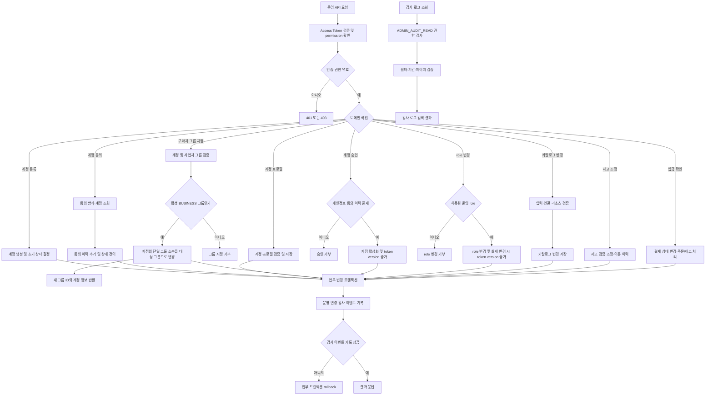

# 관리자 운영

## 관리자 작업 알고리즘 흐름



endpoint별 권한, 실제 감사 대상, 개인정보 제외, role bootstrap과 보존 정책은 이 문서의 각 계약 절을 기준으로 함.<br>
모든 조회 요청이 감사 로그를 생성하는 것은 아니며, 정의된 성공 변경 요청만 기록.<br>

관리자 endpoint는 `/api/operation/**` 아래에 있음.<br>
`REQUIRED` 모드에서는 Access Token의 permission claim으로 endpoint별 인가를 적용함.<br>
인증 정보가 없거나 유효하지 않은 요청은 `401`, 인증됐지만 권한이 없는 요청은 `403`으로 거절함.<br>
로컬 전용 `BYPASS`는 권한 검사를 포함한 보안 검사를 생략함.<br>
운영 환경에서 `BYPASS` 사용 금지.<br>

## 권한 매트릭스

| Role | Permission |
| --- | --- |
| `ADMIN` | `ADMIN_AUDIT_READ`를 제외한 운영 permission |
| `SUPER_ADMIN` | 전체 permission (`ADMIN_AUDIT_READ` 포함) |
| `PRODUCT_MANAGER` | `PRODUCT_READ`, `PRODUCT_WRITE` |
| `ORDER_MANAGER` | `ORDER_READ`, `ORDER_WRITE` |
| `INVENTORY_MANAGER` | `INVENTORY_READ`, `INVENTORY_WRITE` |

| Endpoint | Required permission |
| --- | --- |
| `/api/operation/accounts/**` | `ADMIN_ACCOUNT_MANAGE` |
| `GET /api/operation/audit-logs` | `ADMIN_AUDIT_READ` |
| `/api/operation/payments/**` | `ORDER_WRITE` |
| `/api/operation/orders/{orderId}/shipment/**` | `ORDER_WRITE` |
| 카탈로그 조회 endpoint | `PRODUCT_READ` |
| 카탈로그 생성·수정 endpoint | `PRODUCT_WRITE` |
| 재고 조회·변동 조회 endpoint | `INVENTORY_READ` |
| 재고 조정 endpoint | `INVENTORY_WRITE` |

기본 role-permission 매핑은 Flyway V10, 감사 로그 조회 permission은 V11에서 적용함.<br>
`ADMIN_ACCOUNT_MANAGE` 권한으로 role 관리 endpoint를 이용할 수 있음.<br>
운영 API에서 관리 가능한 role은 `PRODUCT_MANAGER`, `ORDER_MANAGER`, `INVENTORY_MANAGER`로 제한하며 `ADMIN`, `SUPER_ADMIN`, `CUSTOMER`는 API로 부여·회수할 수 없음.<br>
중복 부여와 이미 회수된 role의 회수는 멱등 처리.<br>
role이 실제 변경되면 대상 계정의 token version을 증가시켜 기존 Access Token을 즉시 거부하며, 새 토큰에 변경된 권한을 반영함.<br>
Access Token에 발급 당시 permission을 담음.<br>
매 요청 시 token version을 DB와 대조하므로 token version 변경 시 기존 Access Token은 즉시 인증 실패하고, 새 토큰부터 변경된 permission이 반영됨.<br>
계정 정지는 상태 검사로 즉시 인증 실패 처리됨.<br>
인증 불가 응답은 `401`, 권한 부족 응답은 `403`임.<br>

### 초기 관리자 role bootstrap

초기 최고 관리자 계정 지정은 운영 DB 접근 권한을 가진 담당자가 수행.<br>
`phone_normalized`는 평문 전화번호 대신 정규화된 번호를 사용하며, 계정 상태가 `ACTIVE`인지 먼저 확인.<br>

```sql
SET @admin_account_id = (
    SELECT id
    FROM account
    WHERE phone_normalized = '<정규화된 관리자 전화번호>'
      AND status = 'ACTIVE'
);

START TRANSACTION;

INSERT INTO account_role (account_id, role_id, granted_by)
SELECT @admin_account_id, id, NULL
FROM role
WHERE code = 'SUPER_ADMIN'
  AND @admin_account_id IS NOT NULL
ON DUPLICATE KEY UPDATE granted_at = CURRENT_TIMESTAMP(3);

SELECT a.id, a.name, a.status, r.code
FROM account_role ar
JOIN account a ON a.id = ar.account_id
JOIN role r ON r.id = ar.role_id
WHERE a.id = @admin_account_id;

COMMIT;
```

결과에 대상 계정과 `SUPER_ADMIN`이 한 건씩 표시되는지 확인.<br>
결과가 비어 있거나 예상과 다르면 `COMMIT` 전 `ROLLBACK` 수행.<br>
시스템 role bootstrap은 계속 승인된 DB 작업으로 처리.<br>

### 관리자 role endpoint

| Method | Endpoint | 동작 |
| --- | --- | --- |
| `GET` | `/api/operation/accounts/roles` | API에서 관리 가능한 운영 role 목록 |
| `GET` | `/api/operation/accounts/{id}/roles` | 계정에 부여된 role 목록 |
| `PUT` | `/api/operation/accounts/{id}/roles/{roleCode}` | 운영 role 부여 |
| `DELETE` | `/api/operation/accounts/{id}/roles/{roleCode}` | 운영 role 회수 |

모든 endpoint는 `ADMIN_ACCOUNT_MANAGE` 권한 필요.<br>
부여 시 `granted_by`에는 요청자 계정이 기록됨.<br>

### 구매자 그룹 지정

`ADMIN_ACCOUNT_MANAGE` 운영자가 계정 상세의 `buyerGroupId`를 확인한 뒤 사업자 그룹에 계정을 명시적으로 연결.<br>
같은 사업자번호를 가진 계정도 자동 병합하지 않으며, 대상은 활성 `BUSINESS` 그룹으로 제한.<br>
계정은 기존 그룹 소속 행 하나를 대상 그룹으로 변경. 과거 주문은 원래의 구매자 그룹에 유지하고 자동 이전하지 않음.<br>

| Method | Endpoint | 동작 |
| --- | --- | --- |
| `PUT` | `/api/operation/accounts/{id}/buyer-group` | 요청 본문의 `buyerGroupId`로 계정을 사업자 그룹에 명시적으로 연결 |

성공 응답의 `buyerGroupId`는 새 그룹 공개 UUID.<br>

### 운영 변경 감사 로그

운영자 계정·role, 카테고리·브랜드·상품 및 SKU, 관리자 재고 조정의 성공한 변경 요청을 기록함.<br>
감사 로그에는 운영자 공개 UUID, endpoint method·route template, 대상 리소스 공개 UUID, 요청 trace ID, UTC 발생 시각만 저장함.<br>
요청 본문, 변경 전·후 값, 이름·전화번호·이메일·사업자 정보·주소·동의 근거·인증 정보·재고 메모는 저장하지 않음.<br>
로컬 `BYPASS` 요청처럼 인증 subject가 없는 경우 운영자 UUID는 nullable로 기록됨.<br>
role 변경 시 제한된 role code를 action 값에 포함함.<br>
감사 로그 기록에 실패하면 같은 요청의 업무 변경도 rollback 처리함.<br>

감사 로그 보존 기간은 발생 시각부터 730일.<br>
매일 03:15 UTC에 10,000건 단위로 만료 데이터를 삭제함.<br>
삭제 작업은 만료 행이 batch보다 적게 남을 때까지 반복 수행함.<br>

| Method | Endpoint | 동작 |
| --- | --- | --- |
| `GET` | `/api/operation/audit-logs?actorId=&resourceType=&from=&until=&page=&size=` | 운영 변경 이력 검색 |

조회 권한은 `ADMIN_AUDIT_READ`이며 `SUPER_ADMIN`에만 부여함.<br>
일반 `ADMIN`은 로그를 조회할 수 없음.<br>
`from`은 포함, `until`은 제외하는 UTC ISO-8601 시각 범위이며 페이지 크기는 최대 100.<br>

### 입금 상태 확인

`ORDER_WRITE` 권한 운영자는 `GET /api/operation/payments`로 기본 입금 대기·부분 입금 확인 필요 목록을 조회하고, `PATCH /api/operation/payments/{orderId}/status`로 상태를 변경함.<br>
입금 확인 응답에는 주문자명과 연락처가 포함되며, 실제 은행 내역 확인과 부분 입금 후속 통화는 운영 절차로 수행.<br>
상태 변경은 payment history와 운영 변경 감사 로그에 처리자·시각을 남김.<br>

## 계정

- `POST /api/operation/accounts`
- `GET /api/operation/accounts?status=&page=&size=`
- `GET /api/operation/accounts/{id}`
- `PATCH /api/operation/accounts/{id}/status`
- `PUT /api/operation/accounts/{id}/business-profile`
- `PUT /api/operation/accounts/{id}/buyer-group`
- `POST /api/operation/accounts/{id}/consents`
- `POST /api/operation/accounts/{id}/approve`

계정은 동의·프로필 상태에 따라 대기 상태를 거쳐 승인됨.<br>
운영자는 오프라인 서면 동의를 받은 기존 거래처의 계정에 `consentMethod=WRITTEN`으로 개인정보 동의 이력을 기록할 수 있음.<br>
동의 처리자 UUID와 문서 버전·증빙 참조를 이력에 보관하며, 서명 원본은 운영 절차에 따라 오프라인으로 보관.<br>
개인정보 동의 이력을 확인한 뒤 승인 endpoint로 활성화하고 계정 token version을 갱신함.<br>
상태 변경 endpoint로 `ACTIVE`를 직접 지정하는 것은 차단되며, 동의 확인이 포함된 승인 endpoint를 사용함.<br>

## 카탈로그

관리자 카테고리·브랜드·상품 및 이미지·옵션·SKU endpoint는 [catalog.md](catalog.md)에 정리했음.<br>

## 구조

계정과 카탈로그는 각각 `operation/account`, `operation/catalog`에 배치.<br>
HTTP 모델은 web adapter에서 application 명령·응답 모델로 바꾸고, persistence adapter에서만 JPA Entity를 사용함.<br>
감사 로그 저장·조회·보존 정책 적용은 이 문서의 기준을 사용함.<br>
