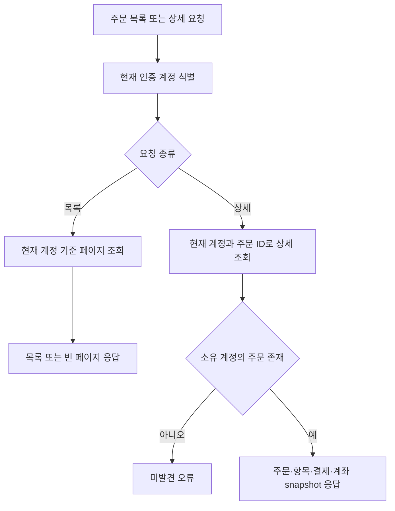

# 주문

## 주문·입금·배송 정책 흐름

입금 확인과 물건 발송은 독립된 운영 작업.<br>
입금 상태 변경만으로 발송 상태가 바뀌지 않으며, 발송 처리도 입금 확인을 선행 조건으로 요구하지 않음.<br>
아래 흐름은 확정된 정책과 이번 구현 범위.<br>
입금 확정은 결제 상태와 주문 결제 상태만 변경하며, 배송 상태는 별도 관리.<br>
재고는 주문에서 예약하고 송장 등록 시 확정.<br>

```mermaid
flowchart TD
    subgraph CHECKOUT[사용자 주문·계좌 안내]
        A[인증된 사용자] --> B[계정 기본 세금계산서 설정 조회]
        B --> C[발행 여부 토글 및 주문별 선택]
        C --> D[선택한 발행 여부에 맞는 계좌 표시]
        D --> E{기본값 변경 확인}
        E -- 확인 --> F[주문과 함께 선택값·기본값 변경 요청]
        E -- 유지 --> G[주문과 함께 선택값 전달]
        F --> H[장바구니·SKU 판매 상태 검증]
        G --> H
        H --> I{주문 가능}
        I -- 아니오 --> J[주문 거부]
        I -- 예 --> K[주문·상품·가격·발행 여부·계좌 snapshot 저장]
        K --> L[결제 대기·배송 대기 상태 저장]
        L --> M[재고 예약 및 장바구니 비우기]
    end

    subgraph SHIPPING[배송 운영]
        M --> N[배송 상태 READY_TO_SHIP]
        N --> O[운영자가 발송 처리 시작]
        O --> P[배송 상태 PREPARING]
        P --> Q[배송 담당자가 택배사·송장번호 입력]
        Q --> R{주문 및 배송 정보 유효}
        R -- 아니오 --> ERR[요청 거부]
        R -- 예 --> DUP{이미 IN_TRANSIT이며 같은 송장 정보}
        DUP -- 예 --> U[변경 없이 기존 배송 정보 반환]
        DUP -- 아니오 --> S[재고 예약 확정 (이미 확정된 예약은 변경 없음)]
        S --> T[배송 정보 저장 및 IN_TRANSIT 반영]
        T --> U[사용자 주문 화면에 배송중·배송 조회 정보 제공]
    end

    subgraph PAYMENT[입금 확인]
        M --> PAY1[사용자가 주문에 저장된 계좌로 송금]
        PAY1 --> PAY2[운영자가 실제 입금 내역 대조]
        PAY2 --> PAY3{입금 결과}
        PAY3 -- 전액 확인 --> PAY4[결제 상태 PAYMENT_CONFIRMED]
        PAY3 -- 부분 확인 --> PAY5[결제 상태 PARTIAL_PAYMENT_REVIEW_REQUIRED]
        PAY3 -- 일반 이슈 --> PAY6[운영자가 PAYMENT_ISSUE_REVIEW_REQUIRED로 변경]
        PAY4 --> PAY7[사용자 주문 화면에 입금 확인 표시]
        PAY5 --> PAY8[사용자 주문 화면에 부분 입금 검토 표시]
        PAY6 --> PAY9[사용자 주문 화면에 일반 입금 이슈 표시]
        PAY9 --> PAY10[운영자가 시스템 밖에서 확인 및 후속 처리]
        PAY10 --> PAY11{운영자 확인 결과}
        PAY11 -- 입금 대기 유지 --> PAY12[WAITING_FOR_DEPOSIT로 변경]
        PAY11 -- 부분 입금 확인 --> PAY13[PARTIAL_PAYMENT_REVIEW_REQUIRED로 변경]
        PAY11 -- 전액 입금 확인 --> PAY14[PAYMENT_CONFIRMED로 변경]
        PAY12 --> PAY15[사용자 입금 대기 상태 갱신]
        PAY13 --> PAY16[사용자 부분 입금 상태 갱신]
        PAY14 --> PAY17[사용자 입금 완료 상태 갱신]
    end
```

입금 및 배송 상태는 각 운영 작업에서 별도로 갱신.<br>
송장 등록 트랜잭션에서 재고 예약을 먼저 확정한 뒤 배송 정보와 `IN_TRANSIT`을 저장.<br>
이미 확정된 재고 예약은 멱등 처리하며, 같은 송장 정보의 중복 등록은 상태 변경 없이 기존 배송 정보를 반환.<br>
배송 처리에는 입금 확인을 요구하지 않음.<br>
배송 완료와 일반 이슈의 세부 분류는 추가 설계 필요.<br>
입금 만료는 두지 않으며, 미입금 주문도 운영자가 별도 입금 상태로 관리.<br>
주문 생성·결제 확인의 현재 구현과 target 변경사항은 각각 아래 동작 설명과 [payment.md](payment.md)를 기준으로 함.<br>

## Endpoint

- `POST /api/orders`
- `GET /api/orders?page=&size=`
- `GET /api/orders/{orderId}`
- `POST /api/operation/orders/{orderId}/shipment/dispatch`
- `PUT /api/operation/orders/{orderId}/shipment/tracking`

## 주문 조회 흐름



## 주문 생성

현재 인증 계정의 장바구니를 기준으로 주문을 생성함.<br>
주문 항목에는 상품명, SKU명·코드, 가격, 수량을 스냅샷으로 저장함.<br>
같은 유스케이스 흐름에서 재고를 예약하고 장바구니 항목을 초기화.<br>
초기 상태는 `PENDING_PAYMENT`임.<br>
초기 결제수단은 `BANK_TRANSFER`, 결제 상태는 `WAITING_FOR_DEPOSIT`이며 사용자 주문 목록·상세에 결제 상태가 포함됨.<br>
배송 상태는 `READY_TO_SHIP`으로 초기화.<br>
계정별 세금계산서 발행 기본값은 초기 미발행이며, `GET /api/orders/checkout-options`에서 기본값과 발행·미발행 계좌 정보를 조회.<br>
주문 생성 요청은 `taxInvoiceRequested` 값을 받아 주문에 저장하며, `updateDefaultTaxInvoicePreference=true`가 함께 전달된 경우 선택값을 계정 기본값에도 반영.<br>
주문 상세에는 주문 당시 세금계산서 발행 선택과 안내 계좌 정보가 포함됨.<br>

주문 조회는 토큰 subject의 계정으로 제한함.<br>
주문 취소·환불 API 및 상태 전이는 아직 구현되지 않았음.<br>
application UseCase가 장바구니·재고·주문 저장 Port를 조정함.<br>

## 입금 확인 운영 흐름

고객에게 세금계산서 발행 여부에 맞는 환경설정 계좌를 안내하고 계좌이체를 받는 방식을 사용함.<br>
가상계좌 발급이나 고객 계좌 연동을 전제로 하지 않음.<br>
운영자가 주문을 실제 계좌 입금 내역과 대조한 뒤 수동으로 입금 확인 처리.<br>
부분 입금으로 표시하면 사용자 주문 조회에 `PARTIAL_PAYMENT_REVIEW_REQUIRED` 상태를 보여주고, 운영자가 전화로 후속 처리.<br>
전액 확인 완료 시 주문 상태를 `PAID`로 변경.<br>
재고 예약은 배송 정보 등록 시 확정.<br>
계좌 내역 자동 조회·자동 매칭은 현재 범위에 포함하지 않음.<br>

운영자 입금 목록·상태 변경 API와 상태 이력은 구현됨.<br>

## 배송 및 송장 조회 흐름

배송 상태는 `READY_TO_SHIP`, `PREPARING`, `IN_TRANSIT`으로 결제 상태와 분리해 관리함.<br>
`ORDER_WRITE` 운영자가 발송 처리를 시작하고, 배송 담당자가 택배사와 송장번호를 등록하면 `IN_TRANSIT`으로 변경.<br>
고객은 주문 목록·상세 조회에서 배송 상태와 송장 정보를 확인함.<br>
배송사 추적 API 직접 연동 여부는 확정되지 않았으며, 우선 택배사의 배송 조회 화면을 WebView로 여는 방식으로 계획함.<br>

배송 완료 처리 및 택배사 배송 현황 WebView 연결은 아직 구현되지 않았음.<br>
운영 배송 API는 `ORDER_WRITE` 권한을 요구.<br>
