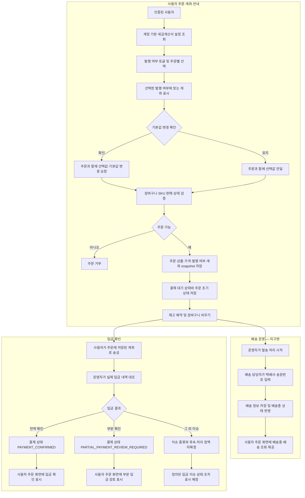
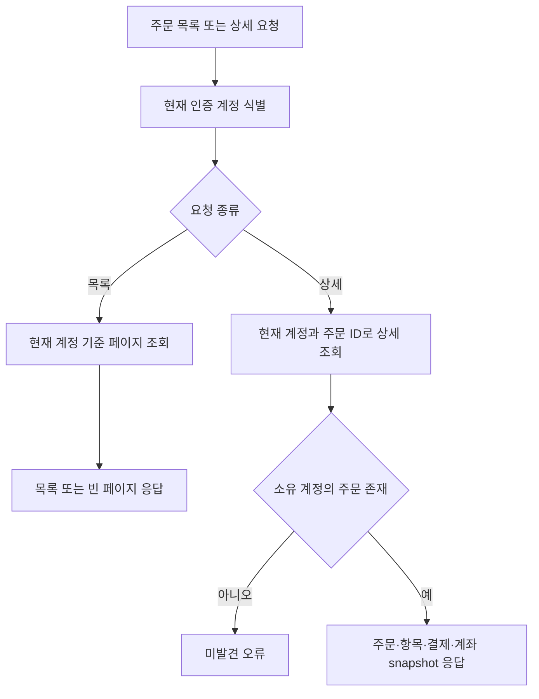

# 주문

## 주문·입금·배송 정책 흐름

입금 확인과 물건 발송은 독립된 운영 작업.
입금 상태 변경만으로 발송 상태가 바뀌지 않으며, 발송 처리도 입금 확인을 선행 조건으로 요구하지 않음.
아래 흐름은 확정된 목표 정책이며, 배송 API·상태는 아직 구현되지 않음.
현재 결제 확정이 주문을 `PAID`로 바꾸고 재고 예약을 확정하는 구현은 이 정책과 분리되지 않은 상태로, 후속 변경 대상.

입금 및 배송 상태는 각 운영 작업에서 별도로 갱신.
배송 전 주문 단계, 재고 예약 확정 시점, 발송 후 미입금 만료·이슈 처리 정책은 추가 설계 필요.
주문 생성·결제 확인의 현재 구현과 target 변경사항은 각각 아래 동작 설명과 [payment.md](payment.md)를 기준으로 함.

## Endpoint

- `POST /api/orders`
- `GET /api/orders?page=&size=`
- `GET /api/orders/{orderId}`

## 주문 조회 흐름

## 주문 생성

현재 인증 계정의 장바구니를 기준으로 주문을 생성함.
주문 항목에는 상품명, SKU명·코드, 가격, 수량을 스냅샷으로 저장함.
같은 유스케이스 흐름에서 재고를 예약하고 장바구니 항목을 초기화.
초기 상태는 `PENDING_PAYMENT`임.
초기 결제수단은 `BANK_TRANSFER`, 결제 상태는 `WAITING_FOR_DEPOSIT`이며 사용자 주문 목록·상세에 결제 상태가 포함됨.
계정별 세금계산서 발행 기본값은 초기 미발행이며, `GET /api/orders/checkout-options`에서 기본값과 발행·미발행 계좌 정보를 조회.
주문 생성 요청은 `taxInvoiceRequested` 값을 받아 주문에 저장하며, `updateDefaultTaxInvoicePreference=true`가 함께 전달된 경우 선택값을 계정 기본값에도 반영.
주문 상세에는 주문 당시 세금계산서 발행 선택과 안내 계좌 정보가 포함됨.

주문 조회는 토큰 subject의 계정으로 제한함.
결제·주문 취소·환불 API 및 상태 전이는 아직 구현되지 않았음.
application UseCase가 장바구니·재고·주문 저장 Port를 조정함.

## 입금 확인 운영 흐름

고객에게 세금계산서 발행 여부에 맞는 환경설정 계좌를 안내하고 계좌이체를 받는 방식을 사용함.
가상계좌 발급이나 고객 계좌 연동을 전제로 하지 않음.
운영자가 주문을 실제 계좌 입금 내역과 대조한 뒤 수동으로 입금 확인 처리.
부분 입금으로 표시하면 사용자 주문 조회에 `PARTIAL_PAYMENT_REVIEW_REQUIRED` 상태를 보여주고, 운영자가 전화로 후속 처리.
전액 확인 완료 시 주문 상태를 `PAID`로 바꾸고 재고 예약 확정.
계좌 내역 자동 조회·자동 매칭은 현재 범위에 포함하지 않음.

운영자 입금 목록·상태 변경 API와 상태 이력은 구현 범위에 포함.

## 배송 및 송장 조회 흐름

배송 관리 운영자가 주문에 택배사와 송장번호를 등록하면 배송 중 상태로 변경하는 흐름으로 계획함.
고객은 주문 조회 화면에서 배송 정보를 선택해 택배사 배송 현황을 WebView 안에서 확인함.
배송사 추적 API 직접 연동 여부는 확정되지 않았으며, 우선 택배사의 배송 조회 화면을 WebView로 여는 방식으로 계획함.

택배사·송장번호 등록, 배송 상태 변경, 고객 배송 조회 화면과 운영자 권한 검사는 아직 구현되지 않았음.
