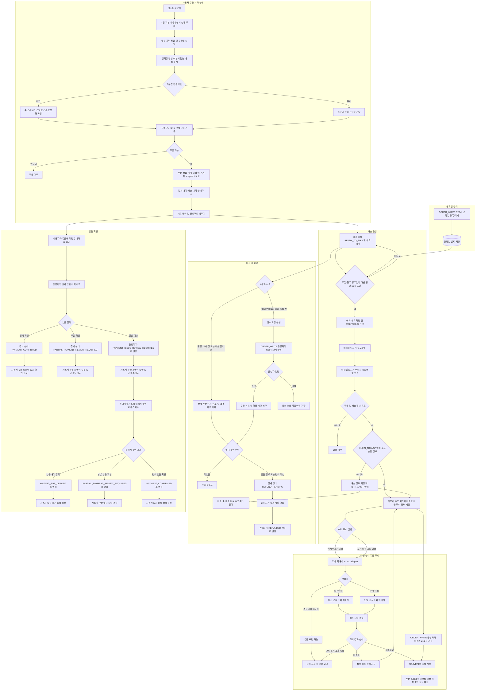
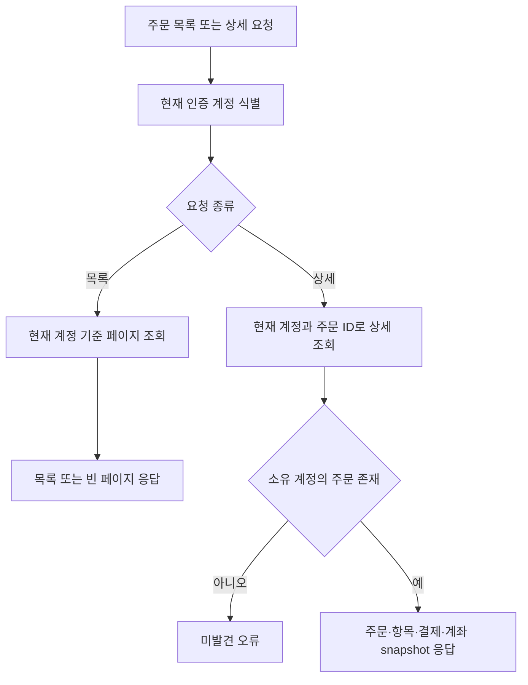

# 주문

## 주문·입금·배송 정책 흐름

입금 확인과 물건 발송은 독립된 운영 작업. 
입금 상태 변경만으로 발송 상태가 바뀌지 않으며, 배송 준비 전환도 입금 확인을 선행 조건으로 요구하지 않음. 
아래 흐름은 확정된 정책과 이번 구현 범위. 
입금 확정은 결제 상태와 주문 결제 상태만 변경하며, 배송 상태는 별도 관리. 
재고는 주문 시 예약하고, 운영자가 등록한 휴무일과 주말을 제외한 평일 15:00(KST)에 배송 준비 상태로 전환하며 확정. 
`READY_TO_SHIP` 상태에서 사용자는 주문 전체를 즉시 취소 가능. `PREPARING` 이후 송장 등록 전에는 취소 요청을 생성하고 운영자가 배송 담당자 확인 후 승인 또는 거절. 
배송 준비 후 취소 승인 시 확정된 재고를 복구. 송장 등록으로 배송 중 상태가 된 주문은 취소 불가. 
배송 중 주문의 공식 배송 페이지를 1시간마다 조회하고, 고객의 배송 조회 요청 시에도 최신 상태를 확인. 
조회 결과는 동일한 멱등 상태 갱신 흐름으로 저장. 배송 완료 후에도 택배사 공식 조회 화면과 송장번호 제공. 
대신택배·천일택배는 공식 조회 페이지 HTML의 상태를 adapter로 추출. 공식 서버 API가 확인되기 전까지 HTML 변경·접근 차단을 고려해 미확인 응답에서는 배송 상태를 유지하고 운영자 수동 상태 보정 유지. 
경동택배는 조회 페이지 링크만 제공 중이며 서버 측 응답·상태 adapter는 미확정. 

입금 및 배송 상태는 각 운영 작업에서 별도로 갱신. 
주말과 운영자 등록 휴무일을 제외한 평일 15:00(KST)에 `READY_TO_SHIP` 주문을 `PREPARING`으로 변경하고 재고 예약을 확정. 
송장 등록 시 배송 정보와 `IN_TRANSIT`을 저장. 같은 송장 정보의 중복 등록은 상태 변경 없이 기존 배송 정보를 반환. 
배송 처리에는 입금 확인을 요구하지 않음. 
대신택배·경동택배·천일택배를 우선 지원 대상으로 하며, 택배사 코드별 공식 배송 조회 화면을 주문 응답의 WebView 링크로 제공. 
배송 중 상태는 스케줄러의 주기 조회를 기본으로 하고 사용자 요청에 따른 즉시 조회도 허용. 두 경로는 동일한 상태 갱신 규칙을 사용. 
택배사 API 또는 중계 API의 조회 결과가 배송완료이면 `DELIVERED`로 전환. 중복 완료 결과는 멱등 처리하고, 연동 실패는 기존 상태를 유지. 
`ORDER_WRITE` 운영자는 배송 완료 상태를 수동 보정 가능. 배송 상태 전이 이력 및 외부 연동 실패 재처리 정책은 별도 범위. 
입금 만료는 두지 않으며, 미입금 주문도 운영자가 별도 입금 상태로 관리. 
주문 생성·결제 확인의 현재 구현과 target 변경사항은 각각 아래 동작 설명과 [payment.md](payment.md)를 기준으로 함. 

## Endpoint

- `POST /api/orders`
- `GET /api/orders?page=&size=`
- `GET /api/orders/{orderId}`
- `POST /api/orders/{orderId}/shipment/refresh`
- `PUT /api/operation/orders/{orderId}/shipment/tracking`
- `POST /api/operation/orders/{orderId}/shipment/delivered`
- `POST /api/orders/{orderId}/cancellation`
- `GET /api/operation/order-cancellations?page=&size=`
- `PATCH /api/operation/order-cancellations/{orderId}`
- `GET /api/operation/shipping-holidays`
- `POST /api/operation/shipping-holidays`
- `DELETE /api/operation/shipping-holidays/{date}`

## 주문 조회 흐름

## 주문 생성

현재 인증 계정의 장바구니를 기준으로 주문을 생성함. 
주문 항목에는 상품명, SKU명·코드, 가격, 수량을 스냅샷으로 저장함. 
같은 유스케이스 흐름에서 재고를 예약하고 장바구니 항목을 초기화. 
초기 상태는 `PENDING_PAYMENT`임. 
초기 결제수단은 `BANK_TRANSFER`, 결제 상태는 `WAITING_FOR_DEPOSIT`이며 사용자 주문 목록·상세에 결제 상태가 포함됨. 
배송 상태는 `READY_TO_SHIP`으로 초기화. 
계정별 세금계산서 발행 기본값은 초기 미발행이며, `GET /api/orders/checkout-options`에서 기본값과 발행·미발행 계좌 정보를 조회. 
주문 생성 요청은 `taxInvoiceRequested` 값을 받아 주문에 저장하며, `updateDefaultTaxInvoicePreference=true`가 함께 전달된 경우 선택값을 계정 기본값에도 반영. 
주문 상세에는 주문 당시 세금계산서 발행 선택과 안내 계좌 정보가 포함됨. 

주문 조회는 토큰 subject의 계정으로 제한하며 최신 취소 요청 상태도 포함함. 
주문 취소는 전체 주문 단위. `READY_TO_SHIP`에서 주문자는 즉시 취소 가능하고 예약 재고 해제. `PREPARING` 이후 송장 등록 전에는 취소 요청 상태(`PENDING`)를 주문 조회에 제공하며, 운영자 승인(`APPROVED`) 시 주문 취소·확정 재고 복구, 거절(`REJECTED`) 시 주문·재고 유지. 
운영자 공휴일 등록은 평일 15:00 배송 준비·재고 확정 배치에서 제외할 날짜를 관리. 
입금이 확인된 취소 주문의 실제 계좌 환불은 운영자가 수행하고 시스템에서 환불 상태를 직접 갱신. 
application UseCase가 장바구니·재고·주문 저장 Port를 조정함. 

## 입금 확인 운영 흐름

고객에게 세금계산서 발행 여부에 맞는 환경설정 계좌를 안내하고 계좌이체를 받는 방식을 사용함. 
가상계좌 발급이나 고객 계좌 연동을 전제로 하지 않음. 
운영자가 주문을 실제 계좌 입금 내역과 대조한 뒤 수동으로 입금 확인 처리. 
부분 입금으로 표시하면 사용자 주문 조회에 `PARTIAL_PAYMENT_REVIEW_REQUIRED` 상태를 보여주고, 운영자가 전화로 후속 처리. 
전액 확인 완료 시 주문 상태를 `PAID`로 변경. 
재고 예약은 평일 15:00 배송 준비 전환 시 확정. 
계좌 내역 자동 조회·자동 매칭은 현재 범위에 포함하지 않음. 

운영자 입금 목록·상태 변경 API와 상태 이력은 구현됨. 

## 배송 및 송장 조회 흐름

배송 상태는 `READY_TO_SHIP`, `PREPARING`, `IN_TRANSIT`, `DELIVERED`로 결제 상태와 분리해 관리함. 
`ORDER_WRITE` 운영자가 발송 처리를 시작하고, 배송 담당자가 택배사와 송장번호를 등록하면 `IN_TRANSIT`으로 변경. 
고객은 주문 목록·상세 조회에서 배송 상태와 송장 정보를 확인함. 
대신택배·경동택배·천일택배의 공식 조회 URL과 송장번호를 사용자 주문 응답에서 제공. 
확인한 조회 URL은 대신택배 `https://www.ds3211.co.kr/freight/internalFreightSearch.ht?billno=`, 경동택배 `https://kdexp.com/newDeliverySearch.kd?barcode=`, 천일택배 `https://www.chunil.co.kr/HTrace/HTrace.jsp?transNo=`. 
대신택배·천일택배는 공식 조회 페이지를 매시간 조회하고, 고객의 `POST /api/orders/{orderId}/shipment/refresh` 요청 시에도 즉시 확인. 
두 택배사 조회 페이지 HTML에서 배송 상태를 추출하는 outbound adapter 적용. 정식 서버 API 계약은 확인되지 않음. HTML 구조 변경 또는 자동화 접근 차단 시 배송 상태를 유지하고 운영자 보정 가능. 
경동택배 조회 링크는 제공하나 현재 실행 환경에서 조회 요청은 `403`을 반환해 상태 응답 확인 미완료. 실제 추적번호를 사용한 결과 확인 후 adapter 범위 확정. 
스케줄 주기는 `shipment.tracking.poll-cron`으로 바꾸며 기본은 매시간 정각(KST). 고객 요청 조회와 배치 조회는 같은 멱등 상태 갱신 유스케이스 사용. 
`POST /api/operation/orders/{orderId}/shipment/delivered`는 `ORDER_WRITE` 운영자의 수동 배송완료 보정 endpoint. 
운영 배송 API는 `ORDER_WRITE` 권한을 요구. 
