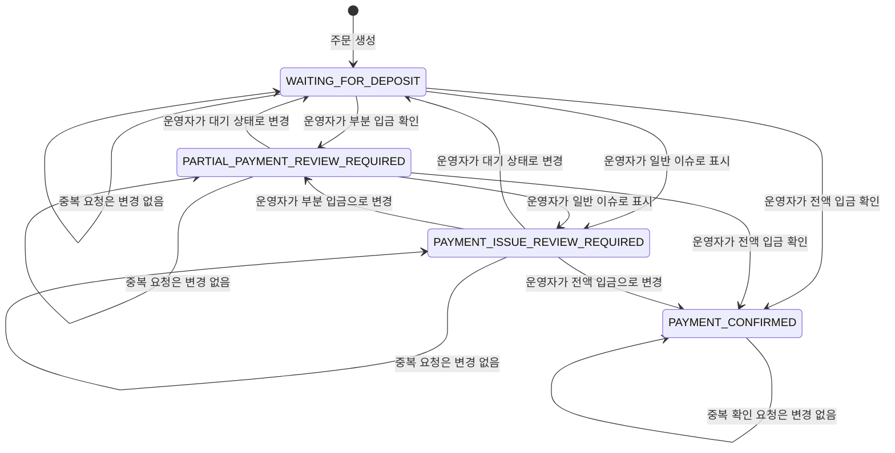

# 결제

## 구현 상태

수동 계좌이체 결제 상태와 운영자 확인 API를 구현함.
PG 연동과 환불은 아직 구현되지 않았음.
입금 만료는 두지 않으며 자동 만료·예약 해제 작업은 없음.

## 알고리즘 흐름

결제 생성 및 입금 승인 알고리즘의 단일 기준은 [order.md](order.md)의 주문·입금 확인 흐름.
이 문서에서는 결제 상태의 조건과 변경 결과를 정의.

`WAITING_FOR_DEPOSIT`, `PARTIAL_PAYMENT_REVIEW_REQUIRED`, `PAYMENT_ISSUE_REVIEW_REQUIRED`는 입금 확인 축의 상태.
입금 확인 상태 변경은 배송 상태를 자동 변경하지 않는 것이 확정된 정책.
`PAYMENT_CONFIRMED` 전이는 주문을 `PAID`로 변경.
재고 예약 확정과 배송 상태 변경은 송장 등록에서 별도로 처리.
입금 확인 완료 이후 되돌리는 전이는 거부.
`PAYMENT_ISSUE_REVIEW_REQUIRED`는 세부 내용 없이 표시하는 공통 이슈 상태.
부분 입금 외 발생 내용은 현재 기록하거나 사용자에게 표시하지 않음.
이슈 상태에서 운영자는 시스템 밖에서 계좌·주문 확인과 후속 처리를 진행.
처리 후 `WAITING_FOR_DEPOSIT`, `PARTIAL_PAYMENT_REVIEW_REQUIRED`, `PAYMENT_CONFIRMED` 중 확인 결과에 맞는 상태로 변경.
미해결 이슈는 기존 상태를 유지하며, 상태 변경 처리자·시각은 기존 결제 이력에 저장.
입금 만료·실패·취소 전이는 제공하지 않음.

## 초기 결제 방식

초기 결제 수단은 수동 계좌이체만 제공.
관리자가 실제 계좌 입금 내역을 확인한 뒤 입금 확인 처리.
초기 범위에는 PG, 가상계좌, 고객 계좌 연동, 계좌 내역 자동 조회·자동 매칭을 포함하지 않음.
향후 카드·PG 등 다른 결제 수단을 추가할 수 있도록 결제수단은 provider 종속 값이 아닌 확장 가능한 코드로 관리.
입금 상태 변경 권한은 `ORDER_WRITE`를 가진 운영자에게 있음.
입금 확인 화면에는 주문자명·연락처가 포함되므로 이 권한을 가진 운영자에게만 노출.

## 입금 확인 상태

입금 확인의 전권은 운영자에게 있음.
운영자가 실제 계좌 입금 내역을 확인해 결제 상태를 직접 설정하며, 부분 입금은 고객이 주문 조회에서 확인한 뒤 운영자가 전화로 후속 처리.
고객은 주문 조회에서 결제수단 코드와 다음 상태를 확인.

| 결제 상태 | 의미 | 주문·재고 처리 |
| --- | --- | --- |
| `WAITING_FOR_DEPOSIT` | 운영자의 입금 확인 전 | 주문 `PENDING_PAYMENT`, 송장 등록 전까지 재고 예약 유지 |
| `PARTIAL_PAYMENT_REVIEW_REQUIRED` | 운영자가 부분 입금으로 표시 | 주문 `PENDING_PAYMENT`, 배송과 재고 상태 유지, 운영자가 전화로 후속 처리 |
| `PAYMENT_ISSUE_REVIEW_REQUIRED` | 운영자가 세부 내용 없이 일반 이슈로 표시 | 주문 결제 상태와 배송·재고 상태 유지 |
| `PAYMENT_CONFIRMED` | 운영자가 전액 입금 확인 완료로 표시 | 주문 `PAID`, 배송 상태는 유지 |

상태 변경은 처리자·시각과 함께 별도 이력으로 남기고 운영 변경 감사 로그도 기록.
초기 범위에서는 실제 입금액 세부내역이나 입금자명을 입력·저장하지 않음.
부분·초과 입금 상세 조정 및 환불은 운영자가 별도 연락으로 처리.

주문 생성 시 재고를 예약하는 현재 동작을 유지하며, 미입금 예약 자동 만료·해제는 초기 범위에서 수행하지 않음.
입금 계좌는 환경변수로 세금계산서 미발행 계좌와 발행 계좌를 각각 관리.
계정별 세금계산서 발행 기본값은 미발행으로 시작하며, 주문 화면에서 기본값을 토글할 수 있음.
고객이 토글을 바꾸고 계정 기본값 변경까지 확인한 경우 주문 생성 요청에 해당 선택을 함께 전달.
주문에는 당시 세금계산서 발행 선택과 안내 계좌 정보를 저장해 이후 계정 기본값이나 환경설정 계좌 변경이 기존 주문에 영향을 주지 않도록 함.
기존 주문은 migration에서 세금계산서 미발행으로 초기화되며, 과거 안내 계좌 스냅샷은 없음.

주문 결제 상태 변경은 입금 확인 트랜잭션에서 수행.
재고 예약 확정은 배송 송장 등록 트랜잭션에서 수행.
PG callback 멱등성 및 위변조 검증은 PG 도입 전까지 범위 외.

## Endpoint

- `GET /api/operation/payments?status=&page=&size=`: 입금 대기·부분 입금·일반 이슈 대상 목록.
  상태 생략 시 세 상태를 반환.
- `PATCH /api/operation/payments/{orderId}/status`: 운영자 입금 상태 변경.
- `GET /api/orders/checkout-options`: 계정 기본 발행 여부와 두 계좌 안내 정보 반환.
- `POST /api/orders`: `taxInvoiceRequested`로 해당 주문 발행 여부 지정.
  `updateDefaultTaxInvoicePreference=true`는 고객이 계정 기본값 변경을 확인한 경우에만 전달.
- 사용자 주문 목록·상세 응답에 `paymentMethod`, `paymentStatus`, 독립 배송 `shippingStatus`, 택배사·송장번호, 주문 당시 `taxInvoiceRequested` 및 계좌 안내 스냅샷 포함.

환경변수는 `UMJI_BANK_STANDARD_NAME`, `UMJI_BANK_STANDARD_ACCOUNT_NUMBER`, `UMJI_BANK_STANDARD_ACCOUNT_HOLDER`와 `UMJI_BANK_TAX_INVOICE_NAME`, `UMJI_BANK_TAX_INVOICE_ACCOUNT_NUMBER`, `UMJI_BANK_TAX_INVOICE_ACCOUNT_HOLDER`를 사용.
